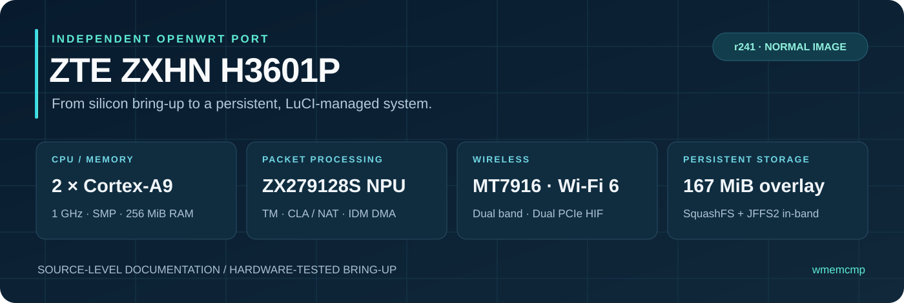
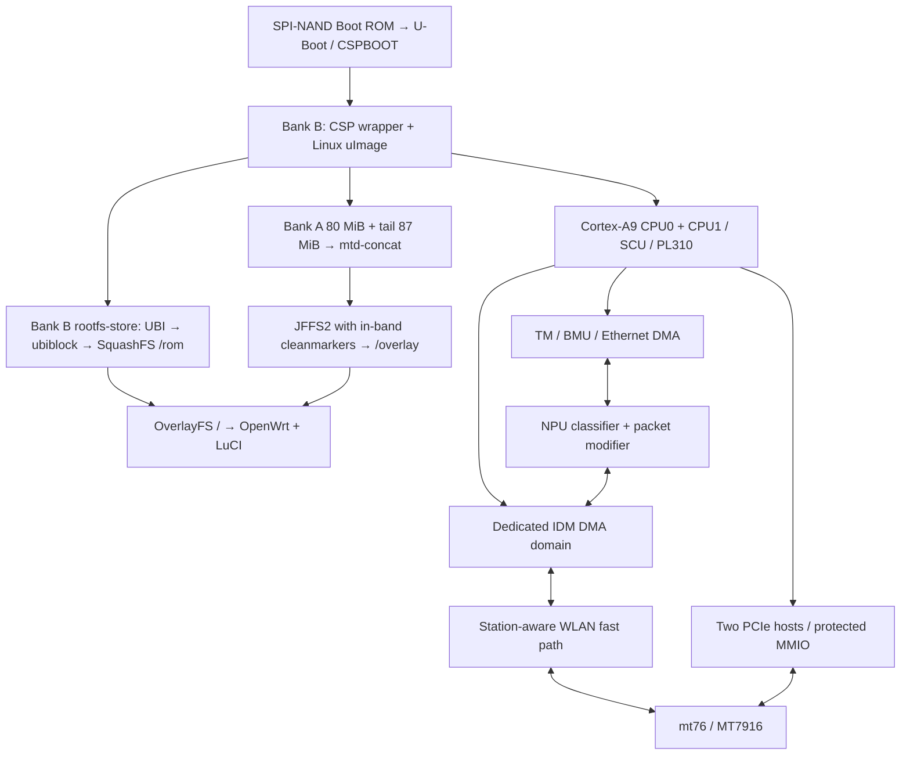
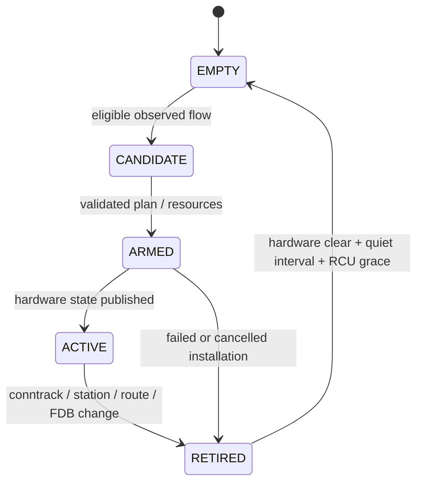

<div align="center">



# ZTE ZXHN H3601P · OpenWrt

**A working OpenWrt port for the Sanechips ZX279128S: dual-core ARM, native Ethernet, NPU acceleration, dual-band Wi-Fi 6 and persistent NAND storage.**

[](#hardware)
[](#software-baseline)
[](#current-status)
[](#nand-layout)
[](#wireless)

**[GitHub: wmemcmp/h3601p](https://github.com/wmemcmp/h3601p) · [Telegram: @thereisnourflevel](https://t.me/thereisnourflevel)**

[Hardware](#hardware) · [Installation](#installation) · [Technical reference](#architecture) · [Report an issue](https://github.com/wmemcmp/h3601p/issues)

An independent, device-specific port. Built on OpenWrt, Linux and mt76; not an official OpenWrt release or a ZTE product.

</div>

<a id="hardware"></a>
## Hardware at a glance

| Component | Implemented / observed configuration |
| :--- | :--- |
| Device | **ZTE ZXHN H3601P**, V9 hardware investigated in this project |
| SoC | **Sanechips / ZTE Microelectronics ZX279128S** |
| CPU | **2 × ARM Cortex-A9, 1.0 GHz**, ARMv7-A; both cores online |
| Userspace ABI | **32-bit ARM, little-endian, soft-float musl**; this CPU configuration has no usable VFP/NEON |
| L2 cache | ARM PL310, **256 KiB, 16-way**, with a platform-specific PCIe/cache serialization fix |
| RAM | **256 MiB DDR3** physically installed; reserved DMA memory reduces Linux-visible usable memory |
| NAND | **Winbond W25N02KV, 256 MiB SPI-NAND**, on-die ECC |
| NAND geometry | **2,048-byte page, 128-byte OOB, 128 KiB eraseblock**, 2,048 eraseblocks |
| Ethernet | **3 × Gigabit Ethernet**: two LAN ports and one WAN port |
| Ethernet implementation | Custom ZX279128S TM/BMU/DMA/MDIO drivers, phylib and Linux netdevices |
| Wired acceleration | Custom NPU classifier and packet-modifier integration for eligible IPv4 NAT traffic |
| Wireless | **MediaTek MT7916, concurrent 2.4 GHz + 5 GHz, 802.11ax / Wi-Fi 6**, mt7915e/mt76 |
| Spatial streams | Two spatial streams on each band; physical RF-chain masks must not be mistaken for NSS |
| 5 GHz channel width | HE80 in current first-boot defaults; HE160 exercised during bring-up |
| PCIe | Two DesignWare host interfaces; main WLAN endpoint `14c3:7906`, secondary HIF endpoint `14c3:790a` |
| PCIe links | Main HIF: Gen1 ×1; secondary HIF: Gen2 ×1, as configured/observed in this port |
| Interrupt strategy | INTx for WLAN, `pci=nomsi`, `pcie_aspm=off`; both HIF paths participate |
| Bootloader | Stock CSPBOOT/U-Boot chain; investigated U-Boot is **2013.04, Apr 23 2024** |
| Console | UART, **115200 baud, 8N1**, Linux `ttyAMA0` |
| System filesystem | Read-only **SquashFS in a UBI volume inside Bank B** |
| Writable filesystem | **167 MiB raw concatenated MTD**, JFFS2 with in-band cleanmarkers, used as the root overlay |
| Management | LuCI, SSH and normal OpenWrt UCI configuration in the r241 normal image |

The model string exposed through the standard board-information path is:

> **ZTE ZXHN H3601P — GitHub: wmemcmp | Telegram: @thereisnourflevel**

The display signature does not change the hardware compatibility identifier: `zte,zx279128s-h3601p`. Image metadata also recognizes `zte,h3601p-v9`. LuCI obtains model information through `ubus call system board`; the signed display name belongs in the device-tree `model`, not in the machine-compatible string.

<a id="current-status"></a>
## Current status

**The r241 normal image has been installed on the device with `sysupgrade -n`, rebooted through CSPBOOT from NAND, mounted the persistent overlay, and reached OpenWrt. The owner reports working LuCI and network operation.**

This is a normal SquashFS-based system with a separate persistent overlay. The earlier initramfs image remains a recovery and migration environment. Successful boot is supported by UART evidence; statements about long-term reliability, every LuCI upgrade scenario or every protocol are not implied by that result.

| Capability | Evidence and status |
| :--- | :--- |
| Both Cortex-A9 cores | Active; SMP bring-up and subsequent WLAN/cache corrections implemented |
| Ethernet / LAN bridge / WAN | Working on hardware; custom TM and MDIO implementation |
| Dual-band Wi-Fi | Working on hardware; both AP interfaces start |
| PCIe + PL310 coexistence | Shared-lock fix implemented; hardware progression documented from r143–r146 |
| Wired IPv4 acceleration | Implemented and exercised; eligibility and fallback rules apply |
| WLAN fast path | Implemented, multi-station enrollment and TCP/downstream UDP support; not a universal bypass |
| NAND boot | Bank B payload and header verified by readback; automatic CSPBOOT boot exercised |
| Persistent storage | Earlier concat image retained files across reboot; r241 boots with the same 167 MiB overlay design |
| Initramfs → normal installation | **Hardware-tested clean installation using the r241 bridge and `sysupgrade -n`** |
| Normal → normal update | Implemented; host/QEMU validation exists; a separate physical repeat-upgrade result is not claimed here |
| Preserve-settings upgrade / reset | Implemented and covered by offline/QEMU checks; physical coverage is narrower |
| Board-specific RF calibration | Stock default EEPROM fallback is used in the observed r241 boot; automatic per-device calibration is not complete |
| Official upstream device support | The platform support documented here is out of tree in this source snapshot |

**Snapshot:** 25 September 2026. The older notebooks are chronological records. Their “not yet flashed,” “TFTP only,” or “hardware result pending” statements describe their original stages, not the final state summarized above. In particular, the immutable r241 bundle was prepared before the later successful physical installation.

### Read this first

- The supported clean-install route below starts from the project's **r240-concat-inband-1** recovery system. It is not a stock web-interface installation guide.
- Bank A has been repurposed for writable storage. **There is no stock Bank A fallback after conversion.** Keep an external device backup and UART/TFTP recovery available.
- The released first-boot script enables Wi-Fi with shared development credentials, changes WAN MTU to 1492, and rewrites package feeds. Review the [actual first-boot defaults](#first-boot-defaults) before deployment.
- A 167 MiB MTD area is not a promise of 167 MiB free space. Cleanmarkers, filesystem metadata and installed files consume space.
- Source offsets, legacy binary addresses and NAND offsets are different address spaces. The tables below label them explicitly.

## Contents

1. [Software baseline and repository map](#software-baseline)
2. [System architecture](#architecture)
3. [CPU, SMP and cache/PCIe serialization](#smp)
4. [PCIe host and WLAN firmware startup](#pcie)
5. [Ethernet, TM, BMU and MDIO](#ethernet)
6. [NPU classifier and IPv4 NAT](#npu)
7. [IDM DMA transport and ownership](#idm)
8. [MT7916 and the WLAN fast path](#wireless)
9. [Physical memory and register map](#register-map)
10. [NAND layout and persistent filesystems](#nand-layout)
11. [CSPBOOT format and boot selection](#cspboot)
12. [Normal image, installation and sysupgrade](#installation)
13. [Defaults, diagnostics and performance evidence](#first-boot-defaults)
14. [Build reproduction and validation](#building)
15. [Development history and remaining limits](#history)
16. [Source accounting and generated appendices](#source-accounting)

<a id="software-baseline"></a>
## Software baseline and repository map

| Item | Audited snapshot |
| :--- | :--- |
| Linux | `6.18.44` |
| OpenWrt checkout | `6c12b87ffc36974b3b24ebc767e8e92023351093` |
| LuCI feed | `f4f91aee257bab4eb9c6b7de6160cea294217956` |
| Packages feed | `4206464bc04ef3dde58218e515e86ab93ea2850c` |
| mt76 package source | `2026.07.01~59676919`, plus the local 140–205 patch series |
| Compiler | GCC `14.4.0`, ARM soft-float toolchain |
| Binutils | `2.46.1` |
| Normal firmware | r241 normal pipeline, based on the r240 networking/storage baseline |
| Recovery | `r240-concat-inband-1`, Linux `6.18.44` |

The original OpenWrt and mt76 code remains the foundation. This project adds the missing SoC/platform implementation, board integration, storage/upgrade support and scoped modifications to the existing wireless driver. It does **not** claim authorship of Linux, mac80211, mt76, UBI, JFFS2 or LuCI.

```text
.
├── README.md                         This consolidated English reference
├── docs/
│   ├── assets/                       GitHub-friendly architecture artwork
│   ├── audit_readme.py                Reproducible source/document accounting
│   └── audit/                        Per-file line counts and SHA-256 inventory
├── openwrt/
│   ├── target/linux/zte/              SoC drivers, DTS, target config and patches
│   ├── package/kernel/mt76/patches/   Wireless/platform integration patches
│   └── files/                        Runtime helpers and image overrides
├── out/
│   ├── r138/ … r240/                  Experiment-specific source and records
│   ├── cspboot-analysis/              Bootloader format and ARM-code checks
│   ├── r240-concat/                   Concat/JFFS2 implementation and migration
│   ├── r241-normal/                   Current normal-image build/upgrade code
│   └── normal-r241/                   Packaged release files and test results
└── analysis/                         Local reverse-engineering evidence
```

### Which source is authoritative?

The networking, SMP, MDIO and PCIe files under [`openwrt/target/linux/zte/files-6.18`](openwrt/target/linux/zte/files-6.18) match the corresponding r241 build inputs checked for this documentation snapshot.

For the **normal release**, additionally use:

- [`out/r241-normal/normal.dts`](out/r241-normal/normal.dts): the generated normal-boot device tree, including the UBI root and signed model string.
- [`out/r241-normal/spi-zx279128s-sfc.c`](out/r241-normal/spi-zx279128s-sfc.c): the extended SFC implementation with the Bank B and rootfs-store write windows.
- [`out/r241-normal/h3601p-upgrade.sh`](out/r241-normal/h3601p-upgrade.sh) and [`platform.sh`](out/r241-normal/platform.sh): the actual normal sysupgrade implementation.
- [`out/r240-concat/jffs2-inband-cleanmarkers.patch`](out/r240-concat/jffs2-inband-cleanmarkers.patch): the NAND cleanmarker fix required by the concat filesystem.

The older target-overlay SFC and the original short `lib/upgrade/platform.sh` are not a complete description of the packaged normal release. Likewise, a retained comment mentioning an older revision is not necessarily the active behavior after all subsequent patches are applied.

Publish this README at the root of **[wmemcmp/h3601p](https://github.com/wmemcmp/h3601p)**, with the `docs/` directory alongside it. Source and evidence links use the relative paths shown above, so their corresponding files must also be published at those paths for the links to work on GitHub. The documentation ZIP contains the README, artwork and audit tools/inventories; it does not contain the linked firmware source tree or release binaries. Private dumps and generated build trees are not required for displaying the documentation. Firmware download links should point to actual uploaded release assets when available.

### Target integration and small upstream-tree changes

The target Makefile selects ARM Cortex-A9, omits an FPU feature, registers the ZX279128S subtarget and runs `olddefconfig` after the kernel fragment is assembled. That last step handles newly introduced Linux configuration symbols without an interactive prompt in the unattended build.

The numbered kernel integration patches have distinct jobs:

| Patch | Role |
| :--- | :--- |
| `100-arm-mach-zte` | Register the machine/SMP implementation with the ARM build |
| `110-net-zte-zx279128s-tm` | Register Ethernet/TM and its companion platform objects |
| `120-mdio-zx279128s` | Add MDIO bus configuration/build integration |
| `130-pcie-zx279128s` | Add the DesignWare-based host driver integration |
| `140-serial-pl011-zteuart` | Adapt PL011 register layout and early console handling |
| `150-bridge-fdb-rcu` | Expose a bridge FDB port lookup used by the forwarding integration |
| `160-pcie-l2-stock-serialization` | Introduce the shared PCIe/PL310 serialization |
| `161-pcie-l2-stock-sync-boundaries` | Cover cache-sync and unaligned invalidation boundary operations |
| `170-spi-zx279128s-sfc` | Register the SPI flash controller with the SPI-mem framework |

The FDB helper returns a **borrowed `net_device` pointer**, not a newly acquired device reference. Its internal RCU lookup does not grant an unlimited lifetime after return; callers still need the surrounding lifetime/refcount discipline. This distinction is important when changing fast-path caches or holding station/port state across asynchronous work.

The selected upstream-based build-context files are counted for visibility, but their full lengths are not new project code. Relative to the pinned OpenWrt commit, the inspected tracked changes are small: `include/feeds.mk` substitutes the current architecture feed list; the mt76 Makefile adds the r239 autoload explanation; the generic kernel fragment enables diagnostic hung-task/soft-lockup settings and a 30-second hung-task timeout. The actual normal-kernel configuration is produced by the isolated pipeline described below.

The original 14-line `h3601p.config` is an **initramfs bring-up seed**, not the complete normal-image package configuration. The normal build uses `out/r241-normal/openwrt-normal-packages.config` and then preserves the verified r240 driver set.

<a id="architecture"></a>
## System architecture



There are three distinct acceleration layers:

1. **Wired NPU forwarding:** software observes eligible conntrack flows and programs classification, next-hop and NAT state.
2. **IDM transport:** packets move between CPU-managed buffers and the SoC forwarding hardware using dedicated rings. This is not the PCIe radio DMA engine.
3. **WLAN integration:** validated flows and authorized stations connect IDM to a bounded, ownership-aware mt76 transmit path. Unsupported packets still use normal Linux networking.

OpenWrt's generic software/hardware flow-offload UCI switches are separate from this custom NPU implementation. The current first-boot script disables those generic switches while the platform-specific code has its own admission controls.

<a id="smp"></a>
## CPU, SMP and the PCIe/cache problem

### Bringing the second Cortex-A9 online

Primary implementation:

- [`platsmp.c`](openwrt/target/linux/zte/files-6.18/arch/arm/mach-zte/platsmp.c): **139 lines**.
- [`headsmp.S`](openwrt/target/linux/zte/files-6.18/arch/arm/mach-zte/headsmp.S): **38 lines**.
- Device-tree enable method: `zte,zx279128-smp`.

The SoC does not acquire working SMP merely by adding a second CPU node. The secondary core must enter an appropriate trampoline, observe a coherent release value, and join the kernel's secondary-startup path.

The implementation follows this sequence:

1. Obtain the Cortex-A9 SCU base using the architecture helper and enable the SCU.
2. Map the board's IRAM area at **physical `0x00200800`, length `0x1000`**.
3. Copy the **68-byte secondary trampoline** into IRAM.
4. Patch the trampoline's startup and holding-pen addresses with physical addresses.
5. Flush the relevant inner/outer cache ranges, order publication and issue `sev`.
6. Publish the selected CPU's hardware ID in the holding pen, synchronize that value and send the wakeup IPI.
7. Wait for the secondary to acknowledge with `-1`, using the boot lock to complete the handshake.

| IRAM-relative offset | Meaning |
| :--- | :--- |
| `+0x00` | Branch over the embedded data words |
| `+0x04` | Patched physical address of the ARM `secondary_startup` entry |
| `+0x08` | Patched physical address of `zx_pen_release` |
| `+0x0c` | Retained stock-layout word `0x34`; not a discovered generic CPU-reset register |
| Following instructions | Read MPIDR, isolate the core ID, wait for the matching pen value, branch to startup |

The primary uses a write barrier and cache synchronization when changing the release value. The boot wait polls at 10 µs intervals with an approximately one-second limit. The secondary selects `SCU_PM_NORMAL`, clears the pen and joins the lock handshake. These steps are about visibility and ordering; they cannot be replaced with an arbitrary delay.

### Why two working cores initially broke Wi-Fi

The critical progression was:

| Stage | Observation | Interpretation |
| :--- | :--- | :--- |
| r143 | A single-core configuration passed the recorded ping experiment | Useful isolation result, not a final SMP solution |
| r144 | Two cores with RPS disabled still froze | RPS alone did not explain the failure |
| Stock audit | PCIe MMIO reads and PL310 physical-address maintenance share `l2x0_lock` | Concrete missing platform behavior in the port |
| r145 | Partial serialization still failed during association | Protecting only the obvious cache loop was insufficient |
| r146 | Cache-sync and invalidation boundary paths were included; the recorded extended ping test passed | Complete coverage of the identified serialization paths mattered |

The project therefore retains both CPU cores and reproduces the relevant platform serialization, instead of shipping a permanent `maxcpus=1` workaround.

### The shared PL310/PCIe lock

Implemented by kernel patches [`160`](openwrt/target/linux/zte/patches-6.18/160-pcie-l2-stock-serialization.patch), [`161`](openwrt/target/linux/zte/patches-6.18/161-pcie-l2-stock-sync-boundaries.patch), and mt76 patch [`150`](openwrt/package/kernel/mt76/patches/150-h3601p-stock-pcie-l2-guard.patch).

The wrapper `zx279128_pcie_readl()` takes the same raw spinlock used by the affected PL310 maintenance paths. It disables local interrupts while holding that lock and tracks waiting PCIe readers. Physical-address cache maintenance works in **32-byte cache lines**, with **2 KiB maximum chunks**, allowing waiting MMIO readers to make progress between chunks.

The protection includes:

- PCIe register reads made through the board-specific mt76 bus wrapper.
- PL310 physical-address clean/invalidate range operations.
- Cache synchronization.
- The head and tail handling for unaligned invalidation ranges.

`writel_relaxed()` is used in the protected cache-maintenance sequence where a heavier barrier could recursively invoke outer-cache synchronization and deadlock on the same lock. This is a targeted platform fix, not permission to replace DMA API synchronization throughout the driver.

| Stock binary virtual address | Function / evidence |
| :--- | :--- |
| `0xc0014e0c` | `fixed_pci_read_u32`, protected PCIe read |
| `0xc0014ce0` | `__l2c210_op_pa_range`, physical-address cache maintenance |
| `0xc0014c94` | `__l2c210_cache_sync` |
| `0xc0014d84` | `l2c210_inv_range` |
| `0xc0606a48` | Stock `l2x0_lock` object |

These are addresses in the investigated **stock kernel**, not MMIO addresses and not symbols that should be hardcoded into the new kernel. The evidence supports a platform-specific concurrency requirement; this README does not assign it an unverified public silicon-erratum number.

### CPU placement is more than IRQ affinity

Stock userspace searches `/proc/interrupts` for `idm` and writes affinity mask `2`, meaning **CPU1**. That is not evidence that all WLAN work belongs on CPU1.

The final port separates the work more carefully:

- IDM requests CPU1 affinity.
- The later WLAN placement policy assigns main/data NAPI work to CPU0 and the MAIN_WA transmit-completion work to CPU1.
- The mt76 TX worker uses **`SCHED_NORMAL`**, avoiding the real-time throttling behavior seen with an RT worker.
- Generic packet steering is disabled by the current defaults; the custom placement is intentional.

IRQ numbers such as 27, 28 or 30 in experiment logs are examples from those boots. Match interrupt **names** when inspecting another build.

<a id="pcie"></a>
## PCIe host and WLAN firmware startup

The [`pcie-zx279128s.c`](openwrt/target/linux/zte/files-6.18/drivers/pci/controller/dwc/pcie-zx279128s.c) host driver is **303 lines**. It adapts the DesignWare host framework to the board's reset, clock, PHY, address-translation and interrupt requirements.

| Resource | Host 0 | Host 1 |
| :--- | :--- | :--- |
| DBI base | `0x0f000000` | `0x0f100000` |
| PHY base | `0x09500000` | `0x09600000` |
| Configuration window | `0x1c000000` | `0x2c000000` |
| Outbound memory window | `0x10000000–0x17ffffff` | `0x20000000–0x27ffffff` |
| WLAN endpoint | `14c3:7906` | `14c3:790a` |
| Link setup | Gen1 ×1 | Gen2 ×1 |
| Endpoint reset GPIO | 53 | 55 |

The inbound mapping covers the real **256 MiB DRAM window at `0x40000000`**. An indiscriminate 4 GiB mapping is not a safe substitute on this 32-bit platform; address arithmetic and inbound-window bounds matter.

The driver uses the stock-derived system clock/reset sequence, toggles endpoint reset through GPIO, configures link speed and waits for the DesignWare link-up condition. The link callback does not reject a functioning link merely because LTSSM has entered L0s rather than remaining at one exact state number.

Notable register operations are documented in the [register map](#register-map). The PCIe devices are not declared DMA-coherent. Correct mappings, cache maintenance and the PL310 guard remain necessary.

### Firmware RX has a single owner

The early WLAN problem was not solved by calling receive-ring routines from arbitrary polling contexts. The final startup arrangement schedules firmware receive processing through **NAPI**, preserving the RX ring's expected execution context and ownership.

During the firmware phase:

1. Physical WLAN interrupts are masked/held while firmware polling is active.
2. Polling schedules the NAPI-owned receive path rather than concurrently consuming the same ring.
3. Both primary and secondary HIF interrupt paths are accounted for.
4. The WA startup path does not wait for an acknowledgement that this firmware path does not provide; readiness is checked through the appropriate firmware state.
5. Normal interrupt-driven operation resumes after the controlled transition.

The old permanent-HIF2-disable experiment is not the final design. MSI remains disabled in the current board configuration because the investigated MSI path produced MCU timeouts; this statement is scoped to this port and firmware combination.

Primary patch: [`140-mt76-h3601p-fw-irq-poll.patch`](openwrt/package/kernel/mt76/patches/140-mt76-h3601p-fw-irq-poll.patch). For the generic receive-polling contract, see the Linux [NAPI documentation](https://docs.kernel.org/networking/napi.html).

<a id="ethernet"></a>
## Ethernet: TM, BMU, DMA and MDIO

The Ethernet implementation is a custom platform driver, not a generic DSA switch description with a few board properties.

| Source | Physical lines | Responsibility |
| :--- | ---: | :--- |
| [`zx279128s-tm.c`](openwrt/target/linux/zte/files-6.18/drivers/net/ethernet/zte/zx279128s-tm.c) | 4,128 | Netdevices, TM setup, rings, interrupt/NAPI handling, buffer ownership, port and diagnostic operations |
| [`zx279128s-tm.h`](openwrt/target/linux/zte/files-6.18/drivers/net/ethernet/zte/zx279128s-tm.h) | 112 | Shared register/layout definitions and interfaces |
| [`mdio-zx279128s.c`](openwrt/target/linux/zte/files-6.18/drivers/net/mdio/mdio-zx279128s.c) | 175 | MDIO bus operations used by phylib |

### Netdevices and forwarding blocks

`eth0` and `eth1` are LAN-facing interfaces; `eth2` is the WAN interface in the normal network configuration. The device tree also describes internal PHY/register resources that must not be counted as extra external RJ45 ports.

The forwarding hardware contains distinct blocks:

- **TM:** traffic-manager control and the CPU-facing DMA path.
- **BMU:** hardware packet-buffer allocation/release and free-pool accounting.
- **RED/queue controls:** queue admission and buffering configuration.
- **NPP:** network packet-processing and port/protocol handling.
- **PP:** bridge, classifier and packet-modifier tables.

Some source names use “PM” for **port manager** and others for **packet modifier**. They are different register regions. Always use the stated base plus offset.

### Packet-memory reservation and ring ownership

The normal device tree reserves **`0x4e700000–0x4fffffff`**, a 25 MiB `no-map` area, for the hardware packet-memory layout. Linux must not allocate ordinary pages out of it.

The driver defines 8,192 normal packet buffers of `0x900` bytes and 96 jumbo buffers of `0x2800` bytes. TM descriptors are 16 bytes. The CPU-facing layout includes 1,024-entry TX rings and multiple RX queues. Descriptor indices, buffer identifiers and packet addresses are distinct values; treating one as another corrupts ownership even when the DMA engine appears to accept the descriptor.

Initialization follows the stock-derived ordering: configure RED and DMA, establish BMU geometry and descriptor bases, then enable the buffer machinery. Receive processing uses NAPI and validates descriptor/packet bounds before handing a packet to Linux or a supported fast path.

### Allocation and completion lessons

BMU allocation and release share a lock in the final implementation. The r227 work addressed concurrent access to the BMU command/result interface.

An earlier resend experiment was withdrawn: retransmitting a buffer after an ambiguous completion created double ownership, duplicate traffic and corruption. The final code does not treat every delayed observation as permission to resend the same packet buffer.

For certain trapped forwarding packets, the software fast path can update the packet and reuse the BMU buffer. This reduces CPU copying, but it is still CPU involvement; it is not evidence that every forwarded frame stayed inside the NPU.

### PHY and MDIO

The MDIO controller at **`0x9a101000`** supplies the clause-22 read/write operations used by phylib. The control word contains register, PHY, operation and start fields; completion is polled with a bounded timeout.

The r234 changes disable EEE advertisement by default and provide ethtool support. This was motivated by link-level observations while investigating missing responses, not by an assertion that all earlier TCP symptoms had one cause.

| MDIO-relative offset | Use |
| :--- | :--- |
| `+0x04` | Write data |
| `+0x08` | Read data |
| `+0x10` | Status |
| `+0x14` | Control: register `[4:0]`, PHY `[9:5]`, operation `[11:10]`, start bit 14 |

Write operation is `1`, read operation is `2`. The driver polls at 1 µs intervals with a 10 ms timeout and handles the optional inherited clock resources.

<a id="npu"></a>
## NPU L3 offload and IPv4 NAT

The main implementation is [`zx279128s-l3offload.c`](openwrt/target/linux/zte/files-6.18/drivers/net/ethernet/zte/zx279128s-l3offload.c), **3,016 lines**, with a **121-line** header. It translates a restricted, validated subset of Linux forwarding state into the SoC's classifier and packet-modifier tables.

### Admission begins with Linux state

The code observes forwarded IPv4 traffic and conntrack state. For eligible flows it determines the two directional tuples, NAT addresses/ports, route, neighbour and physical or WLAN destination.

Important gates include:

- Established TCP, or supported assured UDP state.
- Valid route and neighbour information.
- Correct translated WAN address and tuple symmetry.
- A known LAN forwarding destination; unresolved Wi-Fi destinations are not guessed to be an Ethernet port.
- No unsupported packet layout, such as an unhandled fragment or encapsulation.
- Resource availability in both the software bookkeeping and hardware tables.

DNS ports 53 and 853 remain on the CPU path. QUIC eligibility is enabled in the current wired parameters. This is **IPv4 acceleration**; it is not a claim of equivalent IPv6, tunnel, arbitrary VLAN, multicast or every firewall-feature offload.

### Current policy defaults

| Parameter | Default | Meaning |
| :--- | :--- | :--- |
| `zx_hw_offload_enable` | `1` | Enable the custom hardware admission path |
| `zx_offload_udp` | `1` | Permit eligible wired UDP flows |
| `zx_offload_quic` | `1` | Permit eligible QUIC flows |
| `zx_fwd_upstream` | `0` | Retain the current upstream action policy |
| `zx_cpu_qid_rp` | `1` | CPU-queue replacement behavior for the relevant trap action; not a clone-every-hit policy |
| `zx_up_target` | `3` | Ethernet WAN hardware target |
| `zx_up_gem_valid` | `0` | Ethernet WAN operation, not a GPON GEM configuration |
| `zx_sw_fast` | `1` | Enable the supported software forwarding shortcut |
| `zx_offload_min_len` | `1000` | Wired admission gate based on IPv4 total length |
| `zx_offload_max_conns` | `64` | Default wired connection admission limit |

WLAN has additional eligibility and lifetime machinery; the wired admission gate must not be blindly applied as its complete policy.

### Hash construction

The hardware key builder assembles a **45-byte bitstream** containing the classifier rule/direction, protocol and IPv4 tuple. It reverses that stream as required by the investigated hardware hash convention.

Two software-computed CRCs select candidate buckets:

| Hash | Polynomial | Initial value | Bucket selection |
| :--- | :--- | :--- | :--- |
| Primary | `0x04c11db7`, big-endian CRC algorithm | `0` | Low 8 bits: `0–255` |
| Secondary | `0x1edc6f41`, big-endian CRC algorithm | `0` | `256 + (crc & 0x7f)`: `256–383` |

The silicon hash interface is also available for diagnostics at **PP `+0xc2c0`** and its associated input/output registers. The software hash avoids a per-flow dependence on that diagnostic transaction once the format is understood.

Do not infer capacity from a large C array alone. Some software bookkeeping sizes are 512 or 520 entries, but this allocator's hash destinations cover **384 buckets**. Two directions, collisions, reserved entries and policy limits reduce the usable connection count.

### Table programming order

The classifier and packet modifier are separate indirect interfaces:

| Interface | PP-relative registers | Purpose |
| :--- | :--- | :--- |
| CLA indirect | `+0xc014` command, `+0xc018` completion, `+0xc01c` data | Key/action and related classifier RAM access |
| Hash engine | `+0xc2c0` control, `+0xc2c4…+0xc2f0` input, `+0xc2fc` result | Hardware hash diagnostics |
| Packet modifier indirect | `+0x1c014` command, `+0x1c018` completion, `+0x1c01c…+0x1c028` / `+0x1c100…+0x1c10c` data | NAT, next-hop and rewrite state |

Classifier RAM roles include index/key state, extraction rules, hash banks, CPU-queue actions and aging. Modifier RAM roles include flow entries, next hops, VLAN-related data and modification micro-operations. The appendix lists the exact source constants rather than presenting guessed table meanings as a vendor datasheet.

The important publication rule is: **prepare the modification/next-hop state before making the classifier entry match live traffic**. The WLAN installation path adds checked writes/readback and rollback handling. Older wired accessor behavior is not automatically equivalent to that stronger transaction discipline.

### Removal is part of correctness

Conntrack destruction, station changes, FDB movement and route/neighbour changes can invalidate a flow. The software must stop matching the old destination before recycling table slots or station identity.

Packets that cannot be safely accelerated fall back to the normal networking path. Some TCP ACK traffic is trapped by the hardware with reason 44 and uses the TM/software path. A high offload counter therefore does not mean zero CPU packets or zero CPU cost.

The offload code is tied to the project's supported topology. Changes to bridge membership, VLAN design, routing policy or WAN type require checking admission and fallback behavior rather than assuming stock OpenWrt feature coverage.

<a id="idm"></a>
## IDM DMA transport and ownership

IDM is a dedicated CPU/NPU transport, implemented separately from the Ethernet DMA device and from the radio's PCIe WFDMA engine.

| Source | Lines | Role |
| :--- | ---: | :--- |
| [`zx279128s-idm.c`](openwrt/target/linux/zte/files-6.18/drivers/net/ethernet/zte/zx279128s-idm.c) | 235 | Ring allocation, mapping and ownership primitives |
| [`zx279128s-idm.h`](openwrt/target/linux/zte/files-6.18/drivers/net/ethernet/zte/zx279128s-idm.h) | 64 | Descriptor/state interface |
| [`zx279128s-idm-hw.c`](openwrt/target/linux/zte/files-6.18/drivers/net/ethernet/zte/zx279128s-idm-hw.c) | 1,450 | Hardware publication, IRQ/NAPI, completion, transport policy and diagnostics |
| [`zx279128s-idm-wlan.c`](openwrt/target/linux/zte/files-6.18/drivers/net/ethernet/zte/zx279128s-idm-wlan.c) | 222 | Authorized station registry and WLAN integration |

### Dedicated DMA domain

The device-tree node is **`idm@921c8000`**, with a `0x4000` register region. It is intentionally **not DMA-coherent**. The hardware driver refuses an incompatible coherent DMA domain rather than silently borrowing the Ethernet device's DMA assumptions.

The core uses the Linux DMA API for the normal mapped-buffer path, checks 32-bit DMA address bounds and distinguishes descriptor-memory coherence from payload-buffer ownership. See the Linux [DMA API guide](https://docs.kernel.org/core-api/dma-api-howto.html) for the generic distinction; the board-specific assumptions are documented here and in the source.

### Ring format

| Property | Value |
| :--- | :--- |
| RX ring | 2,048 descriptors |
| TX ring | 1,024 descriptors |
| Descriptor size | 8 bytes: little-endian address + control |
| Receive payload allocation | 1,600 bytes, with 128 bytes of headroom in the relevant buffer path |
| TX IDM selector | Control bit 31 |
| TX SSID selector | Control bits `[30:28]` |
| RX payload length | Control bits `[13:0]` |
| RX IDM selector | Control bit 31 |
| RX SSID selector | Control bits `[18:16]`, validity bit 19 |
| Logical target mapping | `16 + IDM × 8 + SSID` |

Software producer/consumer tracking bounds every completion count against outstanding work. A hardware counter is not accepted as a license to free arbitrary descriptors.

### Hardware register contract

All offsets in this table are relative to **`0x921c8000`**:

| Offset | Function |
| :--- | :--- |
| `0x00` | Main configuration |
| `0x04` / `0x08` | TX / RX descriptor bases |
| `0x0c` | Ring-size encoding; current value `0x04000800` |
| `0x10` | TX threshold |
| `0x18` / `0x1c` | RX threshold / timeout |
| `0x20` / `0x24` | Interrupt status / mask |
| `0x40` / `0x44` | TX count / completion interface |
| `0x48` / `0x4c` | RX count / completion interface |
| `0xc0` | Stock-derived initialization auxiliary register; not a proven general-purpose reset primitive |

The count publication convention uses submitted counts in the upper 16 bits and completion acknowledgement in the lower 16 bits. The active setup uses threshold 64, RX timeout 5000 and the relevant interrupt mask bits `0x14`. The related PP maximum-packet setting at **PP `+0x20028`** is 1600.

### Publication and receive delivery

Before first publication, the driver checks for a fresh hardware state, including descriptor bases and completion state. It prepares resources before exposing DMA addresses, orders writes before notifying hardware and rejects inconsistent ring progress.

On receive, a replacement buffer is installed before the completed packet is handed to another subsystem. This prevents the DMA engine and network stack from owning the same live payload buffer simultaneously.

IRQ/NAPI completion and rearming are coordinated, with a fallback timer for progress. The stock-derived timer cadence is one jiffy in the relevant polling path; it is not a throughput benchmark or a proof of DMA quiescence.

### Modes and lifetime boundary

| Mode | Behavior |
| :--- | :--- |
| `0` | Hardware transport not activated |
| `1` | Allocation/map/unmap preflight; no live ring publication |
| `2` | Active transport; selected by the normal kernel command line |

The stock stop routine masks interrupts and stops software queues but does not establish a complete DMA-idle/unmap contract. The port consequently retains published DMA resources for the boot lifetime. **Interrupt masking is not proof that a DMA engine has stopped accessing memory.** Hot unbind, suspend and kexec teardown are not claimed as validated capabilities.

### A real double-submission bug

During the r155/r156 work, a packet could be submitted twice because `dev_queue_xmit(skb)` was placed directly inside a macro that evaluates its argument more than once. The correction stores the call result before applying `net_xmit_eval()`.

This was not merely a performance issue: the first call transfers packet ownership, so a second call may touch an already-consumed skb. The stock/compiled-code investigation and corrected runtime experiment are recorded in [`out/r156/ROOT-CAUSE.md`](out/r156/ROOT-CAUSE.md).

The earlier staged transport test returned **4,112/4,112** synthetic packets across the exercised targets/ring wraps. That is functional DMA evidence, not a claim of line-rate application throughput.

<a id="wireless"></a>
## MT7916 and the WLAN fast path

The wireless implementation builds on upstream [mt76](https://github.com/openwrt/mt76), mac80211 and cfg80211. The project's contribution is a patch series and a SoC-side integration layer, not a replacement implementation of the complete Wi-Fi stack.

### Radio, firmware and EEPROM

The MT7916 runs concurrent 2.4 GHz and 5 GHz interfaces. The investigated firmware reports October 2023 WM/WA build timestamps. Both PCIe HIFs are used by the final implementation.

The board has two spatial streams per band. A three-bit physical chain mask on 5 GHz does not make the advertised link a three-stream link. Historical HE160 testing reported a 2401.9 Mbit/s PHY rate; that number is not TCP throughput.

The current observed boot reports `eeprom load fail (-22), use default bin` and then successfully initializes both radios. The project has identified the stock calibration area and a 4 KiB EEPROM template, but **r241 does not automatically apply a fully validated per-device calibration extraction path**. The canonical calibration preinit experiment is deliberately excluded from the normal release.

The `wifi` flash partition is retained and protected. Its device-specific contents must not be replaced by another unit's dump. Working association does not, by itself, prove ideal RF calibration or regulatory completeness.

### Flow and station state

| Source | Lines | Purpose |
| :--- | ---: | :--- |
| [`zx279128s-wlan-fast.c`](openwrt/target/linux/zte/files-6.18/drivers/net/ethernet/zte/zx279128s-wlan-fast.c) | 1,345 | Admission, active sessions, direct delivery, retirement and diagnostics |
| [`zx279128s-wlan-fast.h`](openwrt/target/linux/zte/files-6.18/drivers/net/ethernet/zte/zx279128s-wlan-fast.h) | 28 | Public fast-path interface |
| [`zx279128s-wlan-flow.c`](openwrt/target/linux/zte/files-6.18/drivers/net/ethernet/zte/zx279128s-wlan-flow.c) | 147 | Immutable paired flow-plan construction |
| [`zx279128s-wlan-flow.h`](openwrt/target/linux/zte/files-6.18/drivers/net/ethernet/zte/zx279128s-wlan-flow.h) | 31 | Plan structures and interface |
| [`zx279128s-bufpool.c`](openwrt/target/linux/zte/files-6.18/drivers/net/ethernet/zte/zx279128s-bufpool.c) | 235 | Uncached payload pool and skb lifetime handling |

Current capacities include **256 flow slots**, **32 selected stations**, **512 observation slots** and **8 downstream IDM lanes**. Eight lanes do not mean only eight accelerated flows: exact post-NAT tuple validation distinguishes flows sharing a transport lane.

The mature downstream lane mapping uses **IDM1 targets 24–31**. An earlier IDM0 mapping was shown to deliver traffic through the wrong path under real forwarding. The correction is part of the historical progression, not an optional interchangeable numbering scheme.

The eligibility machinery checks station authorization/key epoch, conntrack, route, neighbour and bridge FDB state. TCP observation uses a 128 KiB byte threshold with bounded observer lifetime; later UDP admission has a separate faster path. Cached validation is short-lived and invalidated by registry generations.



Retirement includes hardware clear/readback, a quiet interval of approximately two seconds and an RCU grace period before reuse. Late packets delay reuse; uncertain hardware state is quarantined rather than treated as free capacity.

### Automatic enrollment

From r239, station authorization events schedule kernel work that enrolls eligible stations and starts the first session. Busy/stopping conditions retry with a bounded 1–8 second backoff. There is no requirement to run a userspace polling script after every association.

A manual debug stop disables the corresponding automatic activity until explicitly re-enabled. It should not be used as a harmless status query.

### Downstream path

```text
WAN ingress
  → classifier match
  → packet modifier: destination NAT / next-hop rewrite
  → IDM1 receive ring
  → validate flow, station and packet layout
  → mt76 direct TX queue / TXWI / WA TXP
  → MT7916
  → completion token
  → return credit and release/recycle the packet buffer
```

The code bypasses selected generic per-packet processing only for eligible traffic. Fragments, unsupported IP layouts, TTL/MTU problems and invalidated state fall back. Higher-priority UDP traffic with DSCP at or above the current threshold is retained on the normal path to preserve the intended WMM behavior.

### Upstream path and trapped ACKs

The upstream side is not a blanket radio-to-NPU bypass. It begins with the normal WLAN receive/mac80211/bridge observation path. Eligible TCP traffic can be injected through IDM for source NAT; some pure ACKs return through TM because of the hardware trap policy.

The trap return path preserves the wireless ingress identity. An earlier implementation presented such packets as Ethernet input, causing the bridge to relearn a station on `eth0` and retire/re-admit its flows repeatedly. The r235 correction addresses that identity error.

Upstream UDP acceleration remains disabled by default in the relevant WLAN policy. Loop/bounce detection is a separate safeguard. Do not generalize downstream UDP support into symmetric support for every traffic class.

### Uncached buffers and skb lifetime

The payload pool uses coherent allocations from the dedicated noncoherent IDM device, producing the intended uncached CPU mapping on this platform. The preferred pool contains **8,192 slots**, with smaller fallback sizes **4,096, 3,072 and 2,560** if allocation fails.

Each slot includes 128-byte headroom, the 1,600-byte payload region and skb shared-info space, aligned to the required stride. DMA addresses are checked for the board's 32-bit identity-addressing assumptions.

The skb wrapper has a dedicated lifetime path: the pool-backed head is detached before returning the slot, and normal-stack fallback uses a suitable copy. Ordinary operations that reallocate or free the head cannot be applied blindly to these skbs.

This is a platform-specific optimization. It is not a generic IOMMU-safe zero-copy API, and the normal non-pool path still uses the usual DMA mapping rules.

### Direct TX, batching and completion

The final series uses:

- A **1,024 × 128-byte uncached TXWI pool**.
- A **1,024-credit** transmit window and a **6,144-entry** bounded worker FIFO.
- Doorbell batching, up to **32** in the configured batching path.
- Ordered queue handling under backpressure.
- A worker armed/idle transition with a barrier and recheck so a producer cannot strand queued work.
- Completion-driven credit release and wakeups.
- Reduced completion/status work only for eligible direct frames that do not require the omitted feedback.
- Station polling and validation caches with bounded refresh, while retaining epoch/lifetime checks.

The packet's completion token owns the skb and its associated credit until completion. Enqueue success is not completion, and a slow completion is not a reason to resend the same owned buffer.

### A discarded optimization is still visible in the patch history

Patches 194–198 contain experiments around stock host-TXP, multi-MSDU and dual-TXP layouts. Later analysis corrected the assumption that the inspected stock behavior justified enabling that host format here.

**The final supported path uses WA TXP. Patch 199 rejects enabling the host-TXP mode with `-EOPNOTSUPP`.** Earlier patches remain in the series because later patches build on and disable parts of them. Their presence is not evidence that all experimental modes are supported simultaneously.

The generated patch appendix gives each file's physical line count and additions/deletions. These are patch-text counts, not the size of a newly authored wireless driver.

<a id="register-map"></a>
## Physical memory and register map

This section is a source-backed engineering map for the investigated board. It is not a complete vendor register specification. Unknown fields retain their source names; no behavior is invented from an attractive-looking address.

**Conventions:** ranges are **start-inclusive, end-exclusive** unless stated otherwise. `BASE + offset` means a physical MMIO register. An address explicitly marked “stock virtual” belongs to the analyzed binary. A descriptor offset belongs to memory, not necessarily to a register block.

### CPU, RAM and boot buffers

| Physical address / range | Purpose |
| :--- | :--- |
| `0x00200800–0x00201800` | IRAM mapping used for the SMP trampoline |
| `0x00800100–0x00800200` | Cortex-A9 GIC CPU interface |
| `0x00800200–0x00800220` | Cortex-A9 global timer; 500 MHz peripheral clock in the DT |
| `0x00801000–0x00802000` | GIC distributor |
| `0x00c00000–0x00c01000` | PL310 L2 cache controller |
| `0x40000000–0x50000000` | Physical DRAM, 256 MiB |
| `0x40007000` | CSP boot metadata handoff area in the investigated path |
| `0x40008000` | Legacy kernel load/entry address used by the image |
| `0x42000000` | CSP header buffer |
| `0x42020000` | CSP payload/wrapper load address |
| `0x42020020` | Legacy uImage start after the 32-byte wrapper |
| `0x43000000` | Manual TFTP recovery load address; also relevant to stock temporary settings-buffer use |
| `0x47f00000` | Runtime analysis base of the extracted U-Boot image |
| `0x4e700000–0x50000000` | Reserved 25 MiB hardware packet-memory area |

The r241 offline check places the decompressed kernel end at **`0x40b91fa0`**, below the CSP load area. Recovery uses `0x43000000`; loading an entire recovery image directly at the kernel's decompression entry is not the documented procedure.

### Current TM reserved-memory offsets

These offsets are relative to the reserved-memory base `0x4e700000`, as defined by the current driver. They are not copied from an unrelated stock boot's dynamically printed addresses.

| Relative offset | Physical address | Use |
| :--- | :--- | :--- |
| `0x0000000` | `0x4e700000` | Main BPPE area |
| `0x0010000` | `0x4e710000` | Secondary/jumbo BPPE area |
| `0x0510000` | `0x4ec10000` | Normal packet-buffer area |
| `0x17a0000` | `0x4fea0000` | RX descriptors |
| `0x1860000` | `0x4ff60000` | Upstream TX descriptors |
| `0x1870000` | `0x4ff70000` | Downstream TX descriptors |

CMA/coherent allocations used by the newer WLAN buffer pools are a separate mechanism. A DMA address printed by one boot is not a stable register or a universally fixed pool address.

### SoC MMIO blocks

| Base | Size / extent used | Block |
| :--- | :--- | :--- |
| `0x0f000000` | `0x4000` | PCIe host 0 DBI |
| `0x0f100000` | `0x4000` | PCIe host 1 DBI |
| `0x09500000` | See host driver | PCIe PHY 0 |
| `0x09600000` | See host driver | PCIe PHY 1 |
| `0x921c0000` | `0x180000` | NPP mapping |
| `0x921c8000` | `0x4000` | IDM; a dedicated subregion/device within the NPP address space |
| `0x92340000` | `0x40000` | TM |
| `0x92380000` | `0x40000` | PP |
| `0x94000000` | See host driver | Clock/reset management |
| `0x94100000` | See host driver | PMU |
| `0x94200000` | See host driver | System-control registers |
| `0x94404000` | `0x1000` | UART0 |
| `0x94405000` | `0x1000` | UART1 |
| `0x94406000` | `0x1000` | SPI flash controller |
| `0x94407000` | See GPIO accessors | GPIO |
| `0x9a101000` | `0x18` | MDIO controller |
| `0x9b000000`, `0x9b100000`, `0x9b200000`, `0x9b300000` | Per-PHY resources | Internal GEPHY blocks described in the board work |

### PCIe clock, reset and GPIO details

| Base-relative operation | Meaning in the driver |
| :--- | :--- |
| GPIO bank stride `0x40` | Select the bank containing the reset GPIO |
| GPIO `+0x00`, `+0x18`, `+0x1c` | Direction, set and clear operations |
| SYS `+0x04`, OR `0x00c00000` | Stock-derived clock/reset preparation |
| SYS `+0x0c`, OR `0x00000f80` | Stock-derived peripheral ungating |
| PMU `+0x70` / `+0x74` | Host-specific power/reset sequence |
| CRM `+0x08` / `+0x24` | Host clock/reset sequence |
| DBI `+0xa0`, low four bits | Requested link-speed setup |
| DBI `+0x80`, bit 20 | Retrain/control step used during setup |
| PHY `+0x0dc`, bits `[22:17]` | LTSSM diagnostic state |

The complete order, masks and delays live in the driver. This table is explanatory, not a sequence to paste into `devmem` on a running router.

### TM, RED, BMU and DMA offsets

All entries below are relative to **TM `0x92340000`**:

| Offset(s) | Role |
| :--- | :--- |
| `0x00e8`, `0x00ec` | Main and secondary BPPE physical bases |
| `0x00f0` | Descriptor physical base |
| `0x00f4`, `0x00f8`, `0x00fc` | Normal/jumbo buffer bases and size encoding |
| `0x0100`, `0x0104` | TM interrupt status and mask |
| `0x4004` | RED control |
| `0x4014`, `0x4018`, `0x401c…0x4028` | RED indirect command/status/data |
| `0x4040`, `0x4074` | RED input/output shared-limit controls |
| `0x8000`, `0x8004`, `0x8008` | BMU control/configuration |
| `0x800c` | BMU allocation result: bit 31 valid, low 16 bits buffer index |
| `0x8010` | BMU release interface |
| `0x8014` | BMU command: `1` normal / `3` jumbo allocation; poll low two bits for completion |
| `0x8048`, `0x804c`, `0x8058`, `0x805c` | Main/jumbo pool configuration |
| `0x8080`, `0x8088` | Free BPPE / BPPI counters |
| `0x8090`, `0x8098` | Allocation and release counters |
| `0x80dc` | BMU credits |
| `0x10000` | DMA control |
| `0x10050`, `0x10054`, `0x10058` | Upstream TX base, notification and count |
| `0x10060`, `0x10064`, `0x10068` | Downstream TX base, notification and count |
| `0x10100 + 4 × queue` | RX queue occupancy |

### NPP and PP forwarding offsets

| Base | Offset(s) | Role |
| :--- | :--- | :--- |
| NPP | `0x1407c` | SPA match control |
| NPP | `0x14120` / `0x14124` plus entry stride | ONU-MAC table access used by the forwarding configuration |
| NPP | `0x14300` and following table | Protocol-deal policy; packed fields, per-port layout |
| NPP | `0x20054`, `0x20058`, `0x2005c` | Port-manager controls |
| NPP | `0x20180`, `0x201a0` | Input/output port-rule words |
| PP | `0x8004`, `0x8008` | Bridge controls |
| PP | `0x8180`, `0x8184`, `0x8188`, `0x8190` | Bridge mode, table selection, aging and clear controls |
| PP | `0x81c0`, `0x81c4` | Source-MAC / learning controls |
| PP | `0x82c0` | Lookup control |
| PP | `0x82d4`, `0x8300`, `0x8340` | Unknown multicast, broadcast and unknown-unicast forwarding |
| PP | `0x8380`, `0x8630` | TLS-related / mirror configuration in the source |
| PP | `0xc014…0xc01c` | Classifier indirect interface |
| PP | `0xc2c0…0xc2fc` | Hardware hash interface |
| PP | `0x1c014…0x1c10c` | Packet-modifier indirect interface |
| PP | `0x20010`, `0x20018`, `0x2001c` | Authentication, multicast-MAC and TM global configuration |
| PP | `0x20028` | IDM maximum-packet setup |

Stock names containing “ONU” or “GEM” describe reusable SoC blocks. They do not mean this project implements an optical GPON interface on the H3601P.

### UART adaptation

The ZTE PL011-compatible block uses shifted offsets and platform-specific flags. The local serial patch adds a vendor table, 32-bit accesses, a 16-byte FIFO description, optional reset handling and a dedicated `zteuart` early console.

| UART-relative offset | Register |
| :--- | :--- |
| `0x04` | Data |
| `0x14` | Flags |
| `0x24`, `0x28` | Integer/fractional baud divisors |
| `0x30`, `0x34`, `0x38` | Line control, control, FIFO levels |
| `0x40`, `0x44`, `0x48`, `0x4c` | Interrupt mask, raw status, masked status and clear |
| `0x50` | DMA control |

Busy is bit 8 in the ZTE flag definition. The early output loop waits for TX FIFO space and writes the data register; it does not assume that the standard PL011 offsets happen to match.

<a id="nand-layout"></a>
## NAND layout and persistent filesystems

### Physical partition map

These are **physical data-area offsets**, excluding OOB. MTD numbering depends on registration order; scripts locate partitions by **label and geometry**, not by a universal `mtd8` or `mtd11` assumption.

| Label | Start | End, exclusive | Size | Current role |
| :--- | :--- | :--- | ---: | :--- |
| `bootloader` | `0x00000000` | `0x00100000` | 1 MiB | Existing boot chain and its stored state |
| `tag` | `0x00100000` | `0x00200000` | 1 MiB | Preserved vendor data |
| `wifi` | `0x00200000` | `0x00300000` | 1 MiB | Preserved device-specific radio data |
| `usercfg` | `0x00300000` | `0x00500000` | 2 MiB | Preserved vendor configuration area |
| `defcfg` | `0x00500000` | `0x00700000` | 2 MiB | Preserved vendor defaults |
| `bank-a` | `0x00700000` | `0x05700000` | **80 MiB** | First member of the writable concat filesystem |
| `bank-b` | `0x05700000` | `0x0a700000` | **80 MiB** | CSP kernel/header and normal rootfs store |
| `guard` | `0x0a700000` | `0x0a800000` | 1 MiB | Preserved separation region |
| `ubi` | `0x0a800000` | `0x0ff00000` | **87 MiB** | Second concat member; legacy label, now JFFS2 data |
| `reserved-bbt` | `0x0ff00000` | `0x10000000` | 1 MiB | Preserved tail/BBT reservation |

### Inside Bank B

| Physical range | Size / purpose |
| :--- | :--- |
| `0x05700000–0x06700000` | 16 MiB permitted kernel-update window; actual CSP size checks are tighter |
| `0x06700000–0x06900000` | Retained gap |
| `0x06900000–0x06920000` | One 128 KiB eraseblock for the CSP header; 512-byte header padded with `0xff` |
| `0x06920000–0x06a00000` | Retained gap |
| `0x06a00000–0x0a700000` | **61 MiB `rootfs-store`**, UBI containing the SquashFS `rootfs` volume |

`rootfs-store` is an overlapping MTD **view inside Bank B**, not an additional 61 MiB beyond the physical chip. The kernel and header windows do not overlap it.

### How 80 MiB + 87 MiB becomes one overlay

The virtual concat MTD is **`ubi-concat`**, size **`0x0a700000` = 175,112,192 bytes = 167 MiB**, with 1,336 eraseblocks.

```text
Virtual concat offset                         Physical NAND offset
0x00000000 ────────────────── 0x05000000  →   0x00700000 ── 0x05700000  (Bank A)
0x05000000 ────────────────── 0x0a700000  →   0x0a800000 ── 0x0ff00000  (tail)

Bank B and the guard region are skipped by this virtual address mapping.
```

For a virtual offset `v`:

```text
if v < 0x05000000:
    physical = 0x00700000 + v
else:
    physical = 0x0a800000 + (v - 0x05000000)
```

This does not move or concatenate the active Bank B firmware. It removes the former stock Bank A image and uses that space together with the tail region for writable files.

### Why the combined overlay is JFFS2, not UBI

The investigated CSPBOOT scanner can accept a UBI header as another header class and stops after a limited number of discoveries. Placing UBI metadata in Bank A can consume those discoveries **before the real Bank B CSP header is reached**.

The solution is layout-aware:

- Bank A + tail use JFFS2, whose on-flash markers do not trigger that earlier UBI-header discovery path in the tested cases.
- The normal SquashFS UBI store is placed **after** the valid Bank B CSP header, at `0x06a00000`.
- Actual ARM CSPBOOT code was exercised with these layouts, then the resulting normal image was booted on the device.

The `ubi` and `ubi-concat` labels are historical names. The mounted writable filesystem is **JFFS2 with `inband_cleanmarkers`**, not UBIFS.

### The OOB cleanmarker failure and its correction

The first JFFS2 concat attempt erased the intended area, but remounting failed with an OOB read reporting `-74` (`EBADMSG`). Protected partition hashes still matched. That evidence localized the failure to the storage/filesystem path rather than proving an unrelated Bank B corruption.

On this SPI-NAND/on-die-ECC combination, the OOB cleanmarker programming pattern was unsuitable. The project added an explicit JFFS2 mount mode:

```text
inband_cleanmarkers
```

The patch writes the marker inside a **full 2,048-byte data page padded with `0xff`**, reserves that page and does not later reuse it for file data. It retains normal NAND write buffering, ECC handling and bad-block handling; it does not bypass ECC with raw writes.

The patch is **194 physical lines**, spanning seven source files, with **44 added / 16 removed patch lines**. It is a local kernel modification required by this layout, not an upstream mount option that can be assumed present in any stock OpenWrt kernel.

One marker page per eraseblock costs about **2.61 MiB** across the 167 MiB region before other filesystem overhead. JFFS2's `df` total and immediately available space therefore have different meanings.

### Normal boot mount sequence

1. Built-in SPI-NAND/SFC support exposes the fixed partitions and the rootfs-store view.
2. UBI attaches `rootfs-store`; `ubiblock` exposes its `rootfs` volume.
3. The kernel mounts the read-only SquashFS root.
4. Preinit locates `ubi-concat`, checks size/geometry and verifies the expected layout marker.
5. The intended write gates are opened and JFFS2 mounts at `/overlay` with in-band cleanmarkers.
6. `upper` and `work` supply OverlayFS; the immutable root becomes `/rom`.
7. A queued factory reset, if present, is processed before the old writable tree becomes the live root.

The layout marker is `concat167-jffs2-inband-v1`. The resulting shape is:

```text
/rom       SquashFS over ubiblock over UBI in Bank B
/overlay   JFFS2 over mtd-concat(Bank A, tail)
/          OverlayFS(lower=/rom, upper=/overlay/upper, work=/overlay/work)
```

The generic differences between UBI, UBIFS and a read-only filesystem on a UBI-backed block interface are described in the Linux [UBIFS documentation](https://docs.kernel.org/filesystems/ubifs.html). Here, UBI manages the normal-image store while JFFS2 directly manages the writable concat MTD.

### Space actually observed

| Stage | Reported total / available | Interpretation |
| :--- | :--- | :--- |
| Initial initramfs | Root was tmpfs | RAM space, not persistent package capacity |
| Separate 87 MiB UBIFS overlay | 71.0 MiB total; **66.9 MiB available** after deleting the test file | Real earlier hardware result, including UBI/UBIFS overhead |
| r240 in-band concat | 167.0 MiB total; **160.2 MiB available** in the recorded state | Real concat hardware result; contents and accounting affect availability |
| r241 rootfs-store format | 488 PEBs; 444 available LEBs before creating the maximum-sized volume | 61 MiB physical UBI store for the immutable system |
| r241 normal root overlay | Active 167 MiB design confirmed at boot | No new exact post-install free-space number is invented from the earlier `df` |

Normal packages add writable content to `/overlay`. The 61 MiB rootfs-store volume is not extra general-purpose overlay capacity.

### SPI flash controller implementation

The normal-release SFC implementation is **555 lines**, plus a **16-line write-fence header**. It implements a `spi-mem` host so the standard Linux SPI-NAND layer can handle the W25N02KV's device and ECC behavior.

All registers below are relative to **`0x94406000`**:

| Offset | Register / operation |
| :--- | :--- |
| `0x04` | Start, bit 0 |
| `0x08` | Enable, bit 0; HOLD, bit 1 |
| `0x0c` | FIFO control/reset; stock-derived reset value `0x1c440` |
| `0x10` | Command phases: TX bit 0, RX bit 1, dummy bit 2, address bit 4 |
| `0x14` | Mode: dual-read value `0x4`, address-length `[6:5]`, dummy-byte `[15:12]` |
| `0x18` | Transfer length minus one |
| `0x1c` | Address |
| `0x20` | Opcode |
| `0x2c` | Status: done bit 0, format-error bit 1 |
| `0x30` | Interrupt/status clear, mask `0x3f` |
| `0x34` | FIFO occupancy: RX words `[12:8]`, TX free words `[20:16]` |
| `0x38` | 32-bit FIFO data port |

For each operation the driver sets phases, mode, length, address and opcode, resets FIFO/status, starts the command and transfers PIO words while checking status. Transfers are bounded to 2,048 bytes with bounded polling timeouts. Timing and the clock divider remain inherited from the working bootloader setup.

The accepted opcodes are the scoped set used for this chip:

```text
ff 9f 0f 1f 06 04 13 03 3b 02 84 10 d8
```

SET FEATURE handling restricts block unlock/configuration operations and rejects setting the OTP/lock bits identified in configuration register `0xb0`. The implementation does not advertise an unverified quad-I/O mode.

### Physical write fences

The fence evaluates the physical NAND row address, with 2,048 bytes per row. A logical concat request cannot make an otherwise forbidden physical range writable.

| Physical interval | Required gates |
| :--- | :--- |
| `0x0a800000–0x0ff00000` | `allow_write` |
| `0x00700000–0x05700000` | `allow_write` + `allow_bank_a` |
| `0x05700000–0x06700000` | `allow_write` + `allow_bank_b` |
| `0x06900000–0x06920000` | `allow_write` + `allow_bank_b` |
| `0x06a00000–0x0a700000` | `allow_write` + `allow_rootfs` |
| Bootloader, vendor/calibration partitions, guard, reserved BBT and gaps | No permitted program/erase window in this driver |

The normal boot command line enables the base/rootfs gates needed for the system; overlay preinit opens Bank A for the writable filesystem. The Bank B kernel/header gate is reserved for the upgrade path.

These gates limit this Linux driver's behavior. They are not a security boundary against a privileged user replacing the driver or issuing unrestricted U-Boot commands.

<a id="cspboot"></a>
## CSPBOOT: image format, scanning and selection

### Scope of the bootloader analysis

The principal extracted input is [`analysis/uboot-H3601P.bin`](analysis/uboot-H3601P.bin):

```text
Architecture: ARM, 32-bit, little-endian
Runtime analysis base: 0x47f00000
Length: 0x69800 bytes
SHA-256: e79b051c8a3389d23c37a4c3d0609494886dae50aea967cb795b30953cf5d4eb
```

This is the analyzed stock copy, distinct from the unit's earlier UART-patched copy. The project validates both relevant bootloader variants. OpenWrt acceptance was achieved by producing the required image format and layout; an additional CSPBOOT acceptance patch was not necessary for this investigated boot path.

That conclusion is specific to these inputs. It is not a statement that all ZTE bootloaders or secure-boot variants accept unsigned firmware.

### Boot chain

```text
SoC Boot ROM
  → existing NAND boot stages / U-Boot
  → CSPBOOT firmware scan
  → header validation and bank selection
  → CSP kernel-region CRC
  → legacy uImage validation / bootm
  → Linux at 0x40008000
  → built-in SFC / UBI / SquashFS
  → JFFS2 concat overlay
  → procd / network / LuCI
```

The `bootcmd` environment string observed during bring-up only set arguments. It did not, by itself, describe the vendor CSPBOOT scan and bank-selection logic. Reverse-engineering the actual call chain was necessary.

### The 32-byte outer wrapper

The payload begins with four little-endian words:

```text
0x33333333  0xcccccccc  0x88888888  0xdddddddd
```

They are followed by 16 bytes of `0xff`; the legacy uImage begins at offset `0x20`. The uImage header uses its standard big-endian fields, while the CSP structure uses little-endian fields. Mixing those byte orders produces a superficially plausible but invalid image.

### CSP header fields used by the packager

The logical header is 512 bytes, stored in a full erased/padded 128 KiB block at **`0x06900000`** for Bank B.

| Header-relative offset | Meaning / r241 use |
| :--- | :--- |
| `0x004` | Header class, `0` for this normal CSP image |
| `0x008` | Board identifier, `0x266` |
| `0x00c` | Hardware identifier, `0x12` |
| `0x030` | Version/layout value `0x01200000` in the inherited header |
| `0x034` | Kernel-region length |
| `0x038` | Serialized kernel-offset field `0x234`; not the physical NAND load offset |
| `0x03c` | CRC of the kernel region |
| `0x040`, `0x044`, `0x048` | CSP rootfs length/offset/CRC, zero in this design |
| `0x0a4` | CRC of the first `0xa4` bytes |
| `0x0f4`, `0x0f8`, `0x0fc`, `0x100` | Magic words `0x33333333`, `0x66666666`, `0x99999999`, `0xcccccccc` |
| `0x1e0`, `0x1e4` | Bank A start/end fields |
| `0x1e8`, `0x1ec` | Bank B start/end fields |
| `0x1f0` | This image's bank-start field |
| `0x1f4` | Serial/selection value; r241 uses `7` |
| `0x1fc` | CRC of the first `0x1fc` bytes |

The zero CSP rootfs fields mean CSPBOOT does not validate a separate vendor rootfs object there. Linux subsequently locates its UBI/SquashFS root through the normal-image kernel command line.

CSP CRCs use the standard reflected CRC32 convention implemented by `zlib.crc32()` in the packager. CRCs detect corruption; they are not cryptographic signatures. The inspected signature-check path returns success for this image class/input, which must not be generalized into a vendor-wide secure-boot claim.

### Rounded reads and overlapping RAM limits

The loader rounds its kernel read to `0x20000` eraseblock units based on the kernel-region length. The 32-byte wrapper introduces a boundary condition:

```text
32 + kernel_region_length <= rounded_read_length
```

The packager validates the boundary rather than assuming padding always fits. It also constrains the rounded region to avoid the stock settings-buffer area near `0x43000000`; the relevant maximum is `0x00fe0000`, tighter than simply calling the physical update window “16 MiB.”

For r241:

| Object | Bytes |
| :--- | ---: |
| Legacy uImage, including appended DTB | 3,263,595 |
| CSP padded kernel payload | 3,276,800 (`0x320000`) |
| Stored header block | 131,072 (`0x20000`) |
| Padded SquashFS payload | 5,025,792 |

### Bank selection and recovery limits

The investigated selection logic compares the unsigned serial fields. A valid nonzero A serial at least as large as B can select A; otherwise B is selected in the relevant path. The actual scanner's discovery order and accepted header classes also matter.

The original outer-kernel-CRC failure path can fall back to A when a suitable A image exists. An inner `bootm` failure or a later Linux hang does not establish a health-checked automatic rollback mechanism. After Bank A is reused as storage, there is no stock A image to rely on anyway.

Normal upgrades therefore use **header-last commit**, but this remains a single active firmware layout. Power interruption can require UART/TFTP recovery. It is not an atomic dual-firmware update scheme.

Stock settings handling may write its environment/settings block inside the bootloader partition. Protecting boot code during a Linux upgrade is different from claiming the entire `mtd0` can never change during a later vendor boot.

### Useful analyzed function addresses

All addresses below use the **`0x47f00000` runtime analysis base** of the specific extracted U-Boot image.

| Address | Function / role |
| :--- | :--- |
| `0x47f15bbc` | `pdt_cspboot_run` |
| `0x47f129c4` | Firmware search |
| `0x47f1262c` | Header verification |
| `0x47f1321c` | Boot-parameter update |
| `0x47f1626c` | Bank/image selection |
| `0x47f16064` | Image-index lookup |
| `0x47f152b4` | Real image address/selection resolution |
| `0x47f11ea8` | Kernel verification |
| `0x47f11f34` | Filesystem verification |
| `0x47f157b4` | Kernel start path |
| `0x47f16368` | Settings handling |
| `0x47f131a0` | Boot-parameter save path |
| `0x47f16914` | CRC routine |
| `0x47f12488` | Signature-check path |

The detailed original analysis and executable checks are in [`out/cspboot-analysis`](out/cspboot-analysis). Do not use this address table against a different bootloader without identifying its binary and load base first.

<a id="installation"></a>
## Normal image, installation and sysupgrade

### Release objects

The release directory is [`out/normal-r241`](out/normal-r241). The ZIP is a distribution bundle; it is **not** the file to pass to `sysupgrade`.

| File | Bytes | Purpose |
| :--- | ---: | :--- |
| `h3601p-r241-normal-bundle.zip` | 15,607,382 | Bundle containing the normal image, bridge, recovery and accompanying records |
| `openwrt-h3601p-r241-squashfs-sysupgrade.bin` | 8,448,278 | Normal system image, accepted by this port's platform upgrade handler |
| `h3601p-sysupgrade-bridge.tar.gz` | 45,780 | One-time RAM integration for the supported r240 recovery environment |
| `uImage-h3601p-r240-concat-inband-recovery.img` | 7,291,135 | Unchanged, previously exercised initramfs recovery image |

Pinned SHA-256 values for this exact bundle's principal files:

```text
901572de87c8eeeea3a9b4ef13389b868dd8b367fe7f544e149a92e74d875529  openwrt-h3601p-r241-squashfs-sysupgrade.bin
6f81795bd025e457a721254b024771601db7cc785ed6cf2cb15c66a0fc17119a  h3601p-sysupgrade-bridge.tar.gz
02acef100afd5ca362497dbcff74c55fe313e615fd20f5a6f1705018612b03cc  uImage-h3601p-r240-concat-inband-recovery.img
```

Rebuilding can produce different hashes. Never reuse these values as approval for an unrelated build merely because its filename matches.

### Supported starting point

This procedure applies to this board running the project's recovery environment:

```sh
cat /etc/h3601p-overlay-release
uname -r
```

Expected:

```text
r240-concat-inband-1
6.18.44
```

The bridge checks the expected environment and its own files. It supplies the upgrade implementation and matching modules in RAM; **installing the bridge alone does not write NAND**.

If starting from original stock firmware, this README does not provide a generic factory image or stock-web flash route. The original board-specific backup/UART/recovery preparation must be completed first. Do not substitute a similarly named ZTE model.

### Optional: boot the supported recovery from U-Boot

Place the recovery `.img` in a TFTP server directory on a computer using `192.168.1.100`, connected to the appropriate LAN path. At the U-Boot prompt:

```text
setenv ipaddr 192.168.1.1
setenv serverip 192.168.1.100
tftp 0x43000000 uImage-h3601p-r240-concat-inband-recovery.img
printenv filesize
```

For the pinned recovery file, the transfer is **7,291,135 bytes**, hexadecimal **`6f40ff`**. Proceed only after a successful transfer of the expected file:

```text
bootm 0x43000000
```

These commands load and boot RAM. They do not run `saveenv`, erase NAND or install the normal system. Recovery may mount existing writable storage according to its own preinit logic; it is not automatically a forensic read-only environment.

### Transfer and verify the installation files

From a computer, copy the bridge and normal image to the router's `/tmp`. For example, from the extracted bundle directory:

```sh
scp -O h3601p-sysupgrade-bridge.tar.gz root@192.168.1.1:/tmp/
scp -O openwrt-h3601p-r241-squashfs-sysupgrade.bin root@192.168.1.1:/tmp/
```

On the router:

```sh
(
    set -e
    cd /tmp
    echo '6f81795bd025e457a721254b024771601db7cc785ed6cf2cb15c66a0fc17119a  h3601p-sysupgrade-bridge.tar.gz' | sha256sum -c -
    echo '901572de87c8eeeea3a9b4ef13389b868dd8b367fe7f544e149a92e74d875529  openwrt-h3601p-r241-squashfs-sysupgrade.bin' | sha256sum -c -
    tar -xzf h3601p-sysupgrade-bridge.tar.gz
    sh /tmp/h3601p-sysupgrade-bridge/install.sh
    sysupgrade -T /tmp/openwrt-h3601p-r241-squashfs-sysupgrade.bin
    echo VALIDATION_OK
)
```

`sysupgrade -T` validates the candidate. Its “Bank B operation and readback OK” output comes from a shared helper message; in the preflight stage it is not evidence that a flash write has already happened.

### Install clean

After successful validation, the clean installation command is:

```sh
sysupgrade -n /tmp/openwrt-h3601p-r241-squashfs-sysupgrade.bin
```

**`-n` discards the current writable configuration and installed overlay packages.** The upgrade recreates the intended Bank B rootfs and concat overlay. Save the required configuration externally first; `/tmp` disappears on reboot.

The physical installation recorded for this project completed kernel/header/root validation, rootfs UBI write/readback, concat initialization, final header verification and reboot.

### Subsequent normal upgrades

The r241 normal filesystem contains the platform upgrade handler. It is intended to accept compatible future H3601P images through LuCI's firmware interface or SSH:

```sh
sysupgrade -T /tmp/compatible-h3601p-sysupgrade.bin
sysupgrade -n /tmp/compatible-h3601p-sysupgrade.bin
```

The second filename is a placeholder for a separately verified compatible image, not an existing download. Do not feed a ZIP, raw NAND dump or recovery uImage to this interface. Do not force acceptance of an image rejected by board/layout checks.

Keeping settings uses OpenWrt's standard selected-configuration backup mechanism. It does not preserve every installed package or make arbitrary files in the old overlay survive. A physical normal-to-normal upgrade matrix remains separate from the already successful initial bridge transition.

### What is inside the sysupgrade file?

The file is a USTAR archive with fwtool metadata, carrying a fixed member set:

```text
sysupgrade-zte_h3601p-v9/
    CONTROL
    SHA256SUMS
    kernel
    header
    root
```

The accepted control string is `H3601P-CSP-SQUASHFS-CONCAT-v1`. The validator requires the exact expected member list and checksum targets, checks the board metadata, validates CSP/uImage CRCs and checks the SquashFS payload. It does not execute an archive-supplied installation script.

The flash helper is compact C, currently **29 physical lines** because many statements are formatted onto long lines. That small line count does not represent the complexity of its parsing, geometry, erase/program and readback operations; byte counts are included in the source appendix for that reason.

### Upgrade transaction, in order

1. **Validate before writes:** unpack the fixed archive members, verify SHA-256 and image structures, check the target board and geometry.
2. **Enter RAM stage:** require a RAM root with the active overlay detached; stop using flash-backed filesystems.
3. **Detach known UBI devices:** remove the relevant ubiblock interface and UBI attachment; reject an unexpected attached UBI label.
4. **Prepare the correct driver/layout:** in the old recovery environment, replace the SFC module with the matching bridge module; expose the rootfs-store view through the layout helper as needed.
5. **Resolve labels and geometry:** Bank B 80 MiB, rootfs-store 61 MiB, concat 167 MiB; create device nodes from sysfs major/minor data.
6. **Check fixed boot windows:** refuse unsupported bad blocks in the fixed-offset kernel/header path before erasing anything.
7. **Invalidate the Bank B header:** erase and verify the header block before changing the active image contents.
8. **Write the kernel:** page-aligned writes, bounded to the permitted window, followed by readback comparison.
9. **Create the immutable root store:** format rootfs-store as UBI, create the `rootfs` volume, write SquashFS and compare the data read back from UBI.
10. **Create the writable overlay:** erase the concat members, mount patched JFFS2, create `upper`/`work` and write the layout marker.
11. **Restore selected settings if requested:** place the standard backup where the normal boot restore path expects it; `-n` omits this step.
12. **Remount and verify:** close the Bank A write gate, mount the new overlay read-only and check the marker/directories/backup.
13. **Commit the CSP header last:** write and compare the header that makes the new Bank B image selectable.
14. **Close update gates, sync and reboot.**

Fixed-offset boot areas deliberately do not silently skip a newly encountered bad block. The UBI rootfs store and JFFS2 writable region use their filesystem/MTD bad-block handling, but the CSP loader's physical expectations still constrain the boot payload.

The error path stops the upgrade instead of falling through to an unconditional “success” reboot. A failed transaction may leave the running RAM environment as the recovery point; inspect the error before resetting.

### Factory reset

The custom `jffs2reset`/`firstboot` implementation queues a reset marker. On the next boot, preinit clears the writable `upper` and `work` contents before mounting the live OverlayFS root. It does not erase an upper layer while it is actively serving `/`.

The usual clean-reset entry point is:

```sh
firstboot -y -r
```

This is destructive to settings and installed overlay content. The implementation has offline/QEMU validation; a separate physical reset result is not asserted by the successful initial normal boot.

<a id="first-boot-defaults"></a>
## Actual first-boot defaults and operational notes

### The image builder and first-boot script disagree

Source review for this README found a concrete release discrepancy. `build_rootfs.py` writes radios-disabled/MTU-1500/HTTPS-feed defaults, but the packaged filesystem retains [`99_network_tuning`](openwrt/target/linux/zte/base-files/etc/uci-defaults/99_network_tuning). On a clean first boot, that script applies different values.

This README documents the **actual script behavior**. It does not silently change the already distributed image or its hashes.

| Setting | Builder's initial file content | Retained first-boot script |
| :--- | :--- | :--- |
| Wi-Fi radios/APs | Disabled | **Enabled** |
| Wireless authentication | Key removed in initial config | WPA2 PSK using a shared development key |
| SSIDs | Existing template | `H3601P_2.4G` and `H3601P_5G` |
| 2.4 GHz | Template | Channel 1, HE20 |
| 5 GHz | Template | Channel 36, HE80 |
| Regulatory country | Template | `TR` |
| WAN MTU | `1500` | **`1492`** |
| Package feeds | HTTPS URLs, duplicate lists emptied | HTTP snapshot URLs copied into multiple feed files |

Additional first-boot policy includes WAN MSS clamping, disabled generic flow-offload switches, disabled generic packet steering, WPAD-related DHCP/DNS settings and dnsmasq AAAA filtering. These are project development defaults, not neutral official-device defaults.

**Set a device-specific administrator password and Wi-Fi credentials, select the correct regulatory country, and review WAN MTU, IPv6/DNS policy and feeds for the deployment.** Shared development credentials are not reproduced in this document.

The clean boot UART record shows both APs coming up and WAN MTU 1492, consistent with the retained script. The manifest's older `wifi_enabled: false` field reflects the builder's intent and should not be treated as the final first-boot state.

### Package compatibility

The normal image uses **apk**, not the older opkg-based package workflow. Userspace feeds are configured for the project's soft-float Cortex-A9 package architecture.

Rolling snapshot repositories can move independently of this pinned firmware. In particular, official kernel-module packages should not be assumed compatible with this custom kernel, configuration and local driver ABI. Preserve the matching build/package set for kernel modules. The successful boot and LuCI result are not a blanket validation of every package currently available from a rolling feed.

### Read-only status collection

The following commands inspect the normal system without formatting storage or changing tuning:

```sh
cat /etc/h3601p-normal-release
ubus call system board
cat /proc/cpuinfo
cat /sys/devices/system/cpu/online
cat /proc/cmdline
cat /proc/mtd
df -h / /rom /overlay
grep -E ' / | /rom | /overlay ' /proc/mounts
cat /tmp/h3601p-concat.log
ubinfo -a
ip -br address
iw dev
cat /proc/interrupts
```

To inspect ECC counters without assuming a fixed MTD number:

```sh
for d in /sys/class/mtd/mtd[0-9]*; do
    [ -f "$d/name" ] || continue
    printf '%s: ' "$(cat "$d/name")"
    printf 'failed='
    cat "$d/ecc_failures"
    printf 'corrected='
    cat "$d/corrected_bits"
done
```

The project also provides `h3601p-debug`, `h3601p-measure`, `h3601p-idm-status`, `h3601p-wlan-fast` and the older NAND/probe helpers. Read their subcommand handling before running them: a diagnostic-looking helper can also contain start/stop/probe actions. In particular, old `h3601p-nand` assumptions belong to the earlier storage stages and should not replace the normal upgrade handler.

Some low-level IDM diagnostics retain a `transport_only`/`wlan_offload` label from an earlier phase. End-to-end WLAN state must be assessed using the WLAN fast-path session and completion counters, not that single historical label.

### Interpreting boot messages

| Message / symptom | Interpretation |
| :--- | :--- |
| `active: SquashFS /rom + 167 MiB JFFS2 inband persistent overlay` | Normal overlay activation completed |
| Root is only `tmpfs` | Initramfs/recovery or failed pivot; not proof of persistent root operation |
| `eeprom load fail (-22), use default bin` | Known current calibration fallback; check subsequent firmware/PHY/AP state |
| U-Boot OOB size 64, Linux OOB size 128 | Different driver-reported views; do not use the U-Boot number to construct Linux raw/OOB images |
| `mount ... Resource busy` during the recorded transition | Appeared in generic transition handling; the successful transaction subsequently passed the explicit RAM/overlay checks |
| NAND/ECC error, failed readback or failed geometry check | Stop the transaction and inspect the exact failure; do not reinterpret it as a successful write |

The final supplied boot capture also contains a failed router-to-Windows ping. That capture does not prove a successful ICMP reply. Later owner feedback confirms working operation; Windows firewall/direction-specific connectivity should be evaluated separately if reproducing that test.

### Performance evidence, with units kept separate

| Observation | What it establishes | What it does not establish |
| :--- | :--- | :--- |
| Historical wired results around 930 Mbit/s | Useful hardware forwarding performance evidence for those runs | A new r241 benchmark or throughput above the physical Gigabit link |
| Later owner-reported wireless Speedtest results around 830–910 Mbit/s | High application-level performance in those test conditions | A repeatable guarantee for every client, channel width or WAN |
| Driver IP-byte estimates near 964 Mbit/s | Packet-counter rate over the sampled interval | The same measurement as TCP payload throughput |
| HE80 link at 1200.9 Mbit/s | PHY negotiation on the tested two-stream link | 1200.9 Mbit/s application transfer |
| HE160 link at 2401.9 Mbit/s | Wider-channel/two-stream radio capability in the experiment | More than 1 Gbit/s through a single Gigabit Ethernet uplink |
| 4,112/4,112 IDM test returns | Staged transport correctness under the recorded test | Full-rate WLAN/NAT performance |

The detailed performance analysis is [`out/WIFI-950-ANALYSIS.md`](out/WIFI-950-ANALYSIS.md), including its later updates. Early phrases such as “1.05 Gbps offload” are not carried forward here as proven Ethernet application throughput.

<a id="building"></a>
## Building and reproducing the release

### Current reproducibility boundary

The repository contains the source and scripts used for the port, but the r241 repeat-build script expects a **populated development workspace**, the pinned toolchain, the prepared r240 concat kernel baseline and the original recovery artifacts. It is not yet a self-contained “clone any clean machine and run one command” release system.

That distinction matters: the build reuses known-working r240 modules/firmware and an isolated kernel tree. Pointing a fresh upstream OpenWrt checkout at the old target image Makefile alone does not reproduce the r241 normal image.

Required context includes:

- The OpenWrt checkout and pinned feeds listed above, with local target and mt76 patches.
- The ARM Cortex-A9 **soft-float** toolchain and OpenWrt host tools.
- `out/r240-concat/build/linux-6.18.44` and the prepared r241 isolated kernel tree.
- `out/r240-concat/initramfs-inband.cpio` and the preserved recovery image/header inputs.
- `out/r240-overlay/prepare_initramfs.py`, imported by the normal rootfs builder.
- Host Python 3, a native C compiler, standard OpenWrt build dependencies and the Unicorn environment used by the ARM-code checks.
- Any firmware files needed by the radio, with their original distribution/license terms respected.

The script currently names `/tmp/h3601p-cspboot-analysis-venv/bin/python` explicitly for the Unicorn checks. Preserve or deliberately adapt that environment when reproducing the workspace; do not mistake the hardcoded development path for a portable package dependency resolver.

### Repeat build in the prepared workspace

From the project root:

```sh
bash out/r241-normal/rebuild.sh
```

The script:

1. Saves the current OpenWrt `.config` and installs the normal package configuration temporarily.
2. Runs package configuration, compilation and installation.
3. Builds bridge modules against the **old recovery kernel configuration/ABI**.
4. Enables early NAND/SFC/concat support in the normal kernel and removes the embedded initramfs root.
5. Adds board-specific CPU identification and generates the normal DTB/command line.
6. Compiles the flash helper for ARM and the host validator.
7. Composes the normal root filesystem with LuCI and the retained working driver/firmware set.
8. Produces SquashFS, the legacy uImage/CSP wrapper and fwtool-compatible sysupgrade archive.
9. Runs host validation and actual ARM CSPBOOT-code checks.
10. Restores the caller's prior OpenWrt `.config` through its exit trap.

It does not automatically rerun the physical router installation or the separate QEMU storage suite.

### Normal-kernel choices

The normal build has early storage support built in, including SPI-NAND, the SFC host and virtual concat. It does not depend on loading those modules from a root filesystem that cannot yet be reached.

The command line selects:

```text
earlycon=zteuart,0x94404000
console=ttyAMA0,115200n8
pci=nomsi
pcie_aspm=off
zx279128s_idm_hw.mode=2
spi_zx279128s_sfc.rx_dual=1
spi_zx279128s_sfc.allow_write=1
spi_zx279128s_sfc.allow_rootfs=1
ubi.mtd=rootfs-store
ubi.block=0,rootfs
root=/dev/ubiblock0_0
rootfstype=squashfs
ro rootwait
```

The line above is displayed over several lines for readability. The generated DTS/kernel configuration uses a single boot-argument string.

The CPU identity addition is scoped to the H3601P machine and exposes `Sanechips ZX279128S (Dual ARM Cortex-A9)` in the CPU-information path. Hardware metadata is also installed in `/etc/h3601p-hardware.json`; the actual RAM total remains the kernel's accounting, not a fake display override.

### Validation already performed

| Layer | Coverage |
| :--- | :--- |
| Host checks | 26 listed checks, including corruption rejection, archive restrictions, metadata, rootfs layout, LuCI/service presence and unchanged recovery identity |
| Write-fence enumeration | **2,097,168 physical-page/gate combinations** checked by the recorded host suite |
| ARM ABI scan | **166 ELF files**, no hard-float ABI files in the recorded scan |
| CSPBOOT emulation | Six cases: stock/UART-fixed bootloader × JFFS2/erased/stock Bank A; actual ARM code, mocked NAND/settings |
| QEMU storage suite | Failure before header commit, clean upgrade, keep-config upgrade, normal overlay pivot and factory reset |
| Earlier physical storage tests | NAND readback, checksum persistence, UBI attach/remount, in-band JFFS2 migration and concat persistence |
| Physical r241 transition | Bridge install, clean sysupgrade, payload/rootfs/header readback, automatic NAND boot and normal overlay activation |

The QEMU test used a **256 MiB nandsim device**, 2 KiB pages and 128 KiB eraseblocks, including bad blocks in the concat and rootfs-store areas. It ran the production shell upgrade logic and the flash helper compiled for the guest, with the same patched JFFS2 implementation.

Its limits are explicit:

- SFC parameter/layout activation was represented by fixtures; the guest did not emulate the physical ZX279128S SPI controller.
- The overlay-pivot test used a small native userspace SquashFS; the shipped ARM SquashFS was separately mounted/read through UBI.
- Actual ARM CSPBOOT emulation validates that bootloader code path, not analog NAND timing, every power-loss state or WLAN hardware behavior.
- The later physical result closes the initial installation/boot gap, but does not turn all offline cases into physical tests.

The shipped [`manifest.json`](out/normal-r241/manifest.json) and its referenced reports preserve what was known at packaging time. This README adds the later hardware outcome and the first-boot-default discrepancy without rewriting release evidence.

<a id="history"></a>
## Development history and lessons retained

The project history is a sequence of experiments, corrections and hardware results. A higher revision number does not automatically prove every hypothesis in that revision's notes.

| Phase | Main work | Final interpretation |
| :--- | :--- | :--- |
| Early platform bring-up | ARM boot, UART, memory, Ethernet and PCIe | Established the board-specific platform foundation |
| r138–r142 | Firmware RX ownership, interrupt transitions and client-triggered freezes | NAPI context and dual-HIF behavior needed correction; early candidates were not stable releases |
| r143–r146 | Single-core isolation, two-core reproduction, stock cache-lock audit | Complete PCIe/PL310 serialization retained; both CPUs remain enabled |
| r147–r154 | Dedicated IDM DMA domain, preflight, first packets and ring-wrap tests | Transport established incrementally before general WLAN integration |
| r155–r156 | Runtime failure and double-evaluated TX macro | Fixed a real skb ownership violation |
| r157–r161 | Packet-modifier plans and exact NAT tests | Staged hardware evidence, including 32/32 destination-NAT validation |
| r162–r167 | Real downstream WLAN integration and target mapping | Correct IDM1 destination mapping replaced the unsuitable earlier route |
| r168–r190 | Direct TX, ordering, credits, batching and completion wakeups | Bounded ownership and worker progress became the stable basis |
| r191–r205 | Station-lifetime experiments and TXP investigation | Unsafe persistent station-pointer assumptions and unsupported host-TXP modes were not retained as active shortcuts |
| r206–r210 | Payload/TXWI pooling and transmit batching | Reduced repeated allocation/cache costs while tracking completion ownership |
| r211–r228 | Forwarding diagnostics, trapped-packet path and BMU concurrency | Shared BMU serialization and removal of the incorrect resend behavior |
| r229–r234 | Link-level investigation and PHY/EEE handling | Packet observation at MAC and client ends had to be distinguished |
| r235–r236 | Correct wireless ingress identity and multiple stations | Prevented bridge relearning errors and expanded session handling |
| r237–r239 | CPU cost, NAPI placement, UDP and automatic enrollment | Final networking baseline carried into the storage work |
| r240 | SPI-NAND recognition/read validation | Extended into NAND boot, persistent overlay and concat storage work |
| r240 overlay/concat | 87 MiB UBIFS, 167 MiB concat, OOB failure, in-band fix | Final writable storage is JFFS2 in-band concat, not UBI across Bank A |
| r241 normal | SquashFS/LuCI, rootfs-store, bridge and sysupgrade | Clean migration and normal NAND boot completed on hardware |

### Corrections to older notes

| Historical claim or experiment | Current interpretation |
| :--- | :--- |
| “Never NAND-flash; CSPBOOT prevents OpenWrt” | Superseded by compatible CSP packaging, validation and physical NAND boot |
| “Only one CPU is usable” | Single-core operation was diagnostic; the final system uses two cores |
| “Disable HIF2 permanently” | Superseded by the complete dual-HIF/NAPI startup path |
| “Stock puts all WLAN on CPU1” | The recovered userspace policy specifically targets IDM interrupts |
| “Stock host multi-TXP should be enabled” | Later analysis withdrew that mode; final code rejects activation |
| “An interrupt mask means DMA can be freed” | Not established; published IDM resources remain allocated for boot lifetime |
| “UBI can cover Bank A and the tail directly” | Conflicts with the observed CSPBOOT header search; JFFS2 in-band is used there |
| “87 MiB storage is the final layout” | Superseded by 167 MiB raw concat plus a separate Bank B rootfs store |
| “r241 ships Wi-Fi disabled” | Contradicted by the retained first-boot script and observed AP startup |

### Remaining engineering limits

- **RF calibration:** make per-device calibration extraction/application reproducible and validate it across units; the current fallback is documented, not disguised.
- **Release defaults:** reconcile builder defaults and first-boot UCI actions before describing a future image as a clean general-purpose release.
- **Upgrade coverage:** repeat normal-to-normal, settings-preserving and reset scenarios on physical hardware; the initial clean transition is already proven.
- **Power-loss recovery:** header-last commit reduces an inconsistent-selection window, but there is no second complete firmware slot.
- **DMA lifecycle:** hot removal/suspend/kexec require a proven hardware quiescence contract before freeing published IDM memory.
- **Topology coverage:** IPv6, unusual VLAN/bridge/routing designs and unsupported packet types need explicit testing and eligibility work.
- **Build distribution:** consolidate the isolated normal pipeline into a clean reproducible target/release process, with pinned compatible packages and licenses.
- **Upstreaming:** split board support, generic fixes and highly device-specific optimizations into reviewable changes; this source snapshot does not claim acceptance upstream.

These boundaries do not negate the working system. They describe the difference between a successful board port and a fully qualified general-distribution product.

<a id="source-accounting"></a>
## Source accounting, provenance and how to audit this document

### What the numbers mean

The inventory counts **physical lines**, including blank lines and comments. It also records nonblank lines, byte length and SHA-256 for each selected file. For patch files, additions/deletions are counted separately from diff headers.

The current platform C/header/assembly implementation comprises **22 selected files, 12,420 physical lines and 403,344 bytes**, using the r241 SFC/fence in place of the older SFC copy. This is a code-size measure, not a legal authorship percentage or a comparison against a pristine upstream tree.

The mt76 integration comprises **30 local patch files**, **5,047 physical patch lines**, **2,187 added lines** and **374 removed lines** across the series. Those additions include changes later revised by later patches. They must not be presented as 2,187 unique final new lines without applying and comparing the entire series.

The generated appendices provide:

- Every selected current implementation/support/configuration file, with line and byte counts.
- Patch-by-patch additions/deletions and the purpose of the retained series.
- A source-linked index of constants in the selected platform drivers, including masks and sizes as well as register offsets.
- A full path/line-count index of the project's Markdown records.
- A CSV catalog of archived source snapshots, kept separate from current implementation totals.

The scan includes **154 project Markdown records**, plus 11 upstream Markdown files outside excluded bulk trees. The exact scan roots, exclusions, hashes and duplicate-content groups are recorded in [`docs/audit/summary.json`](docs/audit/summary.json). Vendor source trees, package feeds, build output copies, binary/decompiler exports and this generated documentation are excluded from those project-note totals.

Reading every archived note does not make every statement in it current. The main text resolves important contradictions against the final source, packaged files and supplied hardware results. The archive links remain useful evidence, but their old destructive test commands are not the current installation procedure.

### Reproduce the accounting

```sh
python3 docs/audit_readme.py
python3 docs/build_readme_appendices.py
python3 docs/check_readme.py
```

These documentation tools do not flash a router or rebuild firmware. The first two regenerate accounting/appendices; the last checks local document structure, links and selected numeric claims. Firmware test results are historical evidence unless their corresponding firmware tests are explicitly rerun.

### Provenance and licensing

The port relies on OpenWrt, Linux, mt76, mac80211, UBI/JFFS2 and LuCI. Preserve their license notices and the SPDX identifiers present in individual files. This README does not grant a new blanket license to third-party source, vendor firmware or extracted binaries.

Stock disassembly and scoped decompilation informed register layouts and behavior. An exported pseudocode function count is not a count of newly authored source, nor proof that every dependency was semantically audited. Raw stock dumps can also contain device identities and calibration data; publish the source and sanitized engineering evidence, not another user's device-specific secrets.

**Repository:** [wmemcmp/h3601p](https://github.com/wmemcmp/h3601p). **Maintainer:** [wmemcmp](https://github.com/wmemcmp) · [@thereisnourflevel](https://t.me/thereisnourflevel).

<!-- BEGIN GENERATED APPENDICES -->

<a id="appendices"></a>
## Generated engineering appendices

Generated from this source snapshot. Counts include comments and blank lines. Expand individual sections for the complete file and constant indexes.

### A. Accounting by source group

| Group | Files | Physical lines | Nonblank | Bytes |
| :--- | ---: | ---: | ---: | ---: |
| runtime helpers and defaults | 12 | 814 | 759 | 28,883 |
| upstream-based build context; not original authored LOC | 4 | 9,144 | 9,043 | 309,002 |
| mt76 patch series | 30 | 5,047 | 4,741 | 172,483 |
| target overlay | 54 | 14,563 | 13,214 | 463,058 |
| CSPBOOT validation tools | 3 | 632 | 549 | 31,380 |
| concat and JFFS2 implementation/tests | 27 | 3,222 | 3,040 | 130,613 |
| normal firmware implementation | 20 | 2,052 | 1,889 | 80,228 |
| normal package configuration; generated Kconfig selections | 1 | 3,898 | 3,779 | 151,068 |

There are **151 selected current/support/configuration files**. Do not sum these groups and label the result “all original code”: generated configurations, inherited build files, alternative-stage copies and patch context are intentionally visible.

Machine-readable inventory: [docs/audit/current-source-inventory.csv](docs/audit/current-source-inventory.csv).

The tracked changes in the three inherited build files are much smaller than their full file lengths:

| Tracked file | Added vs. pinned HEAD | Removed vs. pinned HEAD |
| :--- | ---: | ---: |
| [openwrt/include/feeds.mk](openwrt/include/feeds.mk) | +5 | −10 |
| [openwrt/package/kernel/mt76/Makefile](openwrt/package/kernel/mt76/Makefile) | +1 | −0 |
| [openwrt/target/linux/generic/config-6.18](openwrt/target/linux/generic/config-6.18) | +4 | −2 |

Exact comparison base and counts: [docs/audit/tracked-build-context-deltas.csv](docs/audit/tracked-build-context-deltas.csv).

### B. Every selected file, with its responsibility

<details>
<summary><strong>runtime helpers and defaults</strong> — 12 files</summary>

| File | Lines | Nonblank | Bytes | Responsibility |
| :--- | ---: | ---: | ---: | :--- |
| [openwrt/files/etc/apk/repositories.d/customfeeds.list](openwrt/files/etc/apk/repositories.d/customfeeds.list) | 5 | 5 | 412 | Package-feed template; first-boot behavior is documented separately. |
| [openwrt/files/etc/board.d/02_network](openwrt/files/etc/board.d/02_network) | 18 | 12 | 297 | Board-to-LAN/WAN interface defaults. |
| [openwrt/files/etc/config/firewall](openwrt/files/etc/config/firewall) | 200 | 178 | 4,279 | Configuration/template, including inherited upstream selections; not all lines are new code. |
| [openwrt/files/etc/config/network](openwrt/files/etc/config/network) | 30 | 25 | 600 | Configuration/template, including inherited upstream selections; not all lines are new code. |
| [openwrt/files/etc/hotplug.d/ieee80211/10-wifi-detect](openwrt/files/etc/hotplug.d/ieee80211/10-wifi-detect) | 3 | 3 | 83 | Wireless detection hotplug helper. |
| [openwrt/files/usr/sbin/h3601p-debug](openwrt/files/usr/sbin/h3601p-debug) | 18 | 18 | 886 | Collect platform debug status. |
| [openwrt/files/usr/sbin/h3601p-idm-status](openwrt/files/usr/sbin/h3601p-idm-status) | 15 | 15 | 495 | Read IDM transport status. |
| [openwrt/files/usr/sbin/h3601p-idm-wlan-probe](openwrt/files/usr/sbin/h3601p-idm-wlan-probe) | 29 | 29 | 1,890 | Controlled IDM/WLAN bring-up probe helper. |
| [openwrt/files/usr/sbin/h3601p-measure](openwrt/files/usr/sbin/h3601p-measure) | 41 | 41 | 3,716 | Collect bounded performance/counter samples. |
| [openwrt/files/usr/sbin/h3601p-nand](openwrt/files/usr/sbin/h3601p-nand) | 360 | 338 | 12,175 | Earlier staged NAND load/check/write-control tooling; review storage assumptions. |
| [openwrt/files/usr/sbin/h3601p-wifi-up](openwrt/files/usr/sbin/h3601p-wifi-up) | 34 | 34 | 1,216 | Bring up configured radios during the earlier image workflow. |
| [openwrt/files/usr/sbin/h3601p-wlan-fast](openwrt/files/usr/sbin/h3601p-wlan-fast) | 61 | 61 | 2,834 | Fast-path session/status/start/stop helper. |

</details>

<details>
<summary><strong>upstream-based build context; not original authored LOC</strong> — 4 files</summary>

| File | Lines | Nonblank | Bytes | Responsibility |
| :--- | ---: | ---: | ---: | :--- |
| [openwrt/h3601p.config](openwrt/h3601p.config) | 14 | 14 | 476 | Configuration/template, including inherited upstream selections; not all lines are new code. |
| [openwrt/include/feeds.mk](openwrt/include/feeds.mk) | 68 | 58 | 2,427 | Build integration/support file; follow the source link for exact behavior. |
| [openwrt/package/kernel/mt76/Makefile](openwrt/package/kernel/mt76/Makefile) | 793 | 703 | 23,457 | Build-system registration and target/package selection. |
| [openwrt/target/linux/generic/config-6.18](openwrt/target/linux/generic/config-6.18) | 8,269 | 8,268 | 282,642 | Configuration/template, including inherited upstream selections; not all lines are new code. |

</details>

<details>
<summary><strong>mt76 patch series</strong> — 30 files</summary>

| File | Lines | Nonblank | Bytes | Responsibility |
| :--- | ---: | ---: | ---: | :--- |
| [openwrt/package/kernel/mt76/patches/140-mt76-h3601p-fw-irq-poll.patch](openwrt/package/kernel/mt76/patches/140-mt76-h3601p-fw-irq-poll.patch) | 731 | 645 | 20,657 | Firmware RX owned by NAPI; controlled firmware polling and dual-HIF transition. |
| [openwrt/package/kernel/mt76/patches/150-h3601p-stock-pcie-l2-guard.patch](openwrt/package/kernel/mt76/patches/150-h3601p-stock-pcie-l2-guard.patch) | 86 | 75 | 2,130 | Route affected PCIe reads through the shared PL310 serialization guard. |
| [openwrt/package/kernel/mt76/patches/160-h3601p-idm-station-lifetime.patch](openwrt/package/kernel/mt76/patches/160-h3601p-idm-station-lifetime.patch) | 51 | 50 | 1,876 | Station authorization/lifetime hooks for IDM integration. |
| [openwrt/package/kernel/mt76/patches/170-h3601p-normal-tx-worker.patch](openwrt/package/kernel/mt76/patches/170-h3601p-normal-tx-worker.patch) | 20 | 18 | 749 | Use SCHED_NORMAL for the transmit worker. |
| [openwrt/package/kernel/mt76/patches/180-h3601p-direct-tx-stage1.patch](openwrt/package/kernel/mt76/patches/180-h3601p-direct-tx-stage1.patch) | 337 | 329 | 10,045 | Initial bounded direct-TX integration. |
| [openwrt/package/kernel/mt76/patches/181-h3601p-idm-direct-tx.patch](openwrt/package/kernel/mt76/patches/181-h3601p-idm-direct-tx.patch) | 159 | 154 | 4,579 | Connect IDM packet delivery to the direct transmit path. |
| [openwrt/package/kernel/mt76/patches/182-h3601p-direct-aql-bypass.patch](openwrt/package/kernel/mt76/patches/182-h3601p-direct-aql-bypass.patch) | 56 | 53 | 1,747 | Scoped AQL bypass for the controlled direct path. |
| [openwrt/package/kernel/mt76/patches/183-h3601p-direct-tx-credit.patch](openwrt/package/kernel/mt76/patches/183-h3601p-direct-tx-credit.patch) | 72 | 66 | 2,672 | Track bounded direct-TX credits. |
| [openwrt/package/kernel/mt76/patches/184-h3601p-ordered-direct-tx.patch](openwrt/package/kernel/mt76/patches/184-h3601p-ordered-direct-tx.patch) | 206 | 191 | 5,735 | Preserve packet order under queueing/backpressure. |
| [openwrt/package/kernel/mt76/patches/185-h3601p-batched-direct-tx.patch](openwrt/package/kernel/mt76/patches/185-h3601p-batched-direct-tx.patch) | 394 | 384 | 12,490 | Batch direct transmit work. |
| [openwrt/package/kernel/mt76/patches/186-h3601p-armed-work-state.patch](openwrt/package/kernel/mt76/patches/186-h3601p-armed-work-state.patch) | 132 | 127 | 4,798 | Armed worker state and idle-transition coordination. |
| [openwrt/package/kernel/mt76/patches/187-h3601p-completion-wakeup.patch](openwrt/package/kernel/mt76/patches/187-h3601p-completion-wakeup.patch) | 166 | 160 | 6,179 | Completion wakeup handling. |
| [openwrt/package/kernel/mt76/patches/188-h3601p-adjustable-credit.patch](openwrt/package/kernel/mt76/patches/188-h3601p-adjustable-credit.patch) | 134 | 128 | 5,508 | Adjustable credit control. |
| [openwrt/package/kernel/mt76/patches/189-h3601p-credit-default-256.patch](openwrt/package/kernel/mt76/patches/189-h3601p-credit-default-256.patch) | 20 | 19 | 993 | Historical credit default of 256; later patches change the final limit. |
| [openwrt/package/kernel/mt76/patches/190-h3601p-association-safe-station-resolution.patch](openwrt/package/kernel/mt76/patches/190-h3601p-association-safe-station-resolution.patch) | 11 | 11 | 648 | Association-safe station resolution. |
| [openwrt/package/kernel/mt76/patches/191-h3601p-silence-diagnostics.patch](openwrt/package/kernel/mt76/patches/191-h3601p-silence-diagnostics.patch) | 409 | 349 | 13,970 | Diagnostic reduction and lifetime-path refinements. |
| [openwrt/package/kernel/mt76/patches/192-h3601p-idm-napi-inline-tx.patch](openwrt/package/kernel/mt76/patches/192-h3601p-idm-napi-inline-tx.patch) | 141 | 138 | 5,792 | IDM NAPI inline-transmit optimization. |
| [openwrt/package/kernel/mt76/patches/193-h3601p-idm-napi-txwi-batch.patch](openwrt/package/kernel/mt76/patches/193-h3601p-idm-napi-txwi-batch.patch) | 226 | 222 | 8,143 | TXWI preparation/batching in the IDM NAPI path. |
| [openwrt/package/kernel/mt76/patches/194-h3601p-stock-hw-txp-probe.patch](openwrt/package/kernel/mt76/patches/194-h3601p-stock-hw-txp-probe.patch) | 115 | 105 | 4,532 | Experimental stock hardware-TXP probe; not a supported final host mode. |
| [openwrt/package/kernel/mt76/patches/195-h3601p-exact-stock-txp.patch](openwrt/package/kernel/mt76/patches/195-h3601p-exact-stock-txp.patch) | 102 | 94 | 3,528 | Experimental exact stock TXP layout. |
| [openwrt/package/kernel/mt76/patches/196-h3601p-stock-multi-msdu-txp.patch](openwrt/package/kernel/mt76/patches/196-h3601p-stock-multi-msdu-txp.patch) | 307 | 298 | 11,122 | Experimental multi-MSDU host TXP layout. |
| [openwrt/package/kernel/mt76/patches/197-h3601p-stock-dual-txp.patch](openwrt/package/kernel/mt76/patches/197-h3601p-stock-dual-txp.patch) | 190 | 185 | 8,248 | Experimental dual-TXP handling. |
| [openwrt/package/kernel/mt76/patches/198-h3601p-stock-txp-length-marker.patch](openwrt/package/kernel/mt76/patches/198-h3601p-stock-txp-length-marker.patch) | 48 | 48 | 2,222 | Experimental host-TXP length marker. |
| [openwrt/package/kernel/mt76/patches/199-h3601p-reject-host-txp.patch](openwrt/package/kernel/mt76/patches/199-h3601p-reject-host-txp.patch) | 51 | 50 | 2,141 | Reject host-TXP enablement; retain supported WA-TXP operation. |
| [openwrt/package/kernel/mt76/patches/200-h3601p-bounded-worker-context.patch](openwrt/package/kernel/mt76/patches/200-h3601p-bounded-worker-context.patch) | 61 | 60 | 2,310 | Bounded work in transmit worker context. |
| [openwrt/package/kernel/mt76/patches/201-h3601p-uncached-payload-pool.patch](openwrt/package/kernel/mt76/patches/201-h3601p-uncached-payload-pool.patch) | 84 | 78 | 2,772 | Integrate the uncached payload pool. |
| [openwrt/package/kernel/mt76/patches/202-h3601p-worker-doorbell-batch.patch](openwrt/package/kernel/mt76/patches/202-h3601p-worker-doorbell-batch.patch) | 94 | 94 | 4,531 | Batch worker doorbell notifications. |
| [openwrt/package/kernel/mt76/patches/203-h3601p-credit-qlen-txwi.patch](openwrt/package/kernel/mt76/patches/203-h3601p-credit-qlen-txwi.patch) | 149 | 140 | 4,714 | Credit/FIFO/TXWI pool changes for the later baseline. |
| [openwrt/package/kernel/mt76/patches/204-h3601p-r237-lean-completion.patch](openwrt/package/kernel/mt76/patches/204-h3601p-r237-lean-completion.patch) | 288 | 274 | 10,028 | Reduce eligible direct-frame completion cost. |
| [openwrt/package/kernel/mt76/patches/205-h3601p-r238-napi-placement-lean-txsched.patch](openwrt/package/kernel/mt76/patches/205-h3601p-r238-napi-placement-lean-txsched.patch) | 207 | 196 | 7,624 | NAPI placement and lean transmit scheduling. |

</details>

<details>
<summary><strong>target overlay</strong> — 54 files</summary>

| File | Lines | Nonblank | Bytes | Responsibility |
| :--- | ---: | ---: | ---: | :--- |
| [openwrt/target/linux/zte/Makefile](openwrt/target/linux/zte/Makefile) | 33 | 25 | 779 | Build-system registration and target/package selection. |
| [openwrt/target/linux/zte/base-files/etc/apk/repositories](openwrt/target/linux/zte/base-files/etc/apk/repositories) | 5 | 5 | 412 | Package-feed template; first-boot behavior is documented separately. |
| [openwrt/target/linux/zte/base-files/etc/apk/repositories.d/distfeeds.list](openwrt/target/linux/zte/base-files/etc/apk/repositories.d/distfeeds.list) | 5 | 5 | 412 | Package-feed template; first-boot behavior is documented separately. |
| [openwrt/target/linux/zte/base-files/etc/board.d/02_network](openwrt/target/linux/zte/base-files/etc/board.d/02_network) | 18 | 12 | 297 | Board-to-LAN/WAN interface defaults. |
| [openwrt/target/linux/zte/base-files/etc/config/network](openwrt/target/linux/zte/base-files/etc/config/network) | 32 | 27 | 638 | Configuration/template, including inherited upstream selections; not all lines are new code. |
| [openwrt/target/linux/zte/base-files/etc/config/wireless](openwrt/target/linux/zte/base-files/etc/config/wireless) | 37 | 34 | 893 | Configuration/template, including inherited upstream selections; not all lines are new code. |
| [openwrt/target/linux/zte/base-files/etc/hotplug.d/net/00-rps](openwrt/target/linux/zte/base-files/etc/hotplug.d/net/00-rps) | 6 | 5 | 183 | Packet-steering/RPS policy for this platform. |
| [openwrt/target/linux/zte/base-files/etc/rc.local](openwrt/target/linux/zte/base-files/etc/rc.local) | 27 | 22 | 1,236 | Runtime initialization/tuning inherited by the build composer. |
| [openwrt/target/linux/zte/base-files/etc/sysctl.d/90-h3601p-console.conf](openwrt/target/linux/zte/base-files/etc/sysctl.d/90-h3601p-console.conf) | 3 | 3 | 174 | Runtime sysctl/platform tuning defaults. |
| [openwrt/target/linux/zte/base-files/etc/sysctl.d/99-network.conf](openwrt/target/linux/zte/base-files/etc/sysctl.d/99-network.conf) | 20 | 20 | 729 | Runtime sysctl/platform tuning defaults. |
| [openwrt/target/linux/zte/base-files/etc/uci-defaults/99_network_tuning](openwrt/target/linux/zte/base-files/etc/uci-defaults/99_network_tuning) | 96 | 84 | 3,843 | First-boot UCI/network/radio/feed policy; overrides several builder defaults. |
| [openwrt/target/linux/zte/base-files/lib/preinit/68_h3601p_caldata](openwrt/target/linux/zte/base-files/lib/preinit/68_h3601p_caldata) | 33 | 30 | 1,227 | Experimental calibration hook; explicitly excluded from normal r241. |
| [openwrt/target/linux/zte/base-files/lib/upgrade/platform.sh](openwrt/target/linux/zte/base-files/lib/upgrade/platform.sh) | 11 | 9 | 283 | Historical target upgrade stub; replaced in the r241 composer. |
| [openwrt/target/linux/zte/base-files/usr/sbin/h3601p-wlan-tx-stage](openwrt/target/linux/zte/base-files/usr/sbin/h3601p-wlan-tx-stage) | 44 | 35 | 920 | Controlled direct-TX staging and diagnostics. |
| [openwrt/target/linux/zte/config-6.18](openwrt/target/linux/zte/config-6.18) | 523 | 511 | 14,117 | Configuration/template, including inherited upstream selections; not all lines are new code. |
| [openwrt/target/linux/zte/dts/zx279128s-h3601p.dts](openwrt/target/linux/zte/dts/zx279128s-h3601p.dts) | 400 | 355 | 10,002 | Board memory, buses, interrupts and partitions; normal.dts is the normal-release variant. |
| [openwrt/target/linux/zte/files-6.18/arch/arm/boot/dts/zte/Makefile](openwrt/target/linux/zte/files-6.18/arch/arm/boot/dts/zte/Makefile) | 2 | 2 | 87 | Build-system registration and target/package selection. |
| [openwrt/target/linux/zte/files-6.18/arch/arm/boot/dts/zte/zx279128s-h3601p.dts](openwrt/target/linux/zte/files-6.18/arch/arm/boot/dts/zte/zx279128s-h3601p.dts) | 298 | 266 | 7,576 | Board memory, buses, interrupts and partitions; normal.dts is the normal-release variant. |
| [openwrt/target/linux/zte/files-6.18/arch/arm/include/asm/zx279128-pcie.h](openwrt/target/linux/zte/files-6.18/arch/arm/include/asm/zx279128-pcie.h) | 6 | 6 | 184 | Board-specific protected PCIe MMIO read interface. |
| [openwrt/target/linux/zte/files-6.18/arch/arm/mach-zte/Kconfig](openwrt/target/linux/zte/files-6.18/arch/arm/mach-zte/Kconfig) | 14 | 14 | 470 | Build-system registration and target/package selection. |
| [openwrt/target/linux/zte/files-6.18/arch/arm/mach-zte/Makefile](openwrt/target/linux/zte/files-6.18/arch/arm/mach-zte/Makefile) | 2 | 2 | 81 | Build-system registration and target/package selection. |
| [openwrt/target/linux/zte/files-6.18/arch/arm/mach-zte/headsmp.S](openwrt/target/linux/zte/files-6.18/arch/arm/mach-zte/headsmp.S) | 38 | 36 | 966 | Secondary-core trampoline and embedded physical entry/release words. |
| [openwrt/target/linux/zte/files-6.18/arch/arm/mach-zte/platsmp.c](openwrt/target/linux/zte/files-6.18/arch/arm/mach-zte/platsmp.c) | 139 | 115 | 3,311 | SCU setup, IRAM publication and secondary CPU holding-pen handshake. |
| [openwrt/target/linux/zte/files-6.18/drivers/net/ethernet/zte/Kconfig](openwrt/target/linux/zte/files-6.18/drivers/net/ethernet/zte/Kconfig) | 19 | 15 | 464 | Build-system registration and target/package selection. |
| [openwrt/target/linux/zte/files-6.18/drivers/net/ethernet/zte/Makefile](openwrt/target/linux/zte/files-6.18/drivers/net/ethernet/zte/Makefile) | 9 | 7 | 398 | Build-system registration and target/package selection. |
| [openwrt/target/linux/zte/files-6.18/drivers/net/ethernet/zte/zx279128s-bufpool.c](openwrt/target/linux/zte/files-6.18/drivers/net/ethernet/zte/zx279128s-bufpool.c) | 235 | 213 | 5,885 | Uncached payload allocation, pool-backed skb construction and safe recycling. |
| [openwrt/target/linux/zte/files-6.18/drivers/net/ethernet/zte/zx279128s-bufpool.h](openwrt/target/linux/zte/files-6.18/drivers/net/ethernet/zte/zx279128s-bufpool.h) | 19 | 15 | 539 | Definitions and interfaces for the corresponding implementation; see subsystem text. |
| [openwrt/target/linux/zte/files-6.18/drivers/net/ethernet/zte/zx279128s-idm-hw.c](openwrt/target/linux/zte/files-6.18/drivers/net/ethernet/zte/zx279128s-idm-hw.c) | 1,450 | 1,395 | 50,189 | Dedicated IDM device, register publication, IRQ/NAPI and transport lifetime. |
| [openwrt/target/linux/zte/files-6.18/drivers/net/ethernet/zte/zx279128s-idm-wlan.c](openwrt/target/linux/zte/files-6.18/drivers/net/ethernet/zte/zx279128s-idm-wlan.c) | 222 | 204 | 6,145 | Station authorization/epoch registry, callbacks and automatic enrollment work. |
| [openwrt/target/linux/zte/files-6.18/drivers/net/ethernet/zte/zx279128s-idm.c](openwrt/target/linux/zte/files-6.18/drivers/net/ethernet/zte/zx279128s-idm.c) | 235 | 216 | 6,076 | DMA ring/buffer allocation, mapping, descriptor encoding and completion accounting. |
| [openwrt/target/linux/zte/files-6.18/drivers/net/ethernet/zte/zx279128s-idm.h](openwrt/target/linux/zte/files-6.18/drivers/net/ethernet/zte/zx279128s-idm.h) | 64 | 58 | 2,325 | Definitions and interfaces for the corresponding implementation; see subsystem text. |
| [openwrt/target/linux/zte/files-6.18/drivers/net/ethernet/zte/zx279128s-l3offload.c](openwrt/target/linux/zte/files-6.18/drivers/net/ethernet/zte/zx279128s-l3offload.c) | 3,016 | 2,714 | 105,433 | Conntrack observation, classifier/hash/NAT tables, flow lifecycle and CPU fallback. |
| [openwrt/target/linux/zte/files-6.18/drivers/net/ethernet/zte/zx279128s-l3offload.h](openwrt/target/linux/zte/files-6.18/drivers/net/ethernet/zte/zx279128s-l3offload.h) | 121 | 105 | 3,581 | Definitions and interfaces for the corresponding implementation; see subsystem text. |
| [openwrt/target/linux/zte/files-6.18/drivers/net/ethernet/zte/zx279128s-tm.c](openwrt/target/linux/zte/files-6.18/drivers/net/ethernet/zte/zx279128s-tm.c) | 4,128 | 3,642 | 126,816 | Ethernet netdevices, TM/BMU setup, DMA/NAPI, raw forwarding and diagnostics. |
| [openwrt/target/linux/zte/files-6.18/drivers/net/ethernet/zte/zx279128s-tm.h](openwrt/target/linux/zte/files-6.18/drivers/net/ethernet/zte/zx279128s-tm.h) | 112 | 102 | 2,942 | Definitions and interfaces for the corresponding implementation; see subsystem text. |
| [openwrt/target/linux/zte/files-6.18/drivers/net/ethernet/zte/zx279128s-wlan-fast.c](openwrt/target/linux/zte/files-6.18/drivers/net/ethernet/zte/zx279128s-wlan-fast.c) | 1,345 | 1,288 | 49,728 | Flow admission, session/station state, direct forwarding and retirement. |
| [openwrt/target/linux/zte/files-6.18/drivers/net/ethernet/zte/zx279128s-wlan-fast.h](openwrt/target/linux/zte/files-6.18/drivers/net/ethernet/zte/zx279128s-wlan-fast.h) | 28 | 28 | 1,213 | Definitions and interfaces for the corresponding implementation; see subsystem text. |
| [openwrt/target/linux/zte/files-6.18/drivers/net/ethernet/zte/zx279128s-wlan-flow.c](openwrt/target/linux/zte/files-6.18/drivers/net/ethernet/zte/zx279128s-wlan-flow.c) | 147 | 139 | 5,125 | Validate and construct immutable paired WLAN NAT flow plans. |
| [openwrt/target/linux/zte/files-6.18/drivers/net/ethernet/zte/zx279128s-wlan-flow.h](openwrt/target/linux/zte/files-6.18/drivers/net/ethernet/zte/zx279128s-wlan-flow.h) | 31 | 30 | 1,171 | Definitions and interfaces for the corresponding implementation; see subsystem text. |
| [openwrt/target/linux/zte/files-6.18/drivers/net/mdio/mdio-zx279128s.c](openwrt/target/linux/zte/files-6.18/drivers/net/mdio/mdio-zx279128s.c) | 175 | 142 | 4,814 | Bounded clause-22 MDIO transactions and phylib bus registration. |
| [openwrt/target/linux/zte/files-6.18/drivers/pci/controller/dwc/pcie-zx279128s.c](openwrt/target/linux/zte/files-6.18/drivers/pci/controller/dwc/pcie-zx279128s.c) | 303 | 258 | 7,967 | DesignWare host adaptation, reset/clock/PHY sequence, ATU and link handling. |
| [openwrt/target/linux/zte/files-6.18/drivers/spi/spi-zx279128s-sfc.c](openwrt/target/linux/zte/files-6.18/drivers/spi/spi-zx279128s-sfc.c) | 540 | 487 | 15,940 | SPI-mem PIO transactions, bounded polling, opcode validation and physical write gates. |
| [openwrt/target/linux/zte/files-6.18/include/linux/zx-idm-wlan.h](openwrt/target/linux/zte/files-6.18/include/linux/zx-idm-wlan.h) | 35 | 31 | 1,578 | Definitions and interfaces for the corresponding implementation; see subsystem text. |
| [openwrt/target/linux/zte/image/Makefile](openwrt/target/linux/zte/image/Makefile) | 30 | 26 | 896 | Build-system registration and target/package selection. |
| [openwrt/target/linux/zte/patches-6.18/100-arm-mach-zte.patch](openwrt/target/linux/zte/patches-6.18/100-arm-mach-zte.patch) | 21 | 18 | 561 | Kernel integration patch; exact affected paths and +/- counts are indexed below. |
| [openwrt/target/linux/zte/patches-6.18/110-net-zte-zx279128s-tm.patch](openwrt/target/linux/zte/patches-6.18/110-net-zte-zx279128s-tm.patch) | 19 | 18 | 683 | Kernel integration patch; exact affected paths and +/- counts are indexed below. |
| [openwrt/target/linux/zte/patches-6.18/120-mdio-zx279128s.patch](openwrt/target/linux/zte/patches-6.18/120-mdio-zx279128s.patch) | 26 | 25 | 903 | Kernel integration patch; exact affected paths and +/- counts are indexed below. |
| [openwrt/target/linux/zte/patches-6.18/130-pcie-zx279128s.patch](openwrt/target/linux/zte/patches-6.18/130-pcie-zx279128s.patch) | 28 | 27 | 986 | Kernel integration patch; exact affected paths and +/- counts are indexed below. |
| [openwrt/target/linux/zte/patches-6.18/140-serial-pl011-zteuart.patch](openwrt/target/linux/zte/patches-6.18/140-serial-pl011-zteuart.patch) | 140 | 131 | 3,758 | Kernel integration patch; exact affected paths and +/- counts are indexed below. |
| [openwrt/target/linux/zte/patches-6.18/150-bridge-fdb-rcu.patch](openwrt/target/linux/zte/patches-6.18/150-bridge-fdb-rcu.patch) | 62 | 60 | 1,779 | Kernel integration patch; exact affected paths and +/- counts are indexed below. |
| [openwrt/target/linux/zte/patches-6.18/160-pcie-l2-stock-serialization.patch](openwrt/target/linux/zte/patches-6.18/160-pcie-l2-stock-serialization.patch) | 102 | 98 | 2,726 | Kernel integration patch; exact affected paths and +/- counts are indexed below. |
| [openwrt/target/linux/zte/patches-6.18/161-pcie-l2-stock-sync-boundaries.patch](openwrt/target/linux/zte/patches-6.18/161-pcie-l2-stock-sync-boundaries.patch) | 69 | 62 | 2,140 | Kernel integration patch; exact affected paths and +/- counts are indexed below. |
| [openwrt/target/linux/zte/patches-6.18/170-spi-zx279128s-sfc.patch](openwrt/target/linux/zte/patches-6.18/170-spi-zx279128s-sfc.patch) | 29 | 28 | 1,133 | Kernel integration patch; exact affected paths and +/- counts are indexed below. |
| [openwrt/target/linux/zte/zx279128s/target.mk](openwrt/target/linux/zte/zx279128s/target.mk) | 11 | 9 | 344 | Build-system registration and target/package selection. |

</details>

<details>
<summary><strong>CSPBOOT validation tools</strong> — 3 files</summary>

| File | Lines | Nonblank | Bytes | Responsibility |
| :--- | ---: | ---: | ---: | :--- |
| [out/cspboot-analysis/prepare_nand_r240.py](out/cspboot-analysis/prepare_nand_r240.py) | 212 | 185 | 10,651 | Validate stock inputs; construct compatible CSP payload/header and recovery material. |
| [out/cspboot-analysis/verify_cspboot.py](out/cspboot-analysis/verify_cspboot.py) | 292 | 247 | 13,031 | Exercise the original ARM bootloader code with scoped emulated inputs. |
| [out/cspboot-analysis/verify_nand_bundle.py](out/cspboot-analysis/verify_nand_bundle.py) | 128 | 117 | 7,698 | Validate the packaged NAND experiment files and boundaries. |

</details>

<details>
<summary><strong>concat and JFFS2 implementation/tests</strong> — 27 files</summary>

| File | Lines | Nonblank | Bytes | Responsibility |
| :--- | ---: | ---: | ---: | :--- |
| [out/r240-concat/69_h3601p_overlay](out/r240-concat/69_h3601p_overlay) | 20 | 20 | 666 | Earlier initramfs preinit hook for persistent storage. |
| [out/r240-concat/build_images.py](out/r240-concat/build_images.py) | 71 | 68 | 4,247 | Construct concat-stage probe/active RAM image candidates. |
| [out/r240-concat/check_storage_headers.py](out/r240-concat/check_storage_headers.py) | 58 | 57 | 3,405 | Check how candidate storage headers affect actual CSPBOOT scanning. |
| [out/r240-concat/concat.dts](out/r240-concat/concat.dts) | 345 | 297 | 7,680 | Board memory, buses, interrupts and partitions; normal.dts is the normal-release variant. |
| [out/r240-concat/h3601p-concat-fence.h](out/r240-concat/h3601p-concat-fence.h) | 11 | 11 | 470 | Earlier concat-stage physical write gate. |
| [out/r240-concat/h3601p-concat.sh](out/r240-concat/h3601p-concat.sh) | 90 | 90 | 3,397 | Earlier UBI concat/probe helper; historical design, not the final normal mount policy. |
| [out/r240-concat/h3601p-inband.sh](out/r240-concat/h3601p-inband.sh) | 87 | 87 | 3,140 | r240 in-band JFFS2 concat probe/activation helper. |
| [out/r240-concat/h3601p-jffs2.sh](out/r240-concat/h3601p-jffs2.sh) | 87 | 87 | 3,106 | Earlier JFFS2 concat activation helper before the in-band correction. |
| [out/r240-concat/h3601p-ubi-check.c](out/r240-concat/h3601p-ubi-check.c) | 35 | 34 | 1,348 | Inspect the expected UBI data/layout for the earlier storage path. |
| [out/r240-concat/h3601p-xattrs.c](out/r240-concat/h3601p-xattrs.c) | 118 | 117 | 4,825 | Save, restore and verify overlay extended attributes during migration. |
| [out/r240-concat/inband-qemu-build_init.py](out/r240-concat/inband-qemu-build_init.py) | 57 | 57 | 2,441 | Construct a storage-test guest init environment. |
| [out/r240-concat/jffs2-inband-cleanmarkers.patch](out/r240-concat/jffs2-inband-cleanmarkers.patch) | 194 | 173 | 6,175 | Reserve/program a full data page for each NAND cleanmarker. |
| [out/r240-concat/migrate-inband.sh](out/r240-concat/migrate-inband.sh) | 68 | 68 | 3,920 | Corrected migration using in-band JFFS2 and restored overlay attributes. |
| [out/r240-concat/migrate-jffs2.sh](out/r240-concat/migrate-jffs2.sh) | 68 | 68 | 3,858 | Historical migration attempt using OOB markers; failed on physical remount. |
| [out/r240-concat/original.dts](out/r240-concat/original.dts) | 336 | 292 | 7,573 | Board memory, buses, interrupts and partitions; normal.dts is the normal-release variant. |
| [out/r240-concat/package_inband.py](out/r240-concat/package_inband.py) | 105 | 105 | 7,665 | Package and validate the named earlier storage-stage artifacts. |
| [out/r240-concat/package_jffs2.py](out/r240-concat/package_jffs2.py) | 111 | 111 | 7,951 | Package and validate the named earlier storage-stage artifacts. |
| [out/r240-concat/package_verify.py](out/r240-concat/package_verify.py) | 109 | 109 | 7,647 | Package and validate the named earlier storage-stage artifacts. |
| [out/r240-concat/patch_inband.py](out/r240-concat/patch_inband.py) | 78 | 73 | 4,628 | Apply/generate the in-band cleanmarker kernel changes. |
| [out/r240-concat/setup_build.py](out/r240-concat/setup_build.py) | 75 | 72 | 4,890 | Prepare isolated concat-stage kernel build and toolchain context. |
| [out/r240-concat/spi-zx279128s-sfc.c](out/r240-concat/spi-zx279128s-sfc.c) | 547 | 492 | 16,216 | SPI-mem PIO transactions, bounded polling, opcode validation and physical write gates. |
| [out/r240-concat/test_boot.py](out/r240-concat/test_boot.py) | 110 | 110 | 4,553 | Focused storage/boot/helper test for the named historical stage. |
| [out/r240-concat/test_helpers.py](out/r240-concat/test_helpers.py) | 62 | 62 | 3,468 | Focused storage/boot/helper test for the named historical stage. |
| [out/r240-concat/test_inband_boot.py](out/r240-concat/test_inband_boot.py) | 116 | 116 | 4,985 | Focused storage/boot/helper test for the named historical stage. |
| [out/r240-concat/test_inband_migration.py](out/r240-concat/test_inband_migration.py) | 74 | 74 | 3,729 | Focused storage/boot/helper test for the named historical stage. |
| [out/r240-concat/test_jffs2_boot.py](out/r240-concat/test_jffs2_boot.py) | 116 | 116 | 4,956 | Focused storage/boot/helper test for the named historical stage. |
| [out/r240-concat/test_migration.py](out/r240-concat/test_migration.py) | 74 | 74 | 3,674 | Focused storage/boot/helper test for the named historical stage. |

</details>

<details>
<summary><strong>normal firmware implementation</strong> — 20 files</summary>

| File | Lines | Nonblank | Bytes | Responsibility |
| :--- | ---: | ---: | ---: | :--- |
| [out/r241-normal/80_mount_root](out/r241-normal/80_mount_root) | 28 | 28 | 902 | Normal preinit integration for the custom persistent root. |
| [out/r241-normal/base.dts](out/r241-normal/base.dts) | 345 | 297 | 7,680 | Board memory, buses, interrupts and partitions; normal.dts is the normal-release variant. |
| [out/r241-normal/build_rootfs.py](out/r241-normal/build_rootfs.py) | 99 | 97 | 6,093 | Compose LuCI/SquashFS root, preserve verified modules, install normal helpers and metadata. |
| [out/r241-normal/h3601p-flash.c](out/r241-normal/h3601p-flash.c) | 29 | 29 | 6,315 | C image validator and fixed-window flash erase/write/readback helper; densely formatted. |
| [out/r241-normal/h3601p-normal-overlay.sh](out/r241-normal/h3601p-normal-overlay.sh) | 95 | 95 | 3,552 | Locate/verify concat, mount JFFS2, process queued reset and pivot the root. |
| [out/r241-normal/h3601p-upgrade.sh](out/r241-normal/h3601p-upgrade.sh) | 136 | 136 | 5,981 | Validate archive; RAM-stage storage transaction; commit CSP header last. |
| [out/r241-normal/h3601p-write-fence.h](out/r241-normal/h3601p-write-fence.h) | 16 | 16 | 786 | Physical NAND row allow-list with independent A/B/rootfs gates. |
| [out/r241-normal/install-bridge.sh](out/r241-normal/install-bridge.sh) | 26 | 26 | 1,422 | Verify/install the one-time upgrade bridge into the old recovery RAM environment. |
| [out/r241-normal/jffs2reset](out/r241-normal/jffs2reset) | 20 | 20 | 657 | Queue reset for the next preinit instead of erasing the active upper filesystem. |
| [out/r241-normal/layout-module/Makefile](out/r241-normal/layout-module/Makefile) | 1 | 1 | 33 | Build-system registration and target/package selection. |
| [out/r241-normal/layout-module/h3601p-upgrade-layout.c](out/r241-normal/layout-module/h3601p-upgrade-layout.c) | 52 | 52 | 1,784 | Expose the rootfs-store view and enable the parent Bank B update view. |
| [out/r241-normal/normal.dts](out/r241-normal/normal.dts) | 350 | 301 | 8,094 | Board memory, buses, interrupts and partitions; normal.dts is the normal-release variant. |
| [out/r241-normal/package_image.py](out/r241-normal/package_image.py) | 70 | 68 | 4,748 | Build uImage/CSP objects, exact-member sysupgrade archive, metadata and bridge. |
| [out/r241-normal/platform.sh](out/r241-normal/platform.sh) | 18 | 16 | 767 | Normal board check, RAM dependencies and upgrade/error entry points. |
| [out/r241-normal/prepare_kernel.py](out/r241-normal/prepare_kernel.py) | 94 | 90 | 5,055 | Build old-ABI bridge modules and normal built-in storage kernel/DTB. |
| [out/r241-normal/rebuild.sh](out/r241-normal/rebuild.sh) | 24 | 24 | 1,138 | Repeat-build orchestration for the prepared, pinned workspace. |
| [out/r241-normal/spi-zx279128s-sfc.c](out/r241-normal/spi-zx279128s-sfc.c) | 555 | 499 | 16,570 | SPI-mem PIO transactions, bounded polling, opcode validation and physical write gates. |
| [out/r241-normal/test-fence.c](out/r241-normal/test-fence.c) | 3 | 3 | 502 | Enumerate physical row/gate behavior against the fence implementation. |
| [out/r241-normal/test_cspboot.py](out/r241-normal/test_cspboot.py) | 25 | 25 | 2,238 | r241 matrix over original stock/UART-fixed ARM CSPBOOT code. |
| [out/r241-normal/test_host.py](out/r241-normal/test_host.py) | 66 | 66 | 5,911 | Archive, firmware, geometry, ABI/layout and release-object checks. |

</details>

<details>
<summary><strong>normal package configuration; generated Kconfig selections</strong> — 1 files</summary>

| File | Lines | Nonblank | Bytes | Responsibility |
| :--- | ---: | ---: | ---: | :--- |
| [out/r241-normal/openwrt-normal-packages.config](out/r241-normal/openwrt-normal-packages.config) | 3,898 | 3,779 | 151,068 | Configuration/template, including inherited upstream selections; not all lines are new code. |

</details>

### C. Patch deltas and affected upstream files

Additions/deletions are per patch, excluding `+++` / `---` file headers. Later patches may revise or disable earlier work; totals are not a unique final diff.

<details>
<summary><strong>mt76 patch series</strong> — patch details</summary>

| Patch | Physical lines | Added | Removed | Affected paths |
| :--- | ---: | ---: | ---: | :--- |
| [140-mt76-h3601p-fw-irq-poll.patch](openwrt/package/kernel/mt76/patches/140-mt76-h3601p-fw-irq-poll.patch) | 731 | +296 | −24 | `dma.c`<br>`mcu.c`<br>`mt76.h`<br>`mt76_connac_mcu.c`<br>`mt7915/eeprom.c`<br>`mt7915/main.c`<br>`mt7915/mcu.c`<br>`mt7915/mmio.c`<br>`mt7915/mt7915.h`<br>`mt7915/pci.c` |
| [150-h3601p-stock-pcie-l2-guard.patch](openwrt/package/kernel/mt76/patches/150-h3601p-stock-pcie-l2-guard.patch) | 86 | +15 | −7 | `mt76.h`<br>`mmio.c`<br>`dma.h`<br>`mt7915/pci.c` |
| [160-h3601p-idm-station-lifetime.patch](openwrt/package/kernel/mt76/patches/160-h3601p-idm-station-lifetime.patch) | 51 | +34 | −0 | `mt7915/main.c` |
| [170-h3601p-normal-tx-worker.patch](openwrt/package/kernel/mt76/patches/170-h3601p-normal-tx-worker.patch) | 20 | +10 | −0 | `mac80211.c` |
| [180-h3601p-direct-tx-stage1.patch](openwrt/package/kernel/mt76/patches/180-h3601p-direct-tx-stage1.patch) | 337 | +280 | −0 | `mt7915/mt7915.h`<br>`mt7915/init.c`<br>`mt7915/debugfs.c`<br>`mt7915/mac.c` |
| [181-h3601p-idm-direct-tx.patch](openwrt/package/kernel/mt76/patches/181-h3601p-idm-direct-tx.patch) | 159 | +125 | −0 | `mt7915/mt7915.h`<br>`mt7915/init.c`<br>`mt7915/main.c` |
| [182-h3601p-direct-aql-bypass.patch](openwrt/package/kernel/mt76/patches/182-h3601p-direct-aql-bypass.patch) | 56 | +13 | −5 | `mt76.h`<br>`tx.c`<br>`mt7915/main.c` |
| [183-h3601p-direct-tx-credit.patch](openwrt/package/kernel/mt76/patches/183-h3601p-direct-tx-credit.patch) | 72 | +20 | −7 | `mt76.h`<br>`tx.c`<br>`mt7915/main.c` |
| [184-h3601p-ordered-direct-tx.patch](openwrt/package/kernel/mt76/patches/184-h3601p-ordered-direct-tx.patch) | 206 | +101 | −21 | `mt7915/main.c` |
| [185-h3601p-batched-direct-tx.patch](openwrt/package/kernel/mt76/patches/185-h3601p-batched-direct-tx.patch) | 394 | +203 | −117 | `mt7915/main.c` |
| [186-h3601p-armed-work-state.patch](openwrt/package/kernel/mt76/patches/186-h3601p-armed-work-state.patch) | 132 | +47 | −11 | `mt7915/main.c` |
| [187-h3601p-completion-wakeup.patch](openwrt/package/kernel/mt76/patches/187-h3601p-completion-wakeup.patch) | 166 | +55 | −5 | `mt76.h`<br>`tx.c`<br>`mt7915/main.c` |
| [188-h3601p-adjustable-credit.patch](openwrt/package/kernel/mt76/patches/188-h3601p-adjustable-credit.patch) | 134 | +47 | −8 | `mt7915/main.c` |
| [189-h3601p-credit-default-256.patch](openwrt/package/kernel/mt76/patches/189-h3601p-credit-default-256.patch) | 20 | +2 | −2 | `mt7915/main.c` |
| [190-h3601p-association-safe-station-resolution.patch](openwrt/package/kernel/mt76/patches/190-h3601p-association-safe-station-resolution.patch) | 11 | +1 | −1 | `mt7915/main.c` |
| [191-h3601p-silence-diagnostics.patch](openwrt/package/kernel/mt76/patches/191-h3601p-silence-diagnostics.patch) | 409 | +51 | −51 | `dma.c`<br>`mt7915/main.c`<br>`mt7915/mcu.c`<br>`mt7915/mmio.c` |
| [192-h3601p-idm-napi-inline-tx.patch](openwrt/package/kernel/mt76/patches/192-h3601p-idm-napi-inline-tx.patch) | 141 | +73 | −8 | `mt7915/main.c` |
| [193-h3601p-idm-napi-txwi-batch.patch](openwrt/package/kernel/mt76/patches/193-h3601p-idm-napi-txwi-batch.patch) | 226 | +125 | −3 | `mt7915/main.c` |
| [194-h3601p-stock-hw-txp-probe.patch](openwrt/package/kernel/mt76/patches/194-h3601p-stock-hw-txp-probe.patch) | 115 | +36 | −3 | `mt76.h`<br>`mt76_connac_mac.c`<br>`mt7915/mt7915.h`<br>`mt7915/main.c`<br>`mt7915/mac.c` |
| [195-h3601p-exact-stock-txp.patch](openwrt/package/kernel/mt76/patches/195-h3601p-exact-stock-txp.patch) | 102 | +36 | −7 | `mt76.h`<br>`mt76_connac_mac.c`<br>`mt7915/main.c`<br>`mt7915/mac.c` |
| [196-h3601p-stock-multi-msdu-txp.patch](openwrt/package/kernel/mt76/patches/196-h3601p-stock-multi-msdu-txp.patch) | 307 | +157 | −5 | `mt76.h`<br>`mt76_connac_mac.c`<br>`mt7915/mac.c`<br>`mt7915/main.c` |
| [197-h3601p-stock-dual-txp.patch](openwrt/package/kernel/mt76/patches/197-h3601p-stock-dual-txp.patch) | 190 | +59 | −14 | `mt7915/mmio.c`<br>`mt7915/mac.c`<br>`mt7915/main.c` |
| [198-h3601p-stock-txp-length-marker.patch](openwrt/package/kernel/mt76/patches/198-h3601p-stock-txp-length-marker.patch) | 48 | +9 | −6 | `mt7915/mac.c`<br>`mt7915/main.c` |
| [199-h3601p-reject-host-txp.patch](openwrt/package/kernel/mt76/patches/199-h3601p-reject-host-txp.patch) | 51 | +27 | −4 | `mt7915/main.c` |
| [200-h3601p-bounded-worker-context.patch](openwrt/package/kernel/mt76/patches/200-h3601p-bounded-worker-context.patch) | 61 | +17 | −11 | `mt7915/main.c` |
| [201-h3601p-uncached-payload-pool.patch](openwrt/package/kernel/mt76/patches/201-h3601p-uncached-payload-pool.patch) | 84 | +19 | −6 | `dma.c`<br>`mt76_connac_mac.c`<br>`mt76.h`<br>`mt7915/main.c` |
| [202-h3601p-worker-doorbell-batch.patch](openwrt/package/kernel/mt76/patches/202-h3601p-worker-doorbell-batch.patch) | 94 | +27 | −12 | `mt7915/main.c` |
| [203-h3601p-credit-qlen-txwi.patch](openwrt/package/kernel/mt76/patches/203-h3601p-credit-qlen-txwi.patch) | 149 | +68 | −10 | `dma.c`<br>`mt76.h`<br>`mt7915/main.c` |
| [204-h3601p-r237-lean-completion.patch](openwrt/package/kernel/mt76/patches/204-h3601p-r237-lean-completion.patch) | 288 | +127 | −19 | `mt76_connac_mac.c`<br>`mt76.h`<br>`mt7915/mac.c`<br>`mt7915/main.c`<br>`mt7915/mt7915.h`<br>`tx.c` |
| [205-h3601p-r238-napi-placement-lean-txsched.patch](openwrt/package/kernel/mt76/patches/205-h3601p-r238-napi-placement-lean-txsched.patch) | 207 | +107 | −7 | `mt7915/mac.c`<br>`mt7915/main.c`<br>`mt7915/mt7915.h` |

</details>

<details>
<summary><strong>target overlay</strong> — patch details</summary>

| Patch | Physical lines | Added | Removed | Affected paths |
| :--- | ---: | ---: | ---: | :--- |
| [100-arm-mach-zte.patch](openwrt/target/linux/zte/patches-6.18/100-arm-mach-zte.patch) | 21 | +3 | −0 | `arch/arm/Kconfig`<br>`arch/arm/Makefile` |
| [110-net-zte-zx279128s-tm.patch](openwrt/target/linux/zte/patches-6.18/110-net-zte-zx279128s-tm.patch) | 19 | +2 | −0 | `drivers/net/ethernet/Kconfig`<br>`drivers/net/ethernet/Makefile` |
| [120-mdio-zx279128s.patch](openwrt/target/linux/zte/patches-6.18/120-mdio-zx279128s.patch) | 26 | +8 | −0 | `drivers/net/mdio/Kconfig`<br>`drivers/net/mdio/Makefile` |
| [130-pcie-zx279128s.patch](openwrt/target/linux/zte/patches-6.18/130-pcie-zx279128s.patch) | 28 | +10 | −0 | `drivers/pci/controller/dwc/Kconfig`<br>`drivers/pci/controller/dwc/Makefile` |
| [140-serial-pl011-zteuart.patch](openwrt/target/linux/zte/patches-6.18/140-serial-pl011-zteuart.patch) | 140 | +85 | −0 | `drivers/tty/serial/amba-pl011.c` |
| [150-bridge-fdb-rcu.patch](openwrt/target/linux/zte/patches-6.18/150-bridge-fdb-rcu.patch) | 62 | +37 | −0 | `include/linux/if_bridge.h`<br>`net/bridge/br_fdb.c` |
| [160-pcie-l2-stock-serialization.patch](openwrt/target/linux/zte/patches-6.18/160-pcie-l2-stock-serialization.patch) | 102 | +65 | −0 | `arch/arm/mm/cache-l2x0.c` |
| [161-pcie-l2-stock-sync-boundaries.patch](openwrt/target/linux/zte/patches-6.18/161-pcie-l2-stock-sync-boundaries.patch) | 69 | +28 | −4 | `arch/arm/mm/cache-l2x0.c` |
| [170-spi-zx279128s-sfc.patch](openwrt/target/linux/zte/patches-6.18/170-spi-zx279128s-sfc.patch) | 29 | +11 | −0 | `drivers/spi/Kconfig`<br>`drivers/spi/Makefile` |

</details>

<details>
<summary><strong>concat and JFFS2 implementation/tests</strong> — patch details</summary>

| Patch | Physical lines | Added | Removed | Affected paths |
| :--- | ---: | ---: | ---: | :--- |
| [jffs2-inband-cleanmarkers.patch](out/r240-concat/jffs2-inband-cleanmarkers.patch) | 194 | +44 | −16 | `fs/jffs2/jffs2_fs_sb.h`<br>`fs/jffs2/os-linux.h`<br>`fs/jffs2/fs.c`<br>`fs/jffs2/wbuf.c`<br>`fs/jffs2/erase.c`<br>`fs/jffs2/scan.c`<br>`fs/jffs2/super.c` |

</details>

### D. Source constants: register offsets, bit fields and limits

**This is a literal source index, not a list of absolute hardware addresses.** Expressions may be offsets, masks, counts, enum-like values or memory-layout constants. Use the subsystem base tables above and the linked accessors to determine the address space. Unknown source names are left unknown. Function-like macros are shown without evaluating them.

<details>
<summary><strong>platsmp.c</strong> — 2 definitions</summary>

| Symbol | Source expression | Definition |
| :--- | :--- | :--- |
| `TRAMPOLINE_STARTUP_OFF` | `4` | [line 29](openwrt/target/linux/zte/files-6.18/arch/arm/mach-zte/platsmp.c#L29) |
| `TRAMPOLINE_PEN_OFF` | `8` | [line 30](openwrt/target/linux/zte/files-6.18/arch/arm/mach-zte/platsmp.c#L30) |

</details>

<details>
<summary><strong>zx279128s-bufpool.c</strong> — 2 definitions</summary>

| Symbol | Source expression | Definition |
| :--- | :--- | :--- |
| `H3601P_BUF_PAYLOAD` | `(ZX_IDM_RX_HEADROOM + ZX_IDM_BUFFER_SIZE)` | [line 19](openwrt/target/linux/zte/files-6.18/drivers/net/ethernet/zte/zx279128s-bufpool.c#L19) |
| `H3601P_BUF_STRIDE` | `ALIGN(SKB_DATA_ALIGN(H3601P_BUF_PAYLOAD) + SKB_DATA_ALIGN(sizeof(struct skb_shared_info)), 64)` | [line 20](openwrt/target/linux/zte/files-6.18/drivers/net/ethernet/zte/zx279128s-bufpool.c#L20) |

</details>

<details>
<summary><strong>zx279128s-idm-hw.c</strong> — 19 definitions</summary>

| Symbol | Source expression | Definition |
| :--- | :--- | :--- |
| `IDM_CFG` | `0x00` | [line 39](openwrt/target/linux/zte/files-6.18/drivers/net/ethernet/zte/zx279128s-idm-hw.c#L39) |
| `IDM_TX_BASE` | `0x04` | [line 40](openwrt/target/linux/zte/files-6.18/drivers/net/ethernet/zte/zx279128s-idm-hw.c#L40) |
| `IDM_RX_BASE` | `0x08` | [line 41](openwrt/target/linux/zte/files-6.18/drivers/net/ethernet/zte/zx279128s-idm-hw.c#L41) |
| `IDM_RING_SIZE` | `0x0c` | [line 42](openwrt/target/linux/zte/files-6.18/drivers/net/ethernet/zte/zx279128s-idm-hw.c#L42) |
| `IDM_TX_THRESHOLD` | `0x10` | [line 43](openwrt/target/linux/zte/files-6.18/drivers/net/ethernet/zte/zx279128s-idm-hw.c#L43) |
| `IDM_RX_THRESHOLD` | `0x18` | [line 44](openwrt/target/linux/zte/files-6.18/drivers/net/ethernet/zte/zx279128s-idm-hw.c#L44) |
| `IDM_RX_TIMEOUT` | `0x1c` | [line 45](openwrt/target/linux/zte/files-6.18/drivers/net/ethernet/zte/zx279128s-idm-hw.c#L45) |
| `IDM_STATUS` | `0x20` | [line 46](openwrt/target/linux/zte/files-6.18/drivers/net/ethernet/zte/zx279128s-idm-hw.c#L46) |
| `IDM_MASK` | `0x24` | [line 47](openwrt/target/linux/zte/files-6.18/drivers/net/ethernet/zte/zx279128s-idm-hw.c#L47) |
| `IDM_TX_COUNT` | `0x40` | [line 48](openwrt/target/linux/zte/files-6.18/drivers/net/ethernet/zte/zx279128s-idm-hw.c#L48) |
| `IDM_TX_DONE` | `0x44` | [line 49](openwrt/target/linux/zte/files-6.18/drivers/net/ethernet/zte/zx279128s-idm-hw.c#L49) |
| `IDM_RX_COUNT` | `0x48` | [line 50](openwrt/target/linux/zte/files-6.18/drivers/net/ethernet/zte/zx279128s-idm-hw.c#L50) |
| `IDM_RX_DONE` | `0x4c` | [line 51](openwrt/target/linux/zte/files-6.18/drivers/net/ethernet/zte/zx279128s-idm-hw.c#L51) |
| `IDM_INIT_AUX` | `0xc0` | [line 52](openwrt/target/linux/zte/files-6.18/drivers/net/ethernet/zte/zx279128s-idm-hw.c#L52) |
| `IDM_IRQS` | `0x14` | [line 53](openwrt/target/linux/zte/files-6.18/drivers/net/ethernet/zte/zx279128s-idm-hw.c#L53) |
| `IDM_SUITE_MATRIX` | `16` | [line 196](openwrt/target/linux/zte/files-6.18/drivers/net/ethernet/zte/zx279128s-idm-hw.c#L196) |
| `IDM_SUITE_TOTAL` | `(IDM_SUITE_MATRIX + 4096)` | [line 197](openwrt/target/linux/zte/files-6.18/drivers/net/ethernet/zte/zx279128s-idm-hw.c#L197) |
| `IDM_LIVE_SEQ` | `0x48313535` | [line 329](openwrt/target/linux/zte/files-6.18/drivers/net/ethernet/zte/zx279128s-idm-hw.c#L329) |
| `IDM_LIVE_BATCH` | `32` | [line 330](openwrt/target/linux/zte/files-6.18/drivers/net/ethernet/zte/zx279128s-idm-hw.c#L330) |

</details>

<details>
<summary><strong>zx279128s-idm-wlan.c</strong> — 1 definitions</summary>

| Symbol | Source expression | Definition |
| :--- | :--- | :--- |
| `ZX_IDM_STATIONS` | `64` | [line 15](openwrt/target/linux/zte/files-6.18/drivers/net/ethernet/zte/zx279128s-idm-wlan.c#L15) |

</details>

<details>
<summary><strong>zx279128s-idm.c</strong> — 1 definitions</summary>

| Symbol | Source expression | Definition |
| :--- | :--- | :--- |
| `ZX_IDM_DESC_BYTES` | `((ZX_IDM_RX_COUNT + ZX_IDM_TX_COUNT) * sizeof(struct zx_idm_desc))` | [line 11](openwrt/target/linux/zte/files-6.18/drivers/net/ethernet/zte/zx279128s-idm.c#L11) |

</details>

<details>
<summary><strong>zx279128s-idm.h</strong> — 4 definitions</summary>

| Symbol | Source expression | Definition |
| :--- | :--- | :--- |
| `ZX_IDM_RX_COUNT` | `2048` | [line 8](openwrt/target/linux/zte/files-6.18/drivers/net/ethernet/zte/zx279128s-idm.h#L8) |
| `ZX_IDM_TX_COUNT` | `1024` | [line 9](openwrt/target/linux/zte/files-6.18/drivers/net/ethernet/zte/zx279128s-idm.h#L9) |
| `ZX_IDM_BUFFER_SIZE` | `1600` | [line 10](openwrt/target/linux/zte/files-6.18/drivers/net/ethernet/zte/zx279128s-idm.h#L10) |
| `ZX_IDM_RX_HEADROOM` | `128` | [line 15](openwrt/target/linux/zte/files-6.18/drivers/net/ethernet/zte/zx279128s-idm.h#L15) |

</details>

<details>
<summary><strong>zx279128s-l3offload.c</strong> — 3 definitions</summary>

| Symbol | Source expression | Definition |
| :--- | :--- | :--- |
| `ZX_SW_HASH_BITS` | `9` | [line 279](openwrt/target/linux/zte/files-6.18/drivers/net/ethernet/zte/zx279128s-l3offload.c#L279) |
| `ZX_SW_HASH_SIZE` | `(1 << ZX_SW_HASH_BITS)` | [line 280](openwrt/target/linux/zte/files-6.18/drivers/net/ethernet/zte/zx279128s-l3offload.c#L280) |
| `ZX_CLA_CFG_DEFAULT` | `((1u << 19) \| (1u << 16) \| (1u << 10) \| (1u << 9))` | [line 530](openwrt/target/linux/zte/files-6.18/drivers/net/ethernet/zte/zx279128s-l3offload.c#L530) |

</details>

<details>
<summary><strong>zx279128s-l3offload.h</strong> — 28 definitions</summary>

| Symbol | Source expression | Definition |
| :--- | :--- | :--- |
| `ZX_L3_MAX_FLOWS` | `512` | [line 23](openwrt/target/linux/zte/files-6.18/drivers/net/ethernet/zte/zx279128s-l3offload.h#L23) |
| `ZX_L3_MAX_HASH` | `520` | [line 24](openwrt/target/linux/zte/files-6.18/drivers/net/ethernet/zte/zx279128s-l3offload.h#L24) |
| `ZX_L3_MAX_PM_FLOWS` | `1024` | [line 25](openwrt/target/linux/zte/files-6.18/drivers/net/ethernet/zte/zx279128s-l3offload.h#L25) |
| `ZX_PM_IND_CMD` | `0x1c014` | [line 28](openwrt/target/linux/zte/files-6.18/drivers/net/ethernet/zte/zx279128s-l3offload.h#L28) |
| `ZX_PM_IND_DONE` | `0x1c018` | [line 29](openwrt/target/linux/zte/files-6.18/drivers/net/ethernet/zte/zx279128s-l3offload.h#L29) |
| `ZX_PM_IND_DATA0` | `0x1c01c` | [line 30](openwrt/target/linux/zte/files-6.18/drivers/net/ethernet/zte/zx279128s-l3offload.h#L30) |
| `ZX_PM_IND_DATA1` | `0x1c020` | [line 31](openwrt/target/linux/zte/files-6.18/drivers/net/ethernet/zte/zx279128s-l3offload.h#L31) |
| `ZX_PM_IND_DATA2` | `0x1c024` | [line 32](openwrt/target/linux/zte/files-6.18/drivers/net/ethernet/zte/zx279128s-l3offload.h#L32) |
| `ZX_PM_IND_DATA3` | `0x1c028` | [line 33](openwrt/target/linux/zte/files-6.18/drivers/net/ethernet/zte/zx279128s-l3offload.h#L33) |
| `ZX_PM_IND_DATA4` | `0x1c100` | [line 34](openwrt/target/linux/zte/files-6.18/drivers/net/ethernet/zte/zx279128s-l3offload.h#L34) |
| `ZX_PM_IND_DATA5` | `0x1c104` | [line 35](openwrt/target/linux/zte/files-6.18/drivers/net/ethernet/zte/zx279128s-l3offload.h#L35) |
| `ZX_PM_IND_DATA6` | `0x1c108` | [line 36](openwrt/target/linux/zte/files-6.18/drivers/net/ethernet/zte/zx279128s-l3offload.h#L36) |
| `ZX_PM_IND_DATA7` | `0x1c10c` | [line 37](openwrt/target/linux/zte/files-6.18/drivers/net/ethernet/zte/zx279128s-l3offload.h#L37) |
| `ZX_PM_CTRL0` | `0x20054` | [line 40](openwrt/target/linux/zte/files-6.18/drivers/net/ethernet/zte/zx279128s-l3offload.h#L40) |
| `ZX_PM_CTRL1` | `0x20058` | [line 41](openwrt/target/linux/zte/files-6.18/drivers/net/ethernet/zte/zx279128s-l3offload.h#L41) |
| `ZX_PM_CTRL2` | `0x2005c` | [line 42](openwrt/target/linux/zte/files-6.18/drivers/net/ethernet/zte/zx279128s-l3offload.h#L42) |
| `ZX_PM_IN_RULE` | `0x20180` | [line 43](openwrt/target/linux/zte/files-6.18/drivers/net/ethernet/zte/zx279128s-l3offload.h#L43) |
| `ZX_PM_OUT_RULE` | `0x201a0` | [line 44](openwrt/target/linux/zte/files-6.18/drivers/net/ethernet/zte/zx279128s-l3offload.h#L44) |
| `ZX_CLA_RAM_EXTRA_IDX` | `0` | [line 47](openwrt/target/linux/zte/files-6.18/drivers/net/ethernet/zte/zx279128s-l3offload.h#L47) |
| `ZX_CLA_RAM_EXTRA_RULE` | `1` | [line 48](openwrt/target/linux/zte/files-6.18/drivers/net/ethernet/zte/zx279128s-l3offload.h#L48) |
| `ZX_CLA_RAM_HASH_BASE` | `2` | [line 49](openwrt/target/linux/zte/files-6.18/drivers/net/ethernet/zte/zx279128s-l3offload.h#L49) |
| `ZX_CLA_RAM_CPU_QID` | `7` | [line 50](openwrt/target/linux/zte/files-6.18/drivers/net/ethernet/zte/zx279128s-l3offload.h#L50) |
| `ZX_CLA_RAM_AGING` | `8` | [line 51](openwrt/target/linux/zte/files-6.18/drivers/net/ethernet/zte/zx279128s-l3offload.h#L51) |
| `ZX_PM_RAM_FLOW_INFO` | `0` | [line 54](openwrt/target/linux/zte/files-6.18/drivers/net/ethernet/zte/zx279128s-l3offload.h#L54) |
| `ZX_PM_RAM_NEXT_HOP` | `1` | [line 55](openwrt/target/linux/zte/files-6.18/drivers/net/ethernet/zte/zx279128s-l3offload.h#L55) |
| `ZX_PM_RAM_VLAN_MOD` | `2` | [line 56](openwrt/target/linux/zte/files-6.18/drivers/net/ethernet/zte/zx279128s-l3offload.h#L56) |
| `ZX_PM_RAM_CMD` | `3` | [line 57](openwrt/target/linux/zte/files-6.18/drivers/net/ethernet/zte/zx279128s-l3offload.h#L57) |
| `ZX_PM_RAM_SUB` | `6` | [line 58](openwrt/target/linux/zte/files-6.18/drivers/net/ethernet/zte/zx279128s-l3offload.h#L58) |

</details>

<details>
<summary><strong>zx279128s-tm.c</strong> — 131 definitions</summary>

| Symbol | Source expression | Definition |
| :--- | :--- | :--- |
| `ZX_TM_IRQ_STATUS` | `0x100` | [line 51](openwrt/target/linux/zte/files-6.18/drivers/net/ethernet/zte/zx279128s-tm.c#L51) |
| `ZX_TM_IRQ_MASK` | `0x104` | [line 52](openwrt/target/linux/zte/files-6.18/drivers/net/ethernet/zte/zx279128s-tm.c#L52) |
| `ZX_TM_BPPE_PA` | `0x0e8` | [line 53](openwrt/target/linux/zte/files-6.18/drivers/net/ethernet/zte/zx279128s-tm.c#L53) |
| `ZX_TM_BPPE2_PA` | `0x0ec` | [line 54](openwrt/target/linux/zte/files-6.18/drivers/net/ethernet/zte/zx279128s-tm.c#L54) |
| `ZX_TM_DESC_PA` | `0x0f0` | [line 55](openwrt/target/linux/zte/files-6.18/drivers/net/ethernet/zte/zx279128s-tm.c#L55) |
| `ZX_TM_BP_BUF_PA` | `0x0f4` | [line 56](openwrt/target/linux/zte/files-6.18/drivers/net/ethernet/zte/zx279128s-tm.c#L56) |
| `ZX_TM_JUMBO_BUF_PA` | `0x0f8` | [line 57](openwrt/target/linux/zte/files-6.18/drivers/net/ethernet/zte/zx279128s-tm.c#L57) |
| `ZX_TM_BP_SIZES` | `0x0fc` | [line 58](openwrt/target/linux/zte/files-6.18/drivers/net/ethernet/zte/zx279128s-tm.c#L58) |
| `ZX_TM_UNK_128` | `0x128` | [line 59](openwrt/target/linux/zte/files-6.18/drivers/net/ethernet/zte/zx279128s-tm.c#L59) |
| `ZX_TM_UNK_130` | `0x130` | [line 60](openwrt/target/linux/zte/files-6.18/drivers/net/ethernet/zte/zx279128s-tm.c#L60) |
| `ZX_TM_C008` | `0xc008` | [line 61](openwrt/target/linux/zte/files-6.18/drivers/net/ethernet/zte/zx279128s-tm.c#L61) |
| `ZX_RED_CTRL` | `0x4004` | [line 63](openwrt/target/linux/zte/files-6.18/drivers/net/ethernet/zte/zx279128s-tm.c#L63) |
| `ZX_RED_CMD` | `0x4014` | [line 64](openwrt/target/linux/zte/files-6.18/drivers/net/ethernet/zte/zx279128s-tm.c#L64) |
| `ZX_RED_STAT` | `0x4018` | [line 65](openwrt/target/linux/zte/files-6.18/drivers/net/ethernet/zte/zx279128s-tm.c#L65) |
| `ZX_RED_W0` | `0x401c` | [line 66](openwrt/target/linux/zte/files-6.18/drivers/net/ethernet/zte/zx279128s-tm.c#L66) |
| `ZX_RED_W1` | `0x4020` | [line 67](openwrt/target/linux/zte/files-6.18/drivers/net/ethernet/zte/zx279128s-tm.c#L67) |
| `ZX_RED_W2` | `0x4024` | [line 68](openwrt/target/linux/zte/files-6.18/drivers/net/ethernet/zte/zx279128s-tm.c#L68) |
| `ZX_RED_W3` | `0x4028` | [line 69](openwrt/target/linux/zte/files-6.18/drivers/net/ethernet/zte/zx279128s-tm.c#L69) |
| `ZX_RED_IN_SHARE_MAX` | `0x4040` | [line 70](openwrt/target/linux/zte/files-6.18/drivers/net/ethernet/zte/zx279128s-tm.c#L70) |
| `ZX_RED_UP_OUT_SHARE_MAX` | `0x4074` | [line 71](openwrt/target/linux/zte/files-6.18/drivers/net/ethernet/zte/zx279128s-tm.c#L71) |
| `ZX_BMU` | `0x8000` | [line 73](openwrt/target/linux/zte/files-6.18/drivers/net/ethernet/zte/zx279128s-tm.c#L73) |
| `ZX_BMU_CFG0` | `0x8004` | [line 74](openwrt/target/linux/zte/files-6.18/drivers/net/ethernet/zte/zx279128s-tm.c#L74) |
| `ZX_BMU_CFG1` | `0x8008` | [line 75](openwrt/target/linux/zte/files-6.18/drivers/net/ethernet/zte/zx279128s-tm.c#L75) |
| `ZX_BMU_ALLOC_RES` | `0x800c` | [line 76](openwrt/target/linux/zte/files-6.18/drivers/net/ethernet/zte/zx279128s-tm.c#L76) |
| `ZX_BMU_FREE` | `0x8010` | [line 77](openwrt/target/linux/zte/files-6.18/drivers/net/ethernet/zte/zx279128s-tm.c#L77) |
| `ZX_BMU_CMD` | `0x8014` | [line 78](openwrt/target/linux/zte/files-6.18/drivers/net/ethernet/zte/zx279128s-tm.c#L78) |
| `ZX_BMU_POOL` | `0x8048` | [line 79](openwrt/target/linux/zte/files-6.18/drivers/net/ethernet/zte/zx279128s-tm.c#L79) |
| `ZX_BMU_JPOOL` | `0x804c` | [line 80](openwrt/target/linux/zte/files-6.18/drivers/net/ethernet/zte/zx279128s-tm.c#L80) |
| `ZX_BMU_POOLM` | `0x8058` | [line 81](openwrt/target/linux/zte/files-6.18/drivers/net/ethernet/zte/zx279128s-tm.c#L81) |
| `ZX_BMU_JPOOLM` | `0x805c` | [line 82](openwrt/target/linux/zte/files-6.18/drivers/net/ethernet/zte/zx279128s-tm.c#L82) |
| `ZX_BMU_INITSAT` | `0x80a0` | [line 83](openwrt/target/linux/zte/files-6.18/drivers/net/ethernet/zte/zx279128s-tm.c#L83) |
| `ZX_BMU_BPPE_CNT` | `0x8080` | [line 84](openwrt/target/linux/zte/files-6.18/drivers/net/ethernet/zte/zx279128s-tm.c#L84) |
| `ZX_BMU_BPPI_CNT` | `0x8088` | [line 85](openwrt/target/linux/zte/files-6.18/drivers/net/ethernet/zte/zx279128s-tm.c#L85) |
| `ZX_BMU_ALLOC_CNT` | `0x8090` | [line 86](openwrt/target/linux/zte/files-6.18/drivers/net/ethernet/zte/zx279128s-tm.c#L86) |
| `ZX_BMU_RLS_CNT` | `0x8098` | [line 87](openwrt/target/linux/zte/files-6.18/drivers/net/ethernet/zte/zx279128s-tm.c#L87) |
| `ZX_BMU_CREDITS` | `0x80dc` | [line 88](openwrt/target/linux/zte/files-6.18/drivers/net/ethernet/zte/zx279128s-tm.c#L88) |
| `ZX_BMU_CFG_VAL` | `0x0104c040` | [line 89](openwrt/target/linux/zte/files-6.18/drivers/net/ethernet/zte/zx279128s-tm.c#L89) |
| `ZX_BRG_CTRL` | `0x8004` | [line 97](openwrt/target/linux/zte/files-6.18/drivers/net/ethernet/zte/zx279128s-tm.c#L97) |
| `ZX_BRG_CTRL2` | `0x8008` | [line 98](openwrt/target/linux/zte/files-6.18/drivers/net/ethernet/zte/zx279128s-tm.c#L98) |
| `ZX_BRG_MD` | `0x8180` | [line 99](openwrt/target/linux/zte/files-6.18/drivers/net/ethernet/zte/zx279128s-tm.c#L99) |
| `ZX_BRG_TABLE_SEL` | `0x8184` | [line 100](openwrt/target/linux/zte/files-6.18/drivers/net/ethernet/zte/zx279128s-tm.c#L100) |
| `ZX_BRG_SMAC` | `0x81c0` | [line 101](openwrt/target/linux/zte/files-6.18/drivers/net/ethernet/zte/zx279128s-tm.c#L101) |
| `ZX_BRG_LEARN` | `0x81c4` | [line 102](openwrt/target/linux/zte/files-6.18/drivers/net/ethernet/zte/zx279128s-tm.c#L102) |
| `ZX_BRG_DALOOK` | `0x82c0` | [line 103](openwrt/target/linux/zte/files-6.18/drivers/net/ethernet/zte/zx279128s-tm.c#L103) |
| `ZX_BRG_UNKMC` | `0x82d4` | [line 104](openwrt/target/linux/zte/files-6.18/drivers/net/ethernet/zte/zx279128s-tm.c#L104) |
| `ZX_BRG_BCAST` | `0x8300` | [line 105](openwrt/target/linux/zte/files-6.18/drivers/net/ethernet/zte/zx279128s-tm.c#L105) |
| `ZX_BRG_PONBC` | `0x8304` | [line 106](openwrt/target/linux/zte/files-6.18/drivers/net/ethernet/zte/zx279128s-tm.c#L106) |
| `ZX_BRG_UNKUC` | `0x8340` | [line 107](openwrt/target/linux/zte/files-6.18/drivers/net/ethernet/zte/zx279128s-tm.c#L107) |
| `ZX_BRG_PONUC` | `0x8344` | [line 108](openwrt/target/linux/zte/files-6.18/drivers/net/ethernet/zte/zx279128s-tm.c#L108) |
| `ZX_BRG_TLS` | `0x8380` | [line 109](openwrt/target/linux/zte/files-6.18/drivers/net/ethernet/zte/zx279128s-tm.c#L109) |
| `ZX_BRG_MIRROR` | `0x8630` | [line 110](openwrt/target/linux/zte/files-6.18/drivers/net/ethernet/zte/zx279128s-tm.c#L110) |
| `ZX_BRG_AGING_CYCLE` | `0x8188` | [line 111](openwrt/target/linux/zte/files-6.18/drivers/net/ethernet/zte/zx279128s-tm.c#L111) |
| `ZX_BRG_CLR_DONE` | `0x8190` | [line 112](openwrt/target/linux/zte/files-6.18/drivers/net/ethernet/zte/zx279128s-tm.c#L112) |
| `ZX_PM_CTRL0` | `0x20054` | [line 119](openwrt/target/linux/zte/files-6.18/drivers/net/ethernet/zte/zx279128s-tm.c#L119) |
| `ZX_PM_CTRL1` | `0x20058` | [line 120](openwrt/target/linux/zte/files-6.18/drivers/net/ethernet/zte/zx279128s-tm.c#L120) |
| `ZX_PM_CTRL2` | `0x2005c` | [line 121](openwrt/target/linux/zte/files-6.18/drivers/net/ethernet/zte/zx279128s-tm.c#L121) |
| `ZX_PM_IN_RULE` | `0x20180` | [line 122](openwrt/target/linux/zte/files-6.18/drivers/net/ethernet/zte/zx279128s-tm.c#L122) |
| `ZX_PM_OUT_RULE` | `0x201a0` | [line 123](openwrt/target/linux/zte/files-6.18/drivers/net/ethernet/zte/zx279128s-tm.c#L123) |
| `ZX_SPA_MATCH_MODE` | `0x1407c` | [line 132](openwrt/target/linux/zte/files-6.18/drivers/net/ethernet/zte/zx279128s-tm.c#L132) |
| `ZX_SPA_ONU_MAC0` | `0x14120` | [line 133](openwrt/target/linux/zte/files-6.18/drivers/net/ethernet/zte/zx279128s-tm.c#L133) |
| `ZX_SPA_ONU_MAC1` | `0x14124` | [line 134](openwrt/target/linux/zte/files-6.18/drivers/net/ethernet/zte/zx279128s-tm.c#L134) |
| `ZX_SPA_PROTO_DEAL` | `0x14300` | [line 135](openwrt/target/linux/zte/files-6.18/drivers/net/ethernet/zte/zx279128s-tm.c#L135) |
| `ZX_PPM_CMD` | `0x1c014` | [line 143](openwrt/target/linux/zte/files-6.18/drivers/net/ethernet/zte/zx279128s-tm.c#L143) |
| `ZX_PPM_DONE` | `0x1c018` | [line 144](openwrt/target/linux/zte/files-6.18/drivers/net/ethernet/zte/zx279128s-tm.c#L144) |
| `ZX_PPM_DATA0` | `0x1c01c` | [line 145](openwrt/target/linux/zte/files-6.18/drivers/net/ethernet/zte/zx279128s-tm.c#L145) |
| `ZX_PPM_RAM_ONU_MAC` | `12` | [line 146](openwrt/target/linux/zte/files-6.18/drivers/net/ethernet/zte/zx279128s-tm.c#L146) |
| `ZX_CLA_MAC_LOOKUP` | `0xc080` | [line 155](openwrt/target/linux/zte/files-6.18/drivers/net/ethernet/zte/zx279128s-tm.c#L155) |
| `ZX_CLA_CONFIG` | `0xc080` | [line 156](openwrt/target/linux/zte/files-6.18/drivers/net/ethernet/zte/zx279128s-tm.c#L156) |
| `ZX_CLA_L3_MTU` | `0xc088` | [line 157](openwrt/target/linux/zte/files-6.18/drivers/net/ethernet/zte/zx279128s-tm.c#L157) |
| `ZX_CLA_OUTSPACE` | `0xc094` | [line 158](openwrt/target/linux/zte/files-6.18/drivers/net/ethernet/zte/zx279128s-tm.c#L158) |
| `ZX_CLA_UP_DN_MTU` | `0xc098` | [line 159](openwrt/target/linux/zte/files-6.18/drivers/net/ethernet/zte/zx279128s-tm.c#L159) |
| `ZX_CLA_OTH_L3` | `0xc0cc` | [line 160](openwrt/target/linux/zte/files-6.18/drivers/net/ethernet/zte/zx279128s-tm.c#L160) |
| `ZX_CLA_DN_UNKDA` | `0xc0d0` | [line 161](openwrt/target/linux/zte/files-6.18/drivers/net/ethernet/zte/zx279128s-tm.c#L161) |
| `ZX_PONPP_MULT_MAC` | `0x20018` | [line 162](openwrt/target/linux/zte/files-6.18/drivers/net/ethernet/zte/zx279128s-tm.c#L162) |
| `ZX_PONPP_PORT_AUTH` | `0x20010` | [line 163](openwrt/target/linux/zte/files-6.18/drivers/net/ethernet/zte/zx279128s-tm.c#L163) |
| `ZX_PONPP_TM_CFG` | `0x2001c` | [line 164](openwrt/target/linux/zte/files-6.18/drivers/net/ethernet/zte/zx279128s-tm.c#L164) |
| `ZX_GREG_PORT_AUTH` | `0x48` | [line 165](openwrt/target/linux/zte/files-6.18/drivers/net/ethernet/zte/zx279128s-tm.c#L165) |
| `ZX_RX_REL_CMD` | `0x4064` | [line 167](openwrt/target/linux/zte/files-6.18/drivers/net/ethernet/zte/zx279128s-tm.c#L167) |
| `ZX_RX_REL_DATA` | `0x4068` | [line 168](openwrt/target/linux/zte/files-6.18/drivers/net/ethernet/zte/zx279128s-tm.c#L168) |
| `ZX_DMA_CTRL` | `0x10000` | [line 170](openwrt/target/linux/zte/files-6.18/drivers/net/ethernet/zte/zx279128s-tm.c#L170) |
| `ZX_DMA_004` | `0x10004` | [line 171](openwrt/target/linux/zte/files-6.18/drivers/net/ethernet/zte/zx279128s-tm.c#L171) |
| `ZX_DMA_020` | `0x10020` | [line 172](openwrt/target/linux/zte/files-6.18/drivers/net/ethernet/zte/zx279128s-tm.c#L172) |
| `ZX_DMA_024` | `0x10024` | [line 173](openwrt/target/linux/zte/files-6.18/drivers/net/ethernet/zte/zx279128s-tm.c#L173) |
| `ZX_DMA_028` | `0x10028` | [line 174](openwrt/target/linux/zte/files-6.18/drivers/net/ethernet/zte/zx279128s-tm.c#L174) |
| `ZX_DMA_02C` | `0x1002c` | [line 175](openwrt/target/linux/zte/files-6.18/drivers/net/ethernet/zte/zx279128s-tm.c#L175) |
| `ZX_DMA_030` | `0x10030` | [line 176](openwrt/target/linux/zte/files-6.18/drivers/net/ethernet/zte/zx279128s-tm.c#L176) |
| `ZX_DMA_034` | `0x10034` | [line 177](openwrt/target/linux/zte/files-6.18/drivers/net/ethernet/zte/zx279128s-tm.c#L177) |
| `ZX_DMA_03C` | `0x1003c` | [line 178](openwrt/target/linux/zte/files-6.18/drivers/net/ethernet/zte/zx279128s-tm.c#L178) |
| `ZX_DMA_UP_BASE` | `0x10050` | [line 179](openwrt/target/linux/zte/files-6.18/drivers/net/ethernet/zte/zx279128s-tm.c#L179) |
| `ZX_DMA_UP_KICK` | `0x10054` | [line 180](openwrt/target/linux/zte/files-6.18/drivers/net/ethernet/zte/zx279128s-tm.c#L180) |
| `ZX_DMA_UP_CNT` | `0x10058` | [line 181](openwrt/target/linux/zte/files-6.18/drivers/net/ethernet/zte/zx279128s-tm.c#L181) |
| `ZX_DMA_DN_BASE` | `0x10060` | [line 182](openwrt/target/linux/zte/files-6.18/drivers/net/ethernet/zte/zx279128s-tm.c#L182) |
| `ZX_DMA_DN_KICK` | `0x10064` | [line 183](openwrt/target/linux/zte/files-6.18/drivers/net/ethernet/zte/zx279128s-tm.c#L183) |
| `ZX_DMA_DN_CNT` | `0x10068` | [line 184](openwrt/target/linux/zte/files-6.18/drivers/net/ethernet/zte/zx279128s-tm.c#L184) |
| `ZX_DMA_388` | `0x10388` | [line 185](openwrt/target/linux/zte/files-6.18/drivers/net/ethernet/zte/zx279128s-tm.c#L185) |
| `ZX_DMA_RXOCC(q)` | `(0x10100 + 4 * (q))` | [line 186](openwrt/target/linux/zte/files-6.18/drivers/net/ethernet/zte/zx279128s-tm.c#L186) |
| `ZX_OFF_BPPE` | `0x000000` | [line 188](openwrt/target/linux/zte/files-6.18/drivers/net/ethernet/zte/zx279128s-tm.c#L188) |
| `ZX_OFF_JBPPE` | `0x010000` | [line 189](openwrt/target/linux/zte/files-6.18/drivers/net/ethernet/zte/zx279128s-tm.c#L189) |
| `ZX_OFF_BP_BUF` | `0x510000` | [line 190](openwrt/target/linux/zte/files-6.18/drivers/net/ethernet/zte/zx279128s-tm.c#L190) |
| `ZX_OFF_RX_DESC` | `0x17a0000` | [line 191](openwrt/target/linux/zte/files-6.18/drivers/net/ethernet/zte/zx279128s-tm.c#L191) |
| `ZX_OFF_TX_UP` | `0x1860000` | [line 192](openwrt/target/linux/zte/files-6.18/drivers/net/ethernet/zte/zx279128s-tm.c#L192) |
| `ZX_OFF_TX_DN` | `0x1870000` | [line 193](openwrt/target/linux/zte/files-6.18/drivers/net/ethernet/zte/zx279128s-tm.c#L193) |
| `ZX_MEM_SIZE` | `0x1900000` | [line 194](openwrt/target/linux/zte/files-6.18/drivers/net/ethernet/zte/zx279128s-tm.c#L194) |
| `ZX_STOCK_BMU_PA` | `0x4e700000` | [line 195](openwrt/target/linux/zte/files-6.18/drivers/net/ethernet/zte/zx279128s-tm.c#L195) |
| `ZX_BP_SIZE` | `0x900` | [line 197](openwrt/target/linux/zte/files-6.18/drivers/net/ethernet/zte/zx279128s-tm.c#L197) |
| `ZX_BP_HEADROOM` | `16` | [line 198](openwrt/target/linux/zte/files-6.18/drivers/net/ethernet/zte/zx279128s-tm.c#L198) |
| `ZX_BP_COUNT` | `0x2000` | [line 199](openwrt/target/linux/zte/files-6.18/drivers/net/ethernet/zte/zx279128s-tm.c#L199) |
| `ZX_JUMBO_SIZE` | `0x2800` | [line 200](openwrt/target/linux/zte/files-6.18/drivers/net/ethernet/zte/zx279128s-tm.c#L200) |
| `ZX_JUMBO_COUNT` | `0x60` | [line 201](openwrt/target/linux/zte/files-6.18/drivers/net/ethernet/zte/zx279128s-tm.c#L201) |
| `ZX_RX_QUEUES` | `8` | [line 202](openwrt/target/linux/zte/files-6.18/drivers/net/ethernet/zte/zx279128s-tm.c#L202) |
| `ZX_DESC_NUM` | `1024` | [line 203](openwrt/target/linux/zte/files-6.18/drivers/net/ethernet/zte/zx279128s-tm.c#L203) |
| `ZX_DESC_SIZE` | `16` | [line 204](openwrt/target/linux/zte/files-6.18/drivers/net/ethernet/zte/zx279128s-tm.c#L204) |
| `ZX_TX_DIR_UP` | `0` | [line 205](openwrt/target/linux/zte/files-6.18/drivers/net/ethernet/zte/zx279128s-tm.c#L205) |
| `ZX_TX_DIR_DN` | `1` | [line 206](openwrt/target/linux/zte/files-6.18/drivers/net/ethernet/zte/zx279128s-tm.c#L206) |
| `ZX_TM_MAX_PORTS` | `4` | [line 207](openwrt/target/linux/zte/files-6.18/drivers/net/ethernet/zte/zx279128s-tm.c#L207) |
| `ZX_NPP_MAP_SIZE` | `0x180000` | [line 208](openwrt/target/linux/zte/files-6.18/drivers/net/ethernet/zte/zx279128s-tm.c#L208) |
| `ZX_MEM_NONE` | `0` | [line 210](openwrt/target/linux/zte/files-6.18/drivers/net/ethernet/zte/zx279128s-tm.c#L210) |
| `ZX_MEM_DMA` | `1` | [line 211](openwrt/target/linux/zte/files-6.18/drivers/net/ethernet/zte/zx279128s-tm.c#L211) |
| `ZX_MEM_REMAP` | `2` | [line 212](openwrt/target/linux/zte/files-6.18/drivers/net/ethernet/zte/zx279128s-tm.c#L212) |
| `ZX_MAC_CACHE_BITS` | `8` | [line 400](openwrt/target/linux/zte/files-6.18/drivers/net/ethernet/zte/zx279128s-tm.c#L400) |
| `ZX_MAC_CACHE_SIZE` | `(1 << ZX_MAC_CACHE_BITS)` | [line 401](openwrt/target/linux/zte/files-6.18/drivers/net/ethernet/zte/zx279128s-tm.c#L401) |
| `ZX_REFLECT_RING` | `64` | [line 402](openwrt/target/linux/zte/files-6.18/drivers/net/ethernet/zte/zx279128s-tm.c#L402) |
| `ZX_PROBE_MAX` | `1024` | [line 519](openwrt/target/linux/zte/files-6.18/drivers/net/ethernet/zte/zx279128s-tm.c#L519) |
| `ZX_PROBE_MAGIC` | `0x5a5a0000u` | [line 520](openwrt/target/linux/zte/files-6.18/drivers/net/ethernet/zte/zx279128s-tm.c#L520) |
| `ZX_PROBE_LEN` | `66` | [line 521](openwrt/target/linux/zte/files-6.18/drivers/net/ethernet/zte/zx279128s-tm.c#L521) |
| `ZX_PROBE_KEEP` | `4` | [line 522](openwrt/target/linux/zte/files-6.18/drivers/net/ethernet/zte/zx279128s-tm.c#L522) |
| `ZX_RX_HOLD_MAX` | `256` | [line 926](openwrt/target/linux/zte/files-6.18/drivers/net/ethernet/zte/zx279128s-tm.c#L926) |
| `ZX_TM_TX_STALL_TICKS` | `500` | [line 1012](openwrt/target/linux/zte/files-6.18/drivers/net/ethernet/zte/zx279128s-tm.c#L1012) |
| `ZX_WATCH_MAX` | `16` | [line 2906](openwrt/target/linux/zte/files-6.18/drivers/net/ethernet/zte/zx279128s-tm.c#L2906) |
| `ZX_WATCH_BYTES` | `80` | [line 2907](openwrt/target/linux/zte/files-6.18/drivers/net/ethernet/zte/zx279128s-tm.c#L2907) |
| `ZX_TXBP_MAX` | `512` | [line 3093](openwrt/target/linux/zte/files-6.18/drivers/net/ethernet/zte/zx279128s-tm.c#L3093) |

</details>

<details>
<summary><strong>zx279128s-tm.h</strong> — 8 definitions</summary>

| Symbol | Source expression | Definition |
| :--- | :--- | :--- |
| `ZX_TM_MAX_PORTS` | `4` | [line 13](openwrt/target/linux/zte/files-6.18/drivers/net/ethernet/zte/zx279128s-tm.h#L13) |
| `ZX_RX_QUEUES` | `8` | [line 14](openwrt/target/linux/zte/files-6.18/drivers/net/ethernet/zte/zx279128s-tm.h#L14) |
| `ZX_CLA_IND_CMD` | `0xc014` | [line 17](openwrt/target/linux/zte/files-6.18/drivers/net/ethernet/zte/zx279128s-tm.h#L17) |
| `ZX_CLA_IND_DONE` | `0xc018` | [line 18](openwrt/target/linux/zte/files-6.18/drivers/net/ethernet/zte/zx279128s-tm.h#L18) |
| `ZX_CLA_IND_DATA` | `0xc01c` | [line 19](openwrt/target/linux/zte/files-6.18/drivers/net/ethernet/zte/zx279128s-tm.h#L19) |
| `ZX_SW_FAST_NONE` | `0` | [line 100](openwrt/target/linux/zte/files-6.18/drivers/net/ethernet/zte/zx279128s-tm.h#L100) |
| `ZX_SW_FAST_SENT` | `1` | [line 101](openwrt/target/linux/zte/files-6.18/drivers/net/ethernet/zte/zx279128s-tm.h#L101) |
| `ZX_SW_FAST_DROP` | `2` | [line 102](openwrt/target/linux/zte/files-6.18/drivers/net/ethernet/zte/zx279128s-tm.h#L102) |

</details>

<details>
<summary><strong>zx279128s-wlan-fast.c</strong> — 12 definitions</summary>

| Symbol | Source expression | Definition |
| :--- | :--- | :--- |
| `FAST_SLOTS` | `256` | [line 42](openwrt/target/linux/zte/files-6.18/drivers/net/ethernet/zte/zx279128s-wlan-fast.c#L42) |
| `FAST_WLAN_IDM` | `1` | [line 43](openwrt/target/linux/zte/files-6.18/drivers/net/ethernet/zte/zx279128s-wlan-fast.c#L43) |
| `FAST_QUIET_GRACE` | `max_t(unsigned long, 2 * HZ, 1)` | [line 44](openwrt/target/linux/zte/files-6.18/drivers/net/ethernet/zte/zx279128s-wlan-fast.c#L44) |
| `FAST_LATE_GRACE` | `0` | [line 45](openwrt/target/linux/zte/files-6.18/drivers/net/ethernet/zte/zx279128s-wlan-fast.c#L45) |
| `FAST_OBSERVERS` | `512` | [line 46](openwrt/target/linux/zte/files-6.18/drivers/net/ethernet/zte/zx279128s-wlan-fast.c#L46) |
| `FAST_MIN_BYTES` | `(128 * 1024)` | [line 47](openwrt/target/linux/zte/files-6.18/drivers/net/ethernet/zte/zx279128s-wlan-fast.c#L47) |
| `FAST_OBSERVE_AGE` | `(5 * HZ)` | [line 48](openwrt/target/linux/zte/files-6.18/drivers/net/ethernet/zte/zx279128s-wlan-fast.c#L48) |
| `FAST_UDP_DSCP_MAX` | `24` | [line 62](openwrt/target/linux/zte/files-6.18/drivers/net/ethernet/zte/zx279128s-wlan-fast.c#L62) |
| `FAST_STATIONS` | `32` | [line 121](openwrt/target/linux/zte/files-6.18/drivers/net/ethernet/zte/zx279128s-wlan-fast.c#L121) |
| `FAST_HDR_RAW` | `64` | [line 798](openwrt/target/linux/zte/files-6.18/drivers/net/ethernet/zte/zx279128s-wlan-fast.c#L798) |
| `FAST_HDR_IPTCP` | `(sizeof(struct iphdr) + sizeof(struct tcphdr))` | [line 799](openwrt/target/linux/zte/files-6.18/drivers/net/ethernet/zte/zx279128s-wlan-fast.c#L799) |
| `FAST_AUTO_MAX` | `64` | [line 1261](openwrt/target/linux/zte/files-6.18/drivers/net/ethernet/zte/zx279128s-wlan-fast.c#L1261) |

</details>

<details>
<summary><strong>mdio-zx279128s.c</strong> — 12 definitions</summary>

| Symbol | Source expression | Definition |
| :--- | :--- | :--- |
| `ZX279128S_MDIO_WRITE_DATA` | `0x04` | [line 23](openwrt/target/linux/zte/files-6.18/drivers/net/mdio/mdio-zx279128s.c#L23) |
| `ZX279128S_MDIO_READ_DATA` | `0x08` | [line 24](openwrt/target/linux/zte/files-6.18/drivers/net/mdio/mdio-zx279128s.c#L24) |
| `ZX279128S_MDIO_STATUS` | `0x10` | [line 25](openwrt/target/linux/zte/files-6.18/drivers/net/mdio/mdio-zx279128s.c#L25) |
| `ZX279128S_MDIO_CONTROL` | `0x14` | [line 26](openwrt/target/linux/zte/files-6.18/drivers/net/mdio/mdio-zx279128s.c#L26) |
| `ZX279128S_MDIO_CONTROL_REG` | `GENMASK(4, 0)` | [line 28](openwrt/target/linux/zte/files-6.18/drivers/net/mdio/mdio-zx279128s.c#L28) |
| `ZX279128S_MDIO_CONTROL_PHY` | `GENMASK(9, 5)` | [line 29](openwrt/target/linux/zte/files-6.18/drivers/net/mdio/mdio-zx279128s.c#L29) |
| `ZX279128S_MDIO_CONTROL_OP` | `GENMASK(11, 10)` | [line 30](openwrt/target/linux/zte/files-6.18/drivers/net/mdio/mdio-zx279128s.c#L30) |
| `ZX279128S_MDIO_CONTROL_START` | `BIT(14)` | [line 31](openwrt/target/linux/zte/files-6.18/drivers/net/mdio/mdio-zx279128s.c#L31) |
| `ZX279128S_MDIO_OP_WRITE` | `1` | [line 33](openwrt/target/linux/zte/files-6.18/drivers/net/mdio/mdio-zx279128s.c#L33) |
| `ZX279128S_MDIO_OP_C22_READ` | `2` | [line 34](openwrt/target/linux/zte/files-6.18/drivers/net/mdio/mdio-zx279128s.c#L34) |
| `ZX279128S_MDIO_POLL_US` | `1` | [line 36](openwrt/target/linux/zte/files-6.18/drivers/net/mdio/mdio-zx279128s.c#L36) |
| `ZX279128S_MDIO_TIMEOUT_US` | `10000` | [line 37](openwrt/target/linux/zte/files-6.18/drivers/net/mdio/mdio-zx279128s.c#L37) |

</details>

<details>
<summary><strong>pcie-zx279128s.c</strong> — 15 definitions</summary>

| Symbol | Source expression | Definition |
| :--- | :--- | :--- |
| `ZX_CRM_PHYS` | `0x94000000` | [line 29](openwrt/target/linux/zte/files-6.18/drivers/pci/controller/dwc/pcie-zx279128s.c#L29) |
| `ZX_PMU_PHYS` | `0x94100000` | [line 30](openwrt/target/linux/zte/files-6.18/drivers/pci/controller/dwc/pcie-zx279128s.c#L30) |
| `ZX_SYS_PHYS` | `0x94200000` | [line 31](openwrt/target/linux/zte/files-6.18/drivers/pci/controller/dwc/pcie-zx279128s.c#L31) |
| `ZX_GPIO_PHYS` | `0x94407000` | [line 32](openwrt/target/linux/zte/files-6.18/drivers/pci/controller/dwc/pcie-zx279128s.c#L32) |
| `ZX_MMIO_SIZE` | `0x1000` | [line 33](openwrt/target/linux/zte/files-6.18/drivers/pci/controller/dwc/pcie-zx279128s.c#L33) |
| `ZX_GPIO_BANK` | `0x40` | [line 35](openwrt/target/linux/zte/files-6.18/drivers/pci/controller/dwc/pcie-zx279128s.c#L35) |
| `ZX_GPIO_DIR` | `0x00` | [line 36](openwrt/target/linux/zte/files-6.18/drivers/pci/controller/dwc/pcie-zx279128s.c#L36) |
| `ZX_GPIO_SET` | `0x18` | [line 37](openwrt/target/linux/zte/files-6.18/drivers/pci/controller/dwc/pcie-zx279128s.c#L37) |
| `ZX_GPIO_CLR` | `0x1c` | [line 38](openwrt/target/linux/zte/files-6.18/drivers/pci/controller/dwc/pcie-zx279128s.c#L38) |
| `ZX_PERST0` | `53` | [line 39](openwrt/target/linux/zte/files-6.18/drivers/pci/controller/dwc/pcie-zx279128s.c#L39) |
| `ZX_PERST1` | `55` | [line 40](openwrt/target/linux/zte/files-6.18/drivers/pci/controller/dwc/pcie-zx279128s.c#L40) |
| `ZX_PHY_LTSSM` | `0x0dc` | [line 42](openwrt/target/linux/zte/files-6.18/drivers/pci/controller/dwc/pcie-zx279128s.c#L42) |
| `ZX_PHY_LTSSM_SHIFT` | `17` | [line 43](openwrt/target/linux/zte/files-6.18/drivers/pci/controller/dwc/pcie-zx279128s.c#L43) |
| `ZX_PHY_LTSSM_MASK` | `0x3f` | [line 44](openwrt/target/linux/zte/files-6.18/drivers/pci/controller/dwc/pcie-zx279128s.c#L44) |
| `ZX_PHY_LTSSM_L0` | `0x11` | [line 45](openwrt/target/linux/zte/files-6.18/drivers/pci/controller/dwc/pcie-zx279128s.c#L45) |

</details>

<details>
<summary><strong>spi-zx279128s-sfc.c</strong> — 49 definitions</summary>

| Symbol | Source expression | Definition |
| :--- | :--- | :--- |
| `SFC_START` | `0x04` | [line 37](out/r241-normal/spi-zx279128s-sfc.c#L37) |
| `SFC_START_GO` | `BIT(0)` | [line 38](out/r241-normal/spi-zx279128s-sfc.c#L38) |
| `SFC_EN` | `0x08` | [line 39](out/r241-normal/spi-zx279128s-sfc.c#L39) |
| `SFC_EN_ON` | `BIT(0)` | [line 40](out/r241-normal/spi-zx279128s-sfc.c#L40) |
| `SFC_EN_HOLD` | `BIT(1)` | [line 41](out/r241-normal/spi-zx279128s-sfc.c#L41) |
| `SFC_FIFO_CTL` | `0x0c` | [line 42](out/r241-normal/spi-zx279128s-sfc.c#L42) |
| `SFC_FIFO_RESET` | `0x1c440` | [line 43](out/r241-normal/spi-zx279128s-sfc.c#L43) |
| `SFC_CMD` | `0x10` | [line 44](out/r241-normal/spi-zx279128s-sfc.c#L44) |
| `SFC_CMD_TX` | `BIT(0)` | [line 45](out/r241-normal/spi-zx279128s-sfc.c#L45) |
| `SFC_CMD_RX` | `BIT(1)` | [line 46](out/r241-normal/spi-zx279128s-sfc.c#L46) |
| `SFC_CMD_DUMMY` | `BIT(2)` | [line 47](out/r241-normal/spi-zx279128s-sfc.c#L47) |
| `SFC_CMD_ADDR` | `BIT(4)` | [line 48](out/r241-normal/spi-zx279128s-sfc.c#L48) |
| `SFC_MODE` | `0x14` | [line 49](out/r241-normal/spi-zx279128s-sfc.c#L49) |
| `SFC_MODE_DUAL` | `0x4` | [line 50](out/r241-normal/spi-zx279128s-sfc.c#L50) |
| `SFC_MODE_ALEN` | `GENMASK(6, 5)` | [line 51](out/r241-normal/spi-zx279128s-sfc.c#L51) |
| `SFC_MODE_DUMMY` | `GENMASK(15, 12)` | [line 52](out/r241-normal/spi-zx279128s-sfc.c#L52) |
| `SFC_LEN` | `0x18` | [line 53](out/r241-normal/spi-zx279128s-sfc.c#L53) |
| `SFC_ADDR` | `0x1c` | [line 54](out/r241-normal/spi-zx279128s-sfc.c#L54) |
| `SFC_OPCODE` | `0x20` | [line 55](out/r241-normal/spi-zx279128s-sfc.c#L55) |
| `SFC_STATUS` | `0x2c` | [line 56](out/r241-normal/spi-zx279128s-sfc.c#L56) |
| `SFC_STATUS_DONE` | `BIT(0)` | [line 57](out/r241-normal/spi-zx279128s-sfc.c#L57) |
| `SFC_STATUS_FORMAT` | `BIT(1)` | [line 58](out/r241-normal/spi-zx279128s-sfc.c#L58) |
| `SFC_INT_CLR` | `0x30` | [line 59](out/r241-normal/spi-zx279128s-sfc.c#L59) |
| `SFC_INT_ALL` | `0x3f` | [line 60](out/r241-normal/spi-zx279128s-sfc.c#L60) |
| `SFC_FIFO_STAT` | `0x34` | [line 61](out/r241-normal/spi-zx279128s-sfc.c#L61) |
| `SFC_FIFO_RX_WORDS` | `GENMASK(12, 8)` | [line 62](out/r241-normal/spi-zx279128s-sfc.c#L62) |
| `SFC_FIFO_TX_FREE` | `GENMASK(20, 16)` | [line 63](out/r241-normal/spi-zx279128s-sfc.c#L63) |
| `SFC_FIFO` | `0x38` | [line 64](out/r241-normal/spi-zx279128s-sfc.c#L64) |
| `SFC_MAX_XFER` | `2048` | [line 66](out/r241-normal/spi-zx279128s-sfc.c#L66) |
| `SFC_TIMEOUT_US` | `100000` | [line 67](out/r241-normal/spi-zx279128s-sfc.c#L67) |
| `SFC_PAGE_SIZE` | `2048` | [line 71](out/r241-normal/spi-zx279128s-sfc.c#L71) |
| `SFC_FENCE_START` | `0x0a800000` | [line 72](out/r241-normal/spi-zx279128s-sfc.c#L72) |
| `SFC_FENCE_END` | `0x0ff00000` | [line 73](out/r241-normal/spi-zx279128s-sfc.c#L73) |
| `OP_RESET` | `0xff` | [line 75](out/r241-normal/spi-zx279128s-sfc.c#L75) |
| `OP_READ_ID` | `0x9f` | [line 76](out/r241-normal/spi-zx279128s-sfc.c#L76) |
| `OP_GET_FEATURE` | `0x0f` | [line 77](out/r241-normal/spi-zx279128s-sfc.c#L77) |
| `OP_SET_FEATURE` | `0x1f` | [line 78](out/r241-normal/spi-zx279128s-sfc.c#L78) |
| `OP_WRITE_ENABLE` | `0x06` | [line 79](out/r241-normal/spi-zx279128s-sfc.c#L79) |
| `OP_WRITE_DISABLE` | `0x04` | [line 80](out/r241-normal/spi-zx279128s-sfc.c#L80) |
| `OP_PAGE_READ` | `0x13` | [line 81](out/r241-normal/spi-zx279128s-sfc.c#L81) |
| `OP_READ_CACHE` | `0x03` | [line 82](out/r241-normal/spi-zx279128s-sfc.c#L82) |
| `OP_READ_CACHE_X2` | `0x3b` | [line 83](out/r241-normal/spi-zx279128s-sfc.c#L83) |
| `OP_PROG_LOAD` | `0x02` | [line 84](out/r241-normal/spi-zx279128s-sfc.c#L84) |
| `OP_PROG_LOAD_RANDOM` | `0x84` | [line 85](out/r241-normal/spi-zx279128s-sfc.c#L85) |
| `OP_PROG_EXEC` | `0x10` | [line 86](out/r241-normal/spi-zx279128s-sfc.c#L86) |
| `OP_BLOCK_ERASE` | `0xd8` | [line 87](out/r241-normal/spi-zx279128s-sfc.c#L87) |
| `FEAT_PROTECT` | `0xa0` | [line 89](out/r241-normal/spi-zx279128s-sfc.c#L89) |
| `FEAT_CONFIG` | `0xb0` | [line 90](out/r241-normal/spi-zx279128s-sfc.c#L90) |
| `FEAT_CONFIG_LOCKS` | `0xe0` | [line 91](out/r241-normal/spi-zx279128s-sfc.c#L91) |

</details>

Indexed **287 definitions**. CSV: [docs/audit/source-constants.csv](docs/audit/source-constants.csv).

### E. Complete project Markdown record index

These documents preserve their original stage and may contain superseded instructions, uncertain hypotheses or an earlier partition numbering scheme. Read the current installation section before using any old procedure.

<details>
<summary><strong>154 project Markdown records</strong> — paths, physical lines and bytes</summary>

| Record | Lines | Bytes |
| :--- | ---: | ---: |
| [H3601P_OPENWRT_TCP_ISSUE_ANALYSIS.md](H3601P_OPENWRT_TCP_ISSUE_ANALYSIS.md) | 481 | 20,014 |
| [HANDOVER_CODEX.md](HANDOVER_CODEX.md) | 214 | 13,343 |
| [openwrt/README-H3601P.md](openwrt/README-H3601P.md) | 42 | 1,240 |
| [openwrt/target/linux/zte/H3601P-PORTING.md](openwrt/target/linux/zte/H3601P-PORTING.md) | 340 | 12,796 |
| [openwrt-h3601p/H3601P-PORTING.md](openwrt-h3601p/H3601P-PORTING.md) | 340 | 12,796 |
| [out/HANDOVER.md](out/HANDOVER.md) | 2,170 | 211,648 |
| [out/SPINAND-ANALYSIS.md](out/SPINAND-ANALYSIS.md) | 465 | 27,942 |
| [out/WIFI-950-ANALYSIS.md](out/WIFI-950-ANALYSIS.md) | 491 | 30,870 |
| [out/WLAN_ROOT_CAUSE_ANALYSIS.md](out/WLAN_ROOT_CAUSE_ANALYSIS.md) | 137 | 16,839 |
| [out/cspboot-analysis/README.md](out/cspboot-analysis/README.md) | 238 | 14,432 |
| [out/idm-bringup/HARDWARE.md](out/idm-bringup/HARDWARE.md) | 21 | 5,611 |
| [out/idm-bringup/QUIESCE.md](out/idm-bringup/QUIESCE.md) | 20 | 3,365 |
| [out/idm-bringup/RESULT.md](out/idm-bringup/RESULT.md) | 28 | 5,920 |
| [out/nand-r240/README.md](out/nand-r240/README.md) | 223 | 8,878 |
| [out/nand-r240-overlay/README.md](out/nand-r240-overlay/README.md) | 145 | 7,334 |
| [out/normal-r241/KURULUM.md](out/normal-r241/KURULUM.md) | 90 | 4,360 |
| [out/r138/TEST.md](out/r138/TEST.md) | 63 | 2,984 |
| [out/r139/TEST.md](out/r139/TEST.md) | 32 | 2,071 |
| [out/r140/RESULT.md](out/r140/RESULT.md) | 18 | 2,209 |
| [out/r140/TEST.md](out/r140/TEST.md) | 41 | 2,210 |
| [out/r141/RESULT.md](out/r141/RESULT.md) | 27 | 4,091 |
| [out/r141/TEST.md](out/r141/TEST.md) | 7 | 833 |
| [out/r142/RESULT.md](out/r142/RESULT.md) | 9 | 1,562 |
| [out/r142/TEST.md](out/r142/TEST.md) | 25 | 2,056 |
| [out/r143/RESULT.md](out/r143/RESULT.md) | 6 | 1,317 |
| [out/r143/TEST.md](out/r143/TEST.md) | 34 | 1,962 |
| [out/r144/RESULT.md](out/r144/RESULT.md) | 23 | 4,109 |
| [out/r144/TEST.md](out/r144/TEST.md) | 37 | 2,024 |
| [out/r145/IMPLEMENTATION.md](out/r145/IMPLEMENTATION.md) | 31 | 2,997 |
| [out/r145/RESULT.md](out/r145/RESULT.md) | 21 | 2,798 |
| [out/r145/TEST.md](out/r145/TEST.md) | 40 | 1,661 |
| [out/r146/IMPLEMENTATION.md](out/r146/IMPLEMENTATION.md) | 12 | 1,381 |
| [out/r146/RESULT.md](out/r146/RESULT.md) | 39 | 5,938 |
| [out/r146/TEST.md](out/r146/TEST.md) | 31 | 1,248 |
| [out/r147/README.md](out/r147/README.md) | 22 | 1,700 |
| [out/r148/README.md](out/r148/README.md) | 22 | 1,934 |
| [out/r149/README.md](out/r149/README.md) | 31 | 3,336 |
| [out/r150/README.md](out/r150/README.md) | 29 | 4,853 |
| [out/r151/README.md](out/r151/README.md) | 32 | 5,231 |
| [out/r152/README.md](out/r152/README.md) | 13 | 2,647 |
| [out/r153/README.md](out/r153/README.md) | 17 | 4,026 |
| [out/r154/README.md](out/r154/README.md) | 26 | 6,665 |
| [out/r155/README.md](out/r155/README.md) | 21 | 4,764 |
| [out/r155/RUNTIME-FAILURE.md](out/r155/RUNTIME-FAILURE.md) | 20 | 2,544 |
| [out/r156/README.md](out/r156/README.md) | 40 | 3,001 |
| [out/r156/ROOT-CAUSE.md](out/r156/ROOT-CAUSE.md) | 44 | 6,005 |
| [out/r157/README.md](out/r157/README.md) | 73 | 5,343 |
| [out/r158/README.md](out/r158/README.md) | 83 | 6,712 |
| [out/r159/README.md](out/r159/README.md) | 75 | 4,296 |
| [out/r160/README.md](out/r160/README.md) | 65 | 4,122 |
| [out/r161/README.md](out/r161/README.md) | 78 | 5,508 |
| [out/r162/README.md](out/r162/README.md) | 78 | 7,564 |
| [out/r163/README.md](out/r163/README.md) | 65 | 4,673 |
| [out/r164/README.md](out/r164/README.md) | 53 | 3,562 |
| [out/r165/README.md](out/r165/README.md) | 46 | 2,976 |
| [out/r166/README.md](out/r166/README.md) | 50 | 3,720 |
| [out/r167/README.md](out/r167/README.md) | 60 | 2,354 |
| [out/r168/README.md](out/r168/README.md) | 70 | 2,996 |
| [out/r169/README.md](out/r169/README.md) | 70 | 2,379 |
| [out/r170/README.md](out/r170/README.md) | 65 | 2,045 |
| [out/r171/README.md](out/r171/README.md) | 47 | 1,778 |
| [out/r172/README.md](out/r172/README.md) | 44 | 1,614 |
| [out/r173/README.md](out/r173/README.md) | 38 | 1,384 |
| [out/r174/README.md](out/r174/README.md) | 72 | 2,334 |
| [out/r175/README.md](out/r175/README.md) | 69 | 2,176 |
| [out/r176/README.md](out/r176/README.md) | 47 | 1,662 |
| [out/r177/README.md](out/r177/README.md) | 46 | 1,615 |
| [out/r178/README.md](out/r178/README.md) | 82 | 2,339 |
| [out/r179/README.md](out/r179/README.md) | 81 | 2,422 |
| [out/r180/README.md](out/r180/README.md) | 78 | 2,480 |
| [out/r181/README.md](out/r181/README.md) | 72 | 1,958 |
| [out/r182/README.md](out/r182/README.md) | 87 | 2,408 |
| [out/r183/README.md](out/r183/README.md) | 67 | 2,078 |
| [out/r184/README.md](out/r184/README.md) | 55 | 1,695 |
| [out/r185/README.md](out/r185/README.md) | 56 | 1,741 |
| [out/r186/README.md](out/r186/README.md) | 55 | 2,020 |
| [out/r187/README.md](out/r187/README.md) | 74 | 2,583 |
| [out/r188/README.md](out/r188/README.md) | 78 | 2,725 |
| [out/r189/README.md](out/r189/README.md) | 71 | 2,551 |
| [out/r190/README.md](out/r190/README.md) | 58 | 1,663 |
| [out/r191/README.md](out/r191/README.md) | 64 | 2,224 |
| [out/r192/README.md](out/r192/README.md) | 45 | 1,474 |
| [out/r193/README.md](out/r193/README.md) | 47 | 1,346 |
| [out/r194/README.md](out/r194/README.md) | 33 | 1,092 |
| [out/r195/README.md](out/r195/README.md) | 98 | 2,719 |
| [out/r196/README.md](out/r196/README.md) | 100 | 3,003 |
| [out/r197/README.md](out/r197/README.md) | 95 | 2,771 |
| [out/r198/DMA-FASTPATH-FEASIBILITY.md](out/r198/DMA-FASTPATH-FEASIBILITY.md) | 67 | 3,470 |
| [out/r198/NEXT-PERFORMANCE-AUDIT.md](out/r198/NEXT-PERFORMANCE-AUDIT.md) | 85 | 4,993 |
| [out/r198/README.md](out/r198/README.md) | 94 | 2,580 |
| [out/r199/README.md](out/r199/README.md) | 87 | 2,725 |
| [out/r200/IMPLEMENTATION.md](out/r200/IMPLEMENTATION.md) | 20 | 1,324 |
| [out/r200/README.md](out/r200/README.md) | 94 | 2,600 |
| [out/r201/IMPLEMENTATION.md](out/r201/IMPLEMENTATION.md) | 18 | 1,760 |
| [out/r201/NEXT-5-8-TXP.md](out/r201/NEXT-5-8-TXP.md) | 69 | 3,372 |
| [out/r201/README.md](out/r201/README.md) | 120 | 3,770 |
| [out/r202/IMPLEMENTATION.md](out/r202/IMPLEMENTATION.md) | 13 | 1,897 |
| [out/r202/README.md](out/r202/README.md) | 151 | 5,661 |
| [out/r203/IMPLEMENTATION.md](out/r203/IMPLEMENTATION.md) | 13 | 2,032 |
| [out/r203/README.md](out/r203/README.md) | 153 | 5,813 |
| [out/r204/IMPLEMENTATION.md](out/r204/IMPLEMENTATION.md) | 13 | 2,674 |
| [out/r204/README.md](out/r204/README.md) | 51 | 1,883 |
| [out/r205/IMPLEMENTATION.md](out/r205/IMPLEMENTATION.md) | 7 | 918 |
| [out/r205/README.md](out/r205/README.md) | 55 | 2,492 |
| [out/r206/README.md](out/r206/README.md) | 37 | 1,661 |
| [out/r206/REMAINING.md](out/r206/REMAINING.md) | 15 | 1,534 |
| [out/r207/README.md](out/r207/README.md) | 45 | 2,671 |
| [out/r208/README.md](out/r208/README.md) | 34 | 1,251 |
| [out/r209/README.md](out/r209/README.md) | 36 | 1,161 |
| [out/r210/README.md](out/r210/README.md) | 40 | 1,274 |
| [out/r211/README.md](out/r211/README.md) | 35 | 1,230 |
| [out/r212/README.md](out/r212/README.md) | 15 | 524 |
| [out/r213/README.md](out/r213/README.md) | 71 | 2,319 |
| [out/r214/README.md](out/r214/README.md) | 75 | 2,591 |
| [out/r215/README.md](out/r215/README.md) | 56 | 2,107 |
| [out/r216/README.md](out/r216/README.md) | 47 | 1,789 |
| [out/r217/README.md](out/r217/README.md) | 46 | 1,882 |
| [out/r218/README.md](out/r218/README.md) | 46 | 1,899 |
| [out/r219/README.md](out/r219/README.md) | 53 | 2,116 |
| [out/r220/README.md](out/r220/README.md) | 45 | 1,660 |
| [out/r221/README.md](out/r221/README.md) | 73 | 2,718 |
| [out/r222/README.md](out/r222/README.md) | 5 | 535 |
| [out/r223/README.md](out/r223/README.md) | 5 | 508 |
| [out/r224/README.md](out/r224/README.md) | 12 | 975 |
| [out/r225/README.md](out/r225/README.md) | 66 | 2,559 |
| [out/r226/README.md](out/r226/README.md) | 52 | 2,342 |
| [out/r227/README.md](out/r227/README.md) | 53 | 2,058 |
| [out/r228/README.md](out/r228/README.md) | 62 | 2,727 |
| [out/r229/README.md](out/r229/README.md) | 41 | 2,049 |
| [out/r230/README.md](out/r230/README.md) | 44 | 1,967 |
| [out/r231/README.md](out/r231/README.md) | 30 | 1,462 |
| [out/r232/README.md](out/r232/README.md) | 44 | 2,008 |
| [out/r234/README.md](out/r234/README.md) | 39 | 1,479 |
| [out/r235/README.md](out/r235/README.md) | 53 | 2,241 |
| [out/r236/README.md](out/r236/README.md) | 30 | 1,304 |
| [out/r237/README.md](out/r237/README.md) | 83 | 4,924 |
| [out/r238/README.md](out/r238/README.md) | 74 | 5,034 |
| [out/r239/README.md](out/r239/README.md) | 64 | 4,069 |
| [out/r240/README.md](out/r240/README.md) | 109 | 6,973 |
| [out/r240-concat/STATUS.md](out/r240-concat/STATUS.md) | 249 | 15,428 |
| [out/r240-overlay/NAND-UPGRADE-PLAN.md](out/r240-overlay/NAND-UPGRADE-PLAN.md) | 74 | 2,823 |
| [out/r240-overlay/README.md](out/r240-overlay/README.md) | 145 | 7,334 |
| [out/r241-normal/WORK.md](out/r241-normal/WORK.md) | 42 | 2,900 |
| [out/stock-compare-r141/ANALYSIS.md](out/stock-compare-r141/ANALYSIS.md) | 25 | 4,758 |
| [out/stock-cpu-layout/ANALYSIS.md](out/stock-cpu-layout/ANALYSIS.md) | 61 | 5,581 |
| [out/stock-deep-audit/ANALYSIS.md](out/stock-deep-audit/ANALYSIS.md) | 143 | 11,223 |
| [out/stock-wlan-performance/IDMFDB-FLOW.md](out/stock-wlan-performance/IDMFDB-FLOW.md) | 41 | 5,765 |
| [out/stock-wlan-performance/KERNEL-DMA-OWNERSHIP.md](out/stock-wlan-performance/KERNEL-DMA-OWNERSHIP.md) | 38 | 4,220 |
| [out/stock-wlan-performance/KERNEL-FLOW.md](out/stock-wlan-performance/KERNEL-FLOW.md) | 25 | 3,108 |
| [out/stock-wlan-performance/MT7916-DMA.md](out/stock-wlan-performance/MT7916-DMA.md) | 31 | 3,722 |
| [out/stock-wlan-performance/PLATFORM-FLOW.md](out/stock-wlan-performance/PLATFORM-FLOW.md) | 55 | 6,684 |
| [out/stock-wlan-performance/SWITCH-FLOW.md](out/stock-wlan-performance/SWITCH-FLOW.md) | 47 | 5,818 |
| [out/stock-wlan-performance/TM-FLOW.md](out/stock-wlan-performance/TM-FLOW.md) | 35 | 5,400 |
| [out/wlan-l3-integration/README.md](out/wlan-l3-integration/README.md) | 25 | 3,703 |

</details>

The complete Markdown CSV also includes the 11 scanned upstream documents: [docs/audit/markdown-inventory.csv](docs/audit/markdown-inventory.csv).

### F. Archived code and duplicate accounting

The historical CSV catalogs **1,310 source/script/patch snapshots** under the scanned `out/` paths. It includes duplicates and some upstream-derived files. It is an archive index, not an additional current-code total: [docs/audit/historical-source-inventory.csv](docs/audit/historical-source-inventory.csv).

Exact-content duplicates among selected files:

- [openwrt/files/etc/apk/repositories.d/customfeeds.list](openwrt/files/etc/apk/repositories.d/customfeeds.list); [openwrt/target/linux/zte/base-files/etc/apk/repositories](openwrt/target/linux/zte/base-files/etc/apk/repositories); [openwrt/target/linux/zte/base-files/etc/apk/repositories.d/distfeeds.list](openwrt/target/linux/zte/base-files/etc/apk/repositories.d/distfeeds.list).
- [openwrt/files/etc/board.d/02_network](openwrt/files/etc/board.d/02_network); [openwrt/target/linux/zte/base-files/etc/board.d/02_network](openwrt/target/linux/zte/base-files/etc/board.d/02_network).
- [out/r240-concat/concat.dts](out/r240-concat/concat.dts); [out/r241-normal/base.dts](out/r241-normal/base.dts).

SHA-256 values in the CSV files identify the counted contents. Re-run the audit after changing source; do not update narrative claims by guessing new line counts.

<!-- END GENERATED APPENDICES -->
